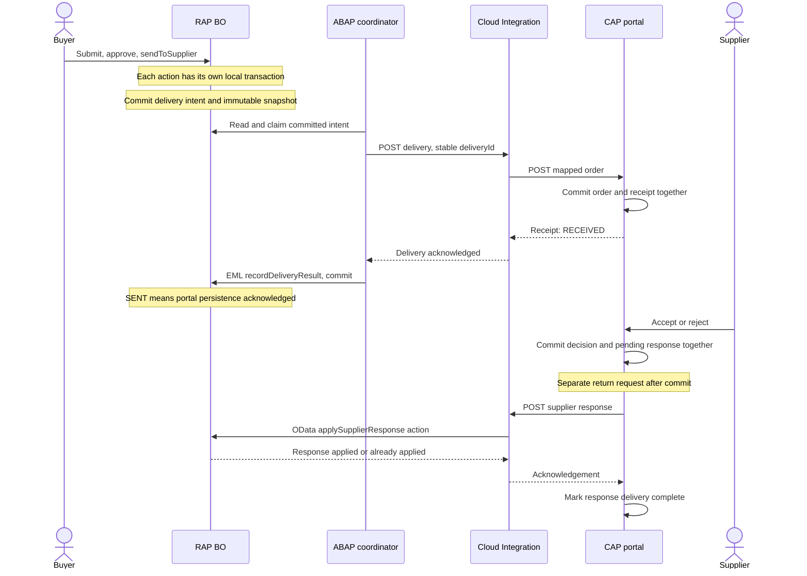
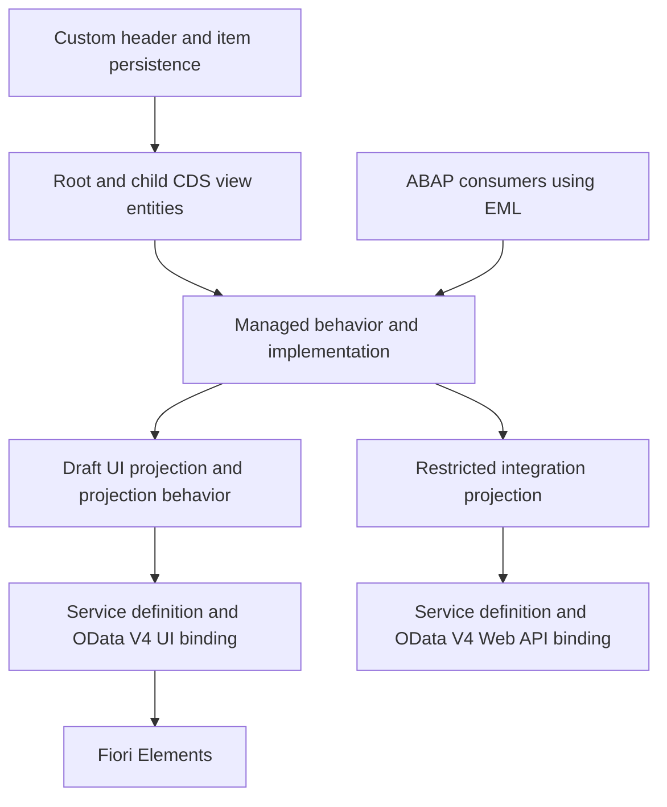
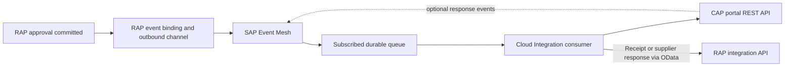

# Architecture

Design baseline: 2026-09-12. Phase 1 objects and Phase 2.1–2.3 managed RAP CRUD/composition have SAP execution evidence supplied by the learner. The [status-initialization plan](abap-rap/docs/phase-2-4a-status-initialization-plan.md) begins Phase 2.4; no determination code is present yet. Business rules and integrations remain proposed.

## Phase 1 implementation boundary

The learner confirmed SAP S/4HANA with ABAP Cloud; exact release is pending. The six model objects are ZJP_PO_H, ZJP_PO_I, ZJP_I_PurchaseOrder, ZJP_I_PurchaseOrderItem, ZJP_C_PurchaseOrder and ZJP_C_PurchaseOrderItem. See the [step-by-step ADT guide](abap-rap/docs/phase-1-domain-model.md).

All six objects were activated in ADT/Eclipse. Two confirmed compiler adjustments are part of the implementation baseline: the root base view exposes Currency without the rejected standalone currency-code marker and keeps the amount-to-currency reference; the child projection omits an explicit transactional_query provider contract while retaining its redirected-parent association. The root projection retains its provider contract. These are target-system findings; they do not establish syntax behavior for every SAP release.

[Phase 2, Step 1](abap-rap/docs/phase-2-step-1-behavior-architecture.md) explains the behavior layers. The [base managed BDEF](abap-rap/docs/phase-2-base-managed-bdef.md) has both entities, complete mappings, root CRUD, child create-by-association/update/delete, master/dependent locks, managed UUIDs and individual LocalLastChangedAt ETags. Target compiler feedback requires explicit authorization under strict(2): root authorization master (instance), child authorization dependent by _PurchaseOrder. Its managed header names implementation class ZBP_I_PURCHASEORDER. The [current behavior-pool lesson](abap-rap/docs/phase-2-minimal-behavior-pool.md) supplies one root callback: a small internal EML read resolves existing instances, then only the target-supported update/delete permissions are allowed under a study-only policy. Managed RAP still owns standard persistence; the permissive policy is not production authorization. The EML CRUD run is now verified by learner-supplied SAP output. The current [EML lesson](abap-rap/docs/phase-2-eml-runtime-test.md) records the successful standalone consumer test, including cleanup. Projection behavior and all further features remain later work.

The two tables implement the Phase 0 header/item field shape with client-aware UUID keys. Monetary storage uses explicit DEC scales, annotated as amounts in CDS; QUAN references the item's UNIT field. Optional domain values use ABAP initial values in non-null persistence columns; later adapters must map them deliberately to wire-level null/absence. Root and item views declare composition/parent navigation; both projections redirect those relationships within the consumer layer. Four delivery/response bookkeeping fields are omitted from the buyer projection.

Standard RAP administrative types and annotations are present, but automatic audit updates, locks, ETags, UUID/default assignment, allowed statuses, calculations and draft processing require Phase 2 behavior. No DCL or business authorization is implemented yet. No service definition, binding, integration projection, outbox, CAP code or iFlow is added in Phase 1.

## Scope and assumptions

Build a custom procurement BO in the learner's SAP S/4HANA study environment using ABAP Cloud. SAP BTP ABAP environment remains an alternative learning landscape. Exact release and future communication permissions still need recording before release-specific implementation.

The initial business scope is one supplier and one currency per order, complete-order acceptance/rejection, manual approval, and synthetic master data. Taxes, freight, goods receipt, invoices, partial confirmation, changes after submission, standard MM integration, and cancellation after delivery are excluded. There is no multitenant SaaS requirement; multiple suppliers still require strict data isolation.

## Component responsibilities

| Component | Owns | Boundary |
| --- | --- | --- |
| RAP | Procurement persistence, totals, lifecycle, approval, audit and integration result | Only BO behavior changes business state |
| Fiori Elements | Buyer/approver list report and object page | Uses UI OData service; never bypasses server rules |
| ABAP dispatch coordinator | Reads committed delivery intent, invokes remote API, records result through EML | No HTTP side effects inside a determination or save handler |
| Cloud Integration | Connectivity, validation of transport shape, mapping, routing, error normalization and message monitoring | Does not decide approval, calculate authoritative prices, or become a business database |
| CAP | Supplier-facing replica, receipt deduplication, decisions and response delivery tracking | Cannot edit SAP-owned commercial data |
| Event Mesh, phase 9 | Durable messaging, routing via topics and subscribed queues | Does not guarantee business-level exactly-once effects |
| API Management, phase 10 | External API facade, token/policy checks, quotas and analytics | Does not replace backend authorization or Cloud Integration mapping |

## Synchronous transport architecture, phases 5–8

Phase 5 bypasses CI using the same boundaries and a small mapping adapter. Phase 6 moves mapping into CI. Each machine-to-machine exchange is synchronous request/reply. The overall human process spans multiple transactions and requests.

The first coordinator can be an explicitly run ABAP console application outside BO handlers: claim through EML, commit, send using a released HTTP client, then record the receipt through EML and commit. A CAP development command can similarly flush a committed response. Automatic scheduling is a later enhancement; scheduling API choice depends on the ABAP release. This makes the commit boundaries observable while keeping the initial HTTP implementation small.

## Transaction and recovery boundary

The enterprise recommendation is to persist a delivery intent with business state and dispatch it after commit. This is an outbox pattern: the pending record survives a process crash. The exact RAP persistence mechanism must be validated in Phase 5 for the selected runtime. It is not a second integration product.

`sendToSupplier` requests delivery; it does not promise that delivery is already complete. Initially it leaves business status `APPROVED` and sets integration state `PENDING`. Claiming the intent prevents concurrent sends and cancellation. The coordinator retains a stable payload and ID across retries. A claim has a bounded lease so a crash can be recovered.

There is no distributed rollback across SAP, CI and CAP. If CAP commits and the receipt is lost, replaying the same delivery returns its original receipt. If SAP result persistence fails, reconciliation applies that receipt later. Never create a fresh delivery ID merely because a network call timed out.

A direct remote call inside a RAP action is a simpler demonstration alternative, but risks remote changes surviving a failed local transaction and prolonged locks. We select the post-commit coordinator. RAP handlers must obey the framework transaction contract; manual commits belong to an appropriate external consumer, not handler code. See [SAP RAP implementation contract](https://help.sap.com/docs/abap-cloud/abap-rap/general-rap-bo-implementation-contract).

## RAP design

- Managed RAP fits new custom persistence: the framework handles transactional buffering and standard persistence while our code handles business rules. Unmanaged RAP is an alternative when existing application APIs own persistence.
- Composition gives items lifecycle dependency on the order. The header is the lock/authorization master; child behavior is dependent on it.
- CDS view entities expose semantics and relationships. Projection views tailor consumers without copying the BO or making database tables public APIs.
- RAP draft preserves an editing session. `IsActiveEntity` and draft administrative data describe technical draft state. The business value `DRAFT` means an active order has not yet been submitted; it is not a replacement for the draft infrastructure.
- Determinations calculate item/header totals and allocate display numbers at a documented lifecycle point. Validations reject invalid values; actions express explicit business transitions. Feature control improves the UI, while action handlers and authorization enforce the same restrictions on the server.
- EML reads/modifies the transactional BO buffer. Behavior logic must account for unsaved item changes and deletions when calculating totals; a raw table sum would miss them.
- Use UUID keys, root locking, local-instance ETags and a root total ETag for draft concurrency. Exact standard administrative types and annotations are selected against released artifacts in Phase 1.
- UI draft actions and business actions are distinct. Integration uses an active-instance Web API surface and cannot mutate buyer drafts. Verify projection/binding support in Phase 3 before freezing the wire contract.

Clean Core means custom objects in the customer namespace, ABAP for Cloud Development where supported, and released APIs/types for SAP dependencies. No changes to SAP standard code, direct updates to standard purchasing tables, unreleased BAPIs, or assumptions that BTP ABAP environment contains MM master data. ABAP CDS and CAP CDS are different languages/runtimes; their files are not interchangeable.

## CAP design

Use CDS persistence models, service projections, and small TypeScript handlers. Start with SQLite, portable CDS data types and parameterized CQN queries. HANA compatibility is an intention until the application is built/deployed and tested with HANA; avoid SQLite-specific SQL. CAP supports local-to-cloud evolution and [TypeScript handlers](https://cap.cloud.sap/docs/node.js/typescript).

The integration service accepts immutable commercial snapshots. The supplier service exposes reads and explicit decision/date actions. Generated READ support is appropriate with authorization filters; ingestion and decisions require custom handlers, not unrestricted generic CRUD. Supplier identity comes from authenticated user attributes or an explicit local mock-user mapping, never a trusted supplier code supplied by the browser.

Persist each decision and its pending response in the same CAP transaction. Response failure changes delivery tracking, not the supplier's already committed decision. Use separate business and transport statuses. An authenticated supplier can access only their own order list, order details, items, and actions. CAP [authentication strategies](https://cap.cloud.sap/docs/node.js/authentication) support progressive local and platform configurations.

## Cloud Integration design

Outbound iFlow, `PIH_OrderDelivery_v1`:

```mermaid
flowchart LR
    HTTPS[HTTPS Sender] --> CM[Content Modifier: IDs and properties]
    CM --> Convert[JSON to XML Converter]
    Convert --> Validate[XML Validator: source schema]
    Validate --> Route[Router: supported contract and supplier route]
    Route --> Map[Graphical Message Mapping]
    Map --> Target[Validate target XML]
    Target --> JSON[XML to JSON Converter]
    JSON --> HTTP[HTTP Receiver: CAP REST endpoint]
    HTTP --> Receipt[Map receipt to source contract]
```

Define XML wrapper/root names and source/target XSDs in Phase 6 so conversion, validation and mapping agree. Route only to configured endpoints, never URLs from incoming payloads. Keep decimal values as canonical strings through conversions. Standard mapping functions handle renaming, nesting, constants and the initial `EA` to `PCE` value mapping. Unknown units fail validation; they are not guessed. XML exists within the iFlow to practice graphical mapping, while external APIs use JSON. A JSON-only mapping is an alternative for a simpler production scenario.

The return iFlow, `PIH_SupplierResponse_v1`, validates the CAP response, maps accepted/rejected/date-update semantics, and invokes the RAP integration action. Use the HTTP receiver for controlled OData V4 requests, or a supported OData V4 receiver after verifying tenant capabilities. Respect the actual service metadata, token requirements and concurrency contract.

An Exception Subprocess captures failures, records correlation ID and safe diagnostic properties, and returns a truthful error. End-event choice affects message processing status; verify failures remain visible in monitoring. It does not automatically resume or retry the failed main flow. SAP documents the [HTTP receiver](https://help.sap.com/docs/integration-suite/sap-integration-suite/http-receiver-adapter) and [Exception Subprocess](https://help.sap.com/docs/cloud-integration/sap-cloud-integration/define-exception-subprocess).

The coordinator owns outbound retries and CAP owns return retries initially. Avoid layered retry loops in every component. CI returns the failure to its caller rather than making a nested error callback into a still-open RAP transaction. Phase 7 adds attempt history and recovery tooling.

## Security progression

| Stage | Design |
| --- | --- |
| Local prototype | Loopback services, synthetic data, explicitly mocked identities; local permission tests |
| Hosted connectivity | TLS and the platform-required authentication from the first hosted request |
| Phase 8 machine calls | OAuth 2.0 client credentials where supported; distinct technical clients for ingestion and callback operations |
| Phase 8 supplier UI | Interactive login via app router/identity provider; XSUAA scopes and supplier attributes validated by CAP |
| Phase 8 configuration | BTP destinations for relevant BTP consumers, CI Security Material aliases, ABAP communication scenarios/arrangements as supported |
| Phase 10 API facade | API Management proxies validate tokens, enforce rate limits and forward correlation IDs |

An ABAP communication arrangement is not automatically a BTP Destination. A destination locates a remote service and its authentication configuration; it does not create network reachability. CI uses its supported security-material and adapter settings. User tokens are not blindly forwarded across different audiences. Secrets remain outside Git.

## Event-driven extension, phase 9

Planned event names: `PurchaseOrderApproved`, `PurchaseOrderSent`, `PurchaseOrderAccepted`, `PurchaseOrderRejected`. RAP owns the first two; CAP owns supplier decisions. `PurchaseOrderSent` is emitted only after a portal receipt, never after merely publishing the approval event. Only approval events trigger outbound delivery; status events must not create a send loop.

Propose a versioned CloudEvents-compatible envelope containing `id`, `source`, `type`, `specversion`, `time`, `subject`, and `data` with order UUID, revision and delivery/response identity. Native RAP envelope support and mapping to this logical contract depend on the selected outbound channel. Events must refer to a committed immutable snapshot, not an editable current order.

Version 2 may automatically request delivery on approval; this is an explicit change from the manually triggered synchronous learning version. Do not enable both triggers for the same order. Define topic names, subscriptions and exact broker offering only after checking the account's entitlement and RAP/CI compatibility.

Use durable publication tied to commit, consumer deduplication, acknowledgement after successful processing, bounded retries and an observable dead-letter queue or equivalent supported quarantine. Store event IDs and business operation IDs: a republished event with a new event ID must still not duplicate an order. Order revision/response version protects against stale and out-of-order messages. No exactly-once delivery claim is made.

Asynchronous delivery absorbs downtime and separates producer availability from consumer availability. It adds operational state and eventual consistency: SAP and CAP may temporarily show different progress. Synchronous REST remains preferable for queries, immediate validation and a simple low-volume initial integration.

SAP supports [RAP business events](https://help.sap.com/docs/abap-cloud/abap-rap/develop-business-events). SAP Event Mesh, the Event Mesh capability in Integration Suite, and Integration Suite advanced event mesh must not be treated as interchangeable subscriptions; see [environment decisions](docs/environments.md).

## Architecture decision register

| ID | Decision | Reason and alternative |
| --- | --- | --- |
| ADR-001 | Custom BO; no standard MM posting | Enables managed RAP learning without modifying SAP purchasing; released standard PO APIs are a separate future integration |
| ADR-002 | Header/item composition and UUID keys | Lifecycle ownership and stable identity; order number is display-only |
| ADR-003 | Draft state separate from business state | Saved-but-unsubmitted is not the same as an unsaved draft |
| ADR-004 | RAP owns commercial facts; CAP owns supplier response | Prevents competing writable copies |
| ADR-005 | Dedicated UI and integration boundaries | Narrow machine permissions and stable contracts |
| ADR-006 | Post-commit dispatcher with synchronous HTTP | Avoids remote side effects inside RAP save; direct action HTTP is a limited demonstration alternative |
| ADR-007 | Stable identities and deduplication from first integration | Safe recovery cannot be bolted onto arbitrary POST retries |
| ADR-008 | TypeScript and portable CAP CDS | Practical type safety and later HANA testing; JavaScript remains a simpler alternative |
| ADR-009 | Standard CI mapping components before Groovy | Makes transformation visible and maintainable |
| ADR-010 | Separate business and integration status | An unavailable portal is different from supplier rejection |
| ADR-011 | SAP mocks explicitly labeled | Allows progress without false claims about service experience |
| ADR-012 | No advanced-platform implementation in Phase 0 | Keeps each learning milestone explainable and testable |
| ADR-013 | ZJP_ prefix for all six Phase 1 objects | Learner's naming preference replaces the earlier provisional ZPIH family |
| ADR-014 | DEC monetary persistence with CDS currency semantics | Preserves explicit 19/2 totals and 19/4 unit prices for the EUR-only contract; CURR is a valid alternative with deliberate currency-decimal handling |
| ADR-015 | ABAP initial values for absent optional persistence values | Avoids relying on SQL NULL in ABAP structures; API conversion remains an explicit later responsibility |
| ADR-016 | Preserve target-compiler compatibility fixes | Remove the root currency marker and child's explicit provider contract exactly as required by the activated implementation; do not restore rejected generic syntax |
| ADR-017 | Confirmation after every major Phase 2 step | Behavior architecture, design, CRUD, EML, draft, logic and actions are separate learning checkpoints |

See [domain model](docs/architecture/domain-model.md), [API contracts](API_CONTRACTS.md), and [project status](PROJECT_STATUS.md) for associated rules and unresolved environment decisions.
