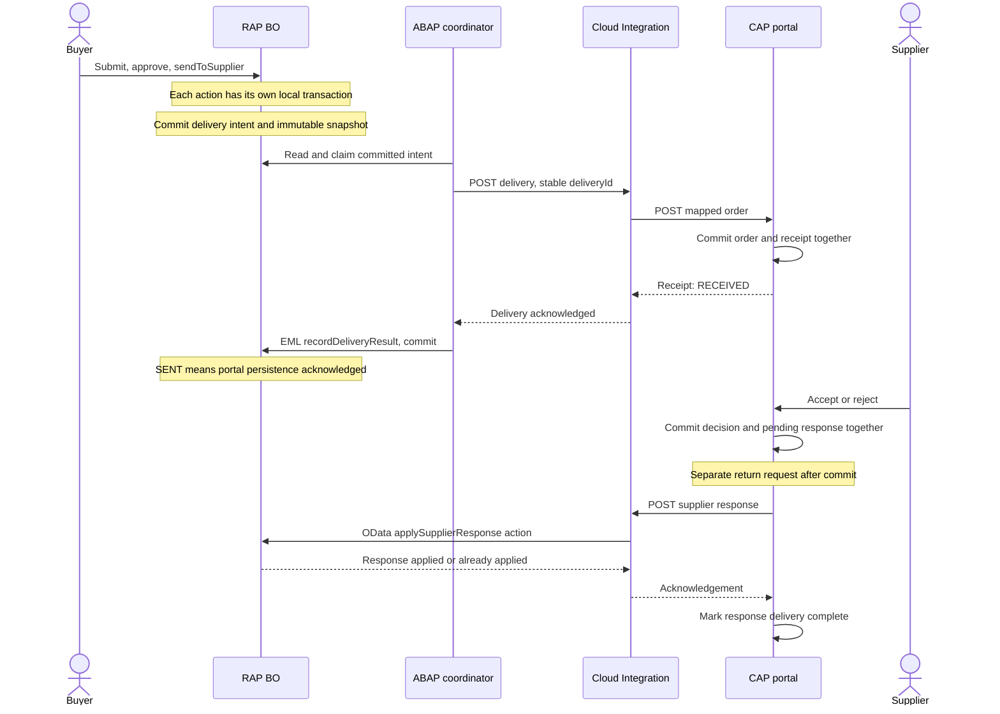
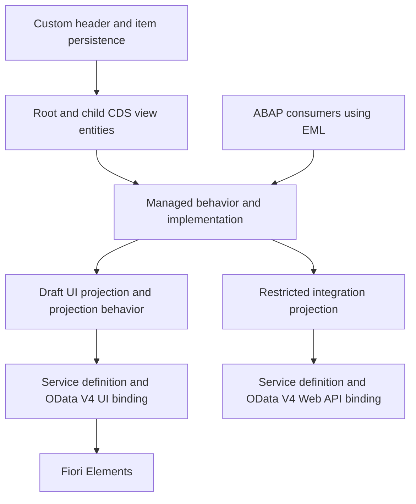
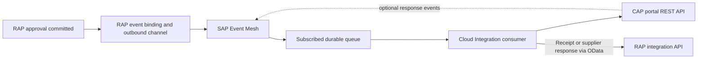

# Architecture

Updated 2026-09-14. Phase 2.5A validateSupplier, Phase 2.5B validateQuantity and Phase 2.5C validateNetPrice are SAP runtime-verified complete on learner-supplied evidence. NetPrice < 0 is rejected at save, while zero-price create/update is valid. Quantity must be greater than 0 on item create and Quantity change; rejected saves preserve persistence. Phase 2.4C header aggregation remains verified for previously committed item deletion; uncommitted-item deletion is unsupported by its persisted-parent lookup.

## Phase 1 implementation boundary

The learner confirmed SAP S/4HANA with ABAP Cloud. The exact Phase 2.6 target is SAP_BASIS 758 SP0001 / S4CORE 108 SP0001, ADT Core 3.60.3 / Business Object Tools 1.209.0, Eclipse 4.40.0. The six model objects are ZJP_PO_H, ZJP_PO_I, ZJP_I_PurchaseOrder, ZJP_I_PurchaseOrderItem, ZJP_C_PurchaseOrder and ZJP_C_PurchaseOrderItem. See the [step-by-step ADT guide](abap-rap/docs/phase-1-domain-model.md).

Phase 2.6 decision after target ADT and active/draft runtime inspection: preserve PurchaseOrderItemUUID as the sole child entity key. Known-root navigation after deletion is verified for active, saved-draft and buffer-only draft instances; deleted-child navigation fails. A technical root removeItem action now checks ownership, invokes managed internal child DELETE, navigates the surviving collection using complete root %tky including %is_draft, and updates root TotalAmount through local EML. It replaces the active-table parent lookup and restricts external child deletion. No direct draft-table access or callback state is used. The action, ownership protection and corrected active/draft totals are SAP runtime-verified; see the [Phase 2.6 guide](abap-rap/docs/phase-2-6-technical-draft.md).

Phase 2.7A adds the first business action on top of that technical baseline. Root `submit` is instance-bound, parameterless and delegates authorization to root update. It rejects technical draft instances outright, requires business `Status = 'DRAFT'` and at least one current item read through the live composition, then writes `Status = 'SUBMITTED'` through one local-mode EML update of the readonly field. It re-checks no business content: Supplier, Quantity and NetPrice remain owned by their existing save validations, whose trigger declarations are unchanged. `PurchaseOrderNumber` allocation and post-submission editing restrictions are deliberately excluded, so a submitted order was still editable at that checkpoint, which Phase 2.7B then closed. The transition, the two active rejections and both technical draft rejections are SAP runtime-verified; see the [Phase 2.7A guide](abap-rap/docs/phase-2-7a-submit-action.md).

Phase 2.7B closes post-submission commercial content. Once business `Status` is `SUBMITTED`, root commercial updates, item commercial updates, create-by-association of new items and `removeItem` are all rejected. Enforcement is server-side and declarative: prechecks are declared as operation options, `update ( precheck )` on root and item and `create ( precheck )` on the `_Items` association, with ADT-generated `FOR PRECHECK` handlers. Each handler filters on `%control` so only user-writable commercial fields are guarded, leaving the framework's own `Status` and `TotalAmount` writes untouched, then reads the deciding root's current status through `%tky`, which carries `%is_draft`. Instance feature control was rejected as an enforcement layer because it is advisory and `IN LOCAL MODE` bypasses it; it remains available as optional UX. A validation-on-save backstop was considered and found to add no coverage. Root `DELETE` of a submitted order stayed allowed at this checkpoint; Phase 2.7D-2 narrowed physical deletion to `DRAFT`. See the [Phase 2.7B guide](abap-rap/docs/phase-2-7b-post-submission-immutability.md).

Phase 2.7C adds the approver decisions and turns the Phase 2.7B rule into a lifecycle invariant. Root `approve` moves business `Status` from `SUBMITTED` to `APPROVED`; root `reject` moves it to `REJECTED`, sets `RejectionOrigin` to `APPROVER` and stores a mandatory `RejectionReason` carried by the new abstract entity `ZJP_A_Reject`. Both are active-instance only and refuse technical drafts, and both evaluate eligibility and lifecycle state before parameter content. The enforcement rule is now stated as an invariant — commercial content is editable only while `Status` is `DRAFT` — so `SUBMITTED`, `APPROVED`, `REJECTED` and any state added later are immutable for root updates, item updates, create-by-association and `removeItem` without further handler changes. `Status` `INITIAL` passes the prechecks strictly as a transient creation-compatibility case before `initializeStatus` establishes `DRAFT`, and is never an editable business state. Approver rejection is distinct from supplier rejection, which sets `RejectionOrigin` to `SUPPLIER` in a later phase. Authorization remains the permissive study stub, so these actions name lifecycle transitions rather than access controls. See the [Phase 2.7C guide](abap-rap/docs/phase-2-7c-approve-reject.md).

Phase 2.7D-1 adds the `cancel` lifecycle action and closes the withdrawal path. Root `cancel` is parameterless, active-instance only and delegates authorization to root update, like the three actions before it. Eligibility is expressed as a positive allow-list of `DRAFT`, `SUBMITTED` and `APPROVED` rather than as a deny-list, which is why it needs no `INITIAL` carve-out: `REJECTED`, `CANCELLED` and the transient `INITIAL` are all outside the list and are refused. The action writes `Status = 'CANCELLED'` and nothing else. `CANCELLED` required **no new enforcement code at all** — it is a state after `DRAFT`, so the Phase 2.7C invariant already makes it commercially immutable, and the action's own write passes the root precheck because `Status` is readonly and never flagged in `%control`. The domain model's rule that `APPROVED` may be cancelled only before delivery was requested is deliberately **not** implemented: `IntegrationStatus` and `DeliveryId` are readonly and no Phase 2 handler can write them, so the condition is unrepresentable as true, a guard would be a tautology that could never fire and could never be tested negatively, and producing the state to test it would require forbidden direct SQL. That guard is a Phase 5 obligation attached to `DeliveryIntent` and `sendToSupplier`, which is what first makes the condition reachable. Root `DELETE` is intentionally untouched here; the subphase was split so that the deletion policy and its regression consequences do not share an activation round with a new transition. See the [Phase 2.7D-1 guide](abap-rap/docs/phase-2-7d-1-cancel-action.md).

Phase 2.7E allocates `PurchaseOrderNumber` and closes OI-02 inside Phase 2 as an implementation rather than a deferment. `submit` draws exactly one number from the configured `ZJP_PO` interval `01` through `CL_NUMBERRANGE_RUNTIME=>NUMBER_GET`, formats it as `PO` plus eight zero-padded digits, and writes it together with `Status` in the same local-mode update. Allocation happens on `DRAFT` → `SUBMITTED` only: not on create or save, not through a determination, and not through RAP late numbering. A `DRAFT` order therefore has no number, an order cancelled straight from `DRAFT` never gets one, and every state after `SUBMITTED` keeps exactly the number drawn at submission. The target returns `NRLEVEL` as twenty digits while the configured interval is eight, so the handler checks the leading twelve digits are zeros and fails the action rather than letting a wider value be truncated into a wrong number. Only `CX_NR_OBJECT_NOT_FOUND` and `CX_NUMBER_RANGES`, the two classes proven on the target, are caught. No behavior definition, CDS or table change was required: the field was already `readonly` and already mapped, and the Phase 2.7B `%control` scoping lets the action's own write through untouched. SAP runtime evidence confirms the format, preservation across every later transition and every refused operation, and a `DRAFT` → `CANCELLED` order that correctly received no number. The same run verified Phase 2.7D-2, which narrows physical root `DELETE` to business `Status` `DRAFT` through `delete ( precheck )` and leaves terminal fixtures as deliberate test residue. With these two subphases, **Phase 2 is complete**. See the [Phase 2.7E guide](abap-rap/docs/phase-2-7e-purchase-order-number.md).

Phase 3.1 opens the business object to external consumers without changing it. An ADT-generated projection behavior definition on `ZJP_C_PurchaseOrder` declares `projection; strict ( 2 ); use draft;` and re-exposes root CRUD, the five business actions, the five framework draft actions and the `_Items` association; the child block exposes `update` alone, so the base `internal delete` keeps item removal behind `removeItem`. Service definition `ZJP_UI_PURCHASEORDER` and OData V4 – UI binding `ZJP_UI_PURCHASEORDER_O4` complete the chain. The layering decision from Phase 2 pays off here: the service adds no rule and repeats none, so the Phase 2 handlers remain the single enforcement point and their exact message texts reach the HTTP boundary unchanged. Two target facts are worth carrying forward. The child projection's missing `provider contract transactional_query`, a Phase 1 compatibility adjustment, did not block transactional exposure — root contract plus redirected-to-parent child is a working combination here. And publishing required `/IWFND/V4_ADMIN` rather than ADT, because client 100 is a Customizing client. Runtime evidence covers metadata, both entity sets, draft, all ten actions with parameters, `$expand`, the full draft cycle, creation through to submission with `PurchaseOrderNumber` appearing at `submit` and not at `Activate`, and post-submission immutability enforced over HTTP. `__OperationControl` advertises actions the lifecycle would reject, which is a UX gap and not a rule defect; concurrency remains unproven. See the [Phase 3.1 guide](abap-rap/docs/phase-3-1-odata-service-exposure.md).

Phase 3.2 adds presentation and nothing else. A metadata extension at layer `#CUSTOMER` over `ZJP_C_PurchaseOrder` drives a Fiori Elements List Report with four columns, a three-field Filter Bar beside the framework's own Editing Status, and header information that replaces the technical UUID with `PurchaseOrderNumber` — the visible form of the Phase 2.7E identity split, where the UUID is what a client addresses and the number is what a person recognises. `TotalAmount` renders as EUR with no currency annotation in the extension at all, because the `@Semantics.amount.currencyCode` marker placed on the base view in Phase 1 propagates through the projection into OData; annotation discipline chosen three phases earlier removed work here. Activating an extension refreshes `$metadata` without republishing the binding, which keeps annotation iteration cheap on a Customizing client where publishing needs `/IWFND/V4_ADMIN`. A second extension over `ZJP_C_PurchaseOrderItem` supplies the item table's columns. The Object Page renders a General Information facet of ten fields and an Items facet over `_Items`, both through `@UI.facet` placed **inside** the `annotate entity … with { }` body — top-level placement is compiler-verified invalid on this target, which is a target fact rather than a general CDS rule, since `@UI.headerInfo` works at top level in the same file. Units and currency need no annotation: the Phase 1 `@Semantics` markers propagate through the projections into OData and Fiori renders `2 EA` and `750.00 EUR` unaided, so no `UnitOfMeasure` or `Currency` column exists in either extension. See the [Phase 3.2 guide](abap-rap/docs/phase-3-2-ui-annotations.md). Fields no Phase 2 code ever writes — `SupplierName`, `SupplierResponse`, `EstimatedDeliveryDate`, `IntegrationStatus` and the `LastError*` group — are deliberately not annotated; they would render permanently empty and become meaningful only in Phase 5.

All six objects were activated in ADT/Eclipse. Two confirmed compiler adjustments are part of the implementation baseline: the root base view exposes Currency without the rejected standalone currency-code marker and keeps the amount-to-currency reference; the child projection omits an explicit transactional_query provider contract while retaining its redirected-parent association. The root projection retains its provider contract. These are target-system findings; they do not establish syntax behavior for every SAP release.

[Phase 2, Step 1](abap-rap/docs/phase-2-step-1-behavior-architecture.md) explains the behavior layers. The [base managed BDEF](abap-rap/docs/phase-2-base-managed-bdef.md) has both entities, complete mappings, root CRUD, child create-by-association/update/delete, master/dependent locks, managed UUIDs and individual LocalLastChangedAt ETags. Target compiler feedback requires explicit authorization under strict(2): root authorization master (instance), child authorization dependent by _PurchaseOrder. Its managed header names implementation class ZBP_I_PURCHASEORDER. The [current behavior-pool lesson](abap-rap/docs/phase-2-minimal-behavior-pool.md) supplies one root callback: a small internal EML read resolves existing instances, then only the target-supported update/delete permissions are allowed under a study-only policy. Managed RAP still owns standard persistence; the permissive policy is not production authorization. The EML CRUD run is now verified by learner-supplied SAP output. The current [EML lesson](abap-rap/docs/phase-2-eml-runtime-test.md) records the successful standalone consumer test, including cleanup. Projection behavior and all further features remain later work.

The two tables implement the Phase 0 header/item field shape with client-aware UUID keys. Monetary storage uses explicit DEC scales, annotated as amounts in CDS; QUAN references the item's UNIT field. Optional domain values use ABAP initial values in non-null persistence columns; later adapters must map them deliberately to wire-level null/absence. Root and item views declare composition/parent navigation; both projections redirect those relationships within the consumer layer. Four delivery/response bookkeeping fields are omitted from the buyer projection.

Standard RAP administrative types and annotations are present, but automatic audit updates, locks, ETags, UUID/default assignment, allowed statuses, calculations and draft processing require Phase 2 behavior. No DCL or business authorization is implemented yet. No service definition, binding, integration projection, outbox, CAP code or iFlow is added in Phase 1.

## Scope and assumptions

Build a custom procurement BO in the learner's SAP S/4HANA study environment using ABAP Cloud. SAP BTP ABAP environment remains an alternative learning landscape. Exact release and future communication permissions still need recording before release-specific implementation.

The initial business scope is one supplier and one currency per order, complete-order acceptance/rejection, manual approval, and synthetic master data. Taxes, freight, goods receipt, invoices, partial confirmation, changes after submission, standard MM integration, and cancellation after delivery are excluded. There is no multitenant SaaS requirement; multiple suppliers still require strict data isolation.

## Component responsibilities

| Component | Owns | Boundary |
| --- | --- | --- |
| RAP | Procurement persistence, totals, lifecycle, approval, audit and integration result | Only BO behavior changes business state |
| Fiori Elements | Buyer/approver list report and object page | Uses UI OData service; never bypasses server rules |
| ABAP dispatch coordinator | Reads committed delivery intent, invokes remote API, records result through EML | No HTTP side effects inside a determination or save handler |
| Cloud Integration | Connectivity, validation of transport shape, mapping, routing, error normalization and message monitoring | Does not decide approval, calculate authoritative prices, or become a business database |
| CAP | Supplier-facing replica, receipt deduplication, decisions and response delivery tracking | Cannot edit SAP-owned commercial data |
| Event Mesh, phase 9 | Durable messaging, routing via topics and subscribed queues | Does not guarantee business-level exactly-once effects |
| API Management, phase 10 | External API facade, token/policy checks, quotas and analytics | Does not replace backend authorization or Cloud Integration mapping |

## Synchronous transport architecture, phases 5–8

Phase 5 bypasses CI using the same boundaries and a small mapping adapter. Phase 6 moves mapping into CI. Each machine-to-machine exchange is synchronous request/reply. The overall human process spans multiple transactions and requests.

The first coordinator can be an explicitly run ABAP console application outside BO handlers: claim through EML, commit, send using a released HTTP client, then record the receipt through EML and commit. A CAP development command can similarly flush a committed response. Automatic scheduling is a later enhancement; scheduling API choice depends on the ABAP release. This makes the commit boundaries observable while keeping the initial HTTP implementation small.

## Transaction and recovery boundary

The enterprise recommendation is to persist a delivery intent with business state and dispatch it after commit. This is an outbox pattern: the pending record survives a process crash. The exact RAP persistence mechanism must be validated in Phase 5 for the selected runtime. It is not a second integration product.

`sendToSupplier` requests delivery; it does not promise that delivery is already complete. Initially it leaves business status `APPROVED` and sets integration state `PENDING`. Claiming the intent prevents concurrent sends and cancellation. The coordinator retains a stable payload and ID across retries. A claim has a bounded lease so a crash can be recovered.

There is no distributed rollback across SAP, CI and CAP. If CAP commits and the receipt is lost, replaying the same delivery returns its original receipt. If SAP result persistence fails, reconciliation applies that receipt later. Never create a fresh delivery ID merely because a network call timed out.

A direct remote call inside a RAP action is a simpler demonstration alternative, but risks remote changes surviving a failed local transaction and prolonged locks. We select the post-commit coordinator. RAP handlers must obey the framework transaction contract; manual commits belong to an appropriate external consumer, not handler code. See [SAP RAP implementation contract](https://help.sap.com/docs/abap-cloud/abap-rap/general-rap-bo-implementation-contract).

Phase 5.1 reviewed this boundary against the actual RAP source and designed the persistence it needs, without implementing any of it. Two findings are worth carrying in this section. The nine integration fields on `ZJP_PO_H` — `OrderRevision`, `IntegrationStatus`, `DeliveryId`, the three `LastError*` fields, `LastCorrelationId`, `LastResponseId` and `LastResponseVersion` — all already exist, are mapped and are `readonly`, all already exist, are mapped and are `readonly`, and at that point **no handler wrote any of them**, so no header column needed adding for the outbound leg. `OrderRevision` consequently held `0` on every row while CAP's ingestion requires `source.revision` ≥ 1, so a delivery built from that persistence would have been refused with 400 `INVALID_SOURCE_IDENTITY` — documented debt turning into a hard blocker at the boundary, recorded rather than patched in a mapper.

**Phase 5.2a closed that gap and is SAP runtime-verified.** Two of the nine fields are now written, by adding them to two clauses that already existed rather than by adding a handler: `submit` writes `OrderRevision = 1` beside `Status` and `PurchaseOrderNumber`, and `initializeStatus` writes `IntegrationStatus = 'NOT_REQUESTED'` beside `Status = 'DRAFT'`. The revision is frozen at submission as the domain model specifies — a `DRAFT` order keeps `0` and is deliberately undeliverable, a refused submit exits before the update, and an order cancelled pre-submit was runtime-observed to retain `0` while every submitted order carries `1` — and it was pointedly **not** defaulted in a mapper. The other **seven** integration fields are still written by nothing, `IntegrationStatus` never advances beyond `NOT_REQUESTED`, and rows persisted earlier keep their blank value by design. The ADR-022 `APPROVED` → `CANCELLED` delivery-request guard is therefore **still not representable**: a handler can now write `IntegrationStatus`, but only the value that means no delivery was requested, and `DeliveryId` remains unwritten. It becomes testable once an intent exists. See the [Phase 5.1 guide](abap-rap/docs/phase-5-1-outbound-foundation.md).

## RAP design

- Managed RAP fits new custom persistence: the framework handles transactional buffering and standard persistence while our code handles business rules. Unmanaged RAP is an alternative when existing application APIs own persistence.
- Composition gives items lifecycle dependency on the order. The header is the lock/authorization master; child behavior is dependent on it.
- CDS view entities expose semantics and relationships. Projection views tailor consumers without copying the BO or making database tables public APIs.
- RAP draft preserves an editing session. `IsActiveEntity` and draft administrative data describe technical draft state. The business value `DRAFT` means an active order has not yet been submitted; it is not a replacement for the draft infrastructure.
- Determinations calculate item/header totals. Validations reject invalid values; actions express explicit business transitions, and an action is also where the display number is allocated — `submit` draws it, not a determination. Earlier wording that assigned display-number allocation to determinations is superseded by [Phase 2.7E](abap-rap/docs/phase-2-7e-purchase-order-number.md). Feature control improves the UI, while action handlers and authorization enforce the same restrictions on the server.
- EML reads/modifies the transactional BO buffer. Behavior logic must account for unsaved item changes and deletions when calculating totals; a raw table sum would miss them.
- Use UUID keys, root locking, local-instance ETags and a root total ETag for draft concurrency. Exact standard administrative types and annotations are selected against released artifacts in Phase 1.
- UI draft actions and business actions are distinct. Integration uses an active-instance Web API surface and cannot mutate buyer drafts. Verify projection/binding support in Phase 3 before freezing the wire contract.

Clean Core means custom objects in the customer namespace, ABAP for Cloud Development where supported, and released APIs/types for SAP dependencies. No changes to SAP standard code, direct updates to standard purchasing tables, unreleased BAPIs, or assumptions that BTP ABAP environment contains MM master data. ABAP CDS and CAP CDS are different languages/runtimes; their files are not interchangeable.

## CAP design

Use CDS persistence models, service projections, and small TypeScript handlers. Start with SQLite, portable CDS data types and parameterized CQN queries. HANA compatibility is an intention until the application is built/deployed and tested with HANA; avoid SQLite-specific SQL. CAP supports local-to-cloud evolution and [TypeScript handlers](https://cap.cloud.sap/docs/node.js/typescript).

The database is now selected **by CAP profile** rather than by a project-wide setting: SQLite `:memory:` for local development, SAP HANA through `@cap-js/hana` for production, and `cds build --production` generates an HDI deployer module. The application is **deployed to Cloud Foundry and bound** to the existing `pih-hdi` container, with the schema deployed into it, and **one business row has now been written to and read back from HANA**. So the sentence above no longer stands unqualified: HANA *data* compatibility is an intention for the write paths still untried, but it is a verified fact for the ingestion path. The generated HANA DDL declares true `DECIMAL` columns and renders each `@assert.unique` rule as a `UNIQUE INVERTED INDEX`; that was evidence about what the compiler emits, and the runtime has since supplied the rest for the values ingestion stores — `DECIMAL(19,2)`, `DECIMAL(19,4)` and `DECIMAL(13,3)` values round-tripped with their scale intact and no float drift, and `Timestamp` kept millisecond precision. What the portable-types discipline still has to carry is the **supplier decision path**, because every write exercised so far was an INSERT and no UPDATE has run against HANA. See ADR-033, ADR-037 and OI-14 in [PROJECT_STATUS.md](PROJECT_STATUS.md).

**The CAP Supplier Portal is complete as of Phase 4.6** and runs locally: CAP 10 on Node.js 22, TypeScript, SQLite in memory, with the resolved versions pinned by a committed lockfile. Phase 4.2 added the persistence layer — namespace `pih.portal` with `Suppliers`, `Orders` and composed `OrderItems` — implementing the CAP persistence table below rather than restating it, and Phases 4.3 and 4.4 added `DeliveryReceipts` and `SupplierResponseDeliveries`, each pulled forward from Phase 5 with only the fields its subphase needed. Phase 4.3 added the integration-facing ingestion boundary, `POST /rest/integration/v1/Orders`, which exposes no persistence entity and is idempotent by database constraint. Phase 4.4 added the supplier-facing service at `/rest/supplier/v1`: scoped `@readonly` projections plus bound `accept`, `reject` and `updateEstimatedDeliveryDate` actions, each writing its decision and a pending outbound response in one transaction. Phase 4.5 added a frameworkless browser UI with bounded `limit`/`offset` list pagination, and Phase 4.6 closed the phase with a clean-install re-verification and a contract reconciliation that found no implementation defect. Nothing is sent to SAP; that is Phase 5. See the [Phase 4.1](cap-supplier-portal/docs/phase-4-1-cap-foundation.md), [4.2](cap-supplier-portal/docs/phase-4-2-domain-model.md), [4.3](cap-supplier-portal/docs/phase-4-3-integration-ingestion.md), [4.4](cap-supplier-portal/docs/phase-4-4-supplier-service.md), [4.5](cap-supplier-portal/docs/phase-4-5-supplier-ui.md) and [4.6](cap-supplier-portal/docs/phase-4-6-closure.md) guides.

The integration service accepts immutable commercial snapshots. The supplier service exposes reads and explicit decision/date actions. Generated READ support is appropriate with authorization filters; ingestion and decisions require custom handlers, not unrestricted generic CRUD. Supplier identity comes from authenticated user attributes or an explicit local mock-user mapping, never a trusted supplier code supplied by the browser.

Persist each decision and its pending response in the same CAP transaction. Response failure changes delivery tracking, not the supplier's already committed decision. Use separate business and transport statuses. An authenticated supplier can access only their own order list, order details, items, and actions. CAP [authentication strategies](https://cap.cloud.sap/docs/node.js/authentication) support progressive local and platform configurations.

## Cloud Integration design

Outbound iFlow, `PIH_OrderDelivery_v1`:

```mermaid
flowchart LR
    HTTPS[HTTPS Sender] --> CM[Content Modifier: IDs and properties]
    CM --> Convert[JSON to XML Converter]
    Convert --> Validate[XML Validator: source schema]
    Validate --> Route[Router: supported contract and supplier route]
    Route --> Map[Graphical Message Mapping]
    Map --> Target[Validate target XML]
    Target --> JSON[XML to JSON Converter]
    JSON --> HTTP[HTTP Receiver: CAP REST endpoint]
    HTTP --> Receipt[Map receipt to source contract]
```

Define XML wrapper/root names and source/target XSDs in Phase 6 so conversion, validation and mapping agree. Route only to configured endpoints, never URLs from incoming payloads. Keep decimal values as canonical strings through conversions. Standard mapping functions handle renaming, nesting, constants and the initial `EA` to `PCE` value mapping. Unknown units fail validation; they are not guessed. XML exists within the iFlow to practice graphical mapping, while external APIs use JSON. A JSON-only mapping is an alternative for a simpler production scenario.

The return iFlow, `PIH_SupplierResponse_v1`, validates the CAP response, maps accepted/rejected/date-update semantics, and invokes the RAP integration action. Use the HTTP receiver for controlled OData V4 requests, or a supported OData V4 receiver after verifying tenant capabilities. Respect the actual service metadata, token requirements and concurrency contract.

An Exception Subprocess captures failures, records correlation ID and safe diagnostic properties, and returns a truthful error. End-event choice affects message processing status; verify failures remain visible in monitoring. It does not automatically resume or retry the failed main flow. SAP documents the [HTTP receiver](https://help.sap.com/docs/integration-suite/sap-integration-suite/http-receiver-adapter) and [Exception Subprocess](https://help.sap.com/docs/cloud-integration/sap-cloud-integration/define-exception-subprocess).

The coordinator owns outbound retries and CAP owns return retries initially. Avoid layered retry loops in every component. CI returns the failure to its caller rather than making a nested error callback into a still-open RAP transaction. Phase 7 adds attempt history and recovery tooling.

## Security progression

| Stage | Design |
| --- | --- |
| Local prototype | Loopback services, synthetic data, explicitly mocked identities; local permission tests. Mocked auth is now confined to the `[development]` profile, so it cannot resolve in production |
| Production model, prepared | `@sap/xssec` with `requires.[production].auth: xsuaa`; two named roles, `SupplierPortalUser` and `IntegrationClient`, and a generated `xs-security.json`. The `IntegrationClient` authority is token-level proven against a real XSUAA instance; deployed enforcement and the supplier attribute mapping are not. See ADR-036 |
| Hosted connectivity | TLS and the platform-required authentication from the first hosted request |
| Phase 8 machine calls | OAuth 2.0 client credentials where supported; distinct technical clients for ingestion and callback operations |
| Phase 8 supplier UI | Interactive login via app router/identity provider; XSUAA scopes and supplier attributes validated by CAP |
| Phase 8 configuration | BTP destinations for relevant BTP consumers, CI Security Material aliases, ABAP communication scenarios/arrangements as supported |
| Phase 10 API facade | API Management proxies validate tokens, enforce rate limits and forward correlation IDs |

An ABAP communication arrangement is not automatically a BTP Destination. A destination locates a remote service and its authentication configuration; it does not create network reachability. CI uses its supported security-material and adapter settings. User tokens are not blindly forwarded across different audiences. Secrets remain outside Git.

## Event-driven extension, phase 9

Planned event names: `PurchaseOrderApproved`, `PurchaseOrderSent`, `PurchaseOrderAccepted`, `PurchaseOrderRejected`. RAP owns the first two; CAP owns supplier decisions. `PurchaseOrderSent` is emitted only after a portal receipt, never after merely publishing the approval event. Only approval events trigger outbound delivery; status events must not create a send loop.

Propose a versioned CloudEvents-compatible envelope containing `id`, `source`, `type`, `specversion`, `time`, `subject`, and `data` with order UUID, revision and delivery/response identity. Native RAP envelope support and mapping to this logical contract depend on the selected outbound channel. Events must refer to a committed immutable snapshot, not an editable current order.

Version 2 may automatically request delivery on approval; this is an explicit change from the manually triggered synchronous learning version. Do not enable both triggers for the same order. Define topic names, subscriptions and exact broker offering only after checking the account's entitlement and RAP/CI compatibility.

Use durable publication tied to commit, consumer deduplication, acknowledgement after successful processing, bounded retries and an observable dead-letter queue or equivalent supported quarantine. Store event IDs and business operation IDs: a republished event with a new event ID must still not duplicate an order. Order revision/response version protects against stale and out-of-order messages. No exactly-once delivery claim is made.

Asynchronous delivery absorbs downtime and separates producer availability from consumer availability. It adds operational state and eventual consistency: SAP and CAP may temporarily show different progress. Synchronous REST remains preferable for queries, immediate validation and a simple low-volume initial integration.

SAP supports [RAP business events](https://help.sap.com/docs/abap-cloud/abap-rap/develop-business-events). SAP Event Mesh, the Event Mesh capability in Integration Suite, and Integration Suite advanced event mesh must not be treated as interchangeable subscriptions; see [environment decisions](docs/environments.md).

## Architecture decision register

| ID | Decision | Reason and alternative |
| --- | --- | --- |
| ADR-001 | Custom BO; no standard MM posting | Enables managed RAP learning without modifying SAP purchasing; released standard PO APIs are a separate future integration |
| ADR-002 | Header/item composition and UUID keys | Lifecycle ownership and stable identity; order number is display-only |
| ADR-003 | Draft state separate from business state | Saved-but-unsubmitted is not the same as an unsaved draft |
| ADR-004 | RAP owns commercial facts; CAP owns supplier response | Prevents competing writable copies |
| ADR-005 | Dedicated UI and integration boundaries | Narrow machine permissions and stable contracts |
| ADR-006 | Post-commit dispatcher with synchronous HTTP | Avoids remote side effects inside RAP save; direct action HTTP is a limited demonstration alternative |
| ADR-007 | Stable identities and deduplication from first integration | Safe recovery cannot be bolted onto arbitrary POST retries |
| ADR-008 | TypeScript and portable CAP CDS | Practical type safety and later HANA testing; JavaScript remains a simpler alternative |
| ADR-009 | Standard CI mapping components before Groovy | Makes transformation visible and maintainable |
| ADR-010 | Separate business and integration status | An unavailable portal is different from supplier rejection |
| ADR-011 | SAP mocks explicitly labeled | Allows progress without false claims about service experience |
| ADR-012 | No advanced-platform implementation in Phase 0 | Keeps each learning milestone explainable and testable |
| ADR-013 | ZJP_ prefix for all six Phase 1 objects | Learner's naming preference replaces the earlier provisional ZPIH family |
| ADR-014 | DEC monetary persistence with CDS currency semantics | Preserves explicit 19/2 totals and 19/4 unit prices for the EUR-only contract; CURR is a valid alternative with deliberate currency-decimal handling |
| ADR-015 | ABAP initial values for absent optional persistence values | Avoids relying on SQL NULL in ABAP structures; API conversion remains an explicit later responsibility |
| ADR-016 | Preserve target-compiler compatibility fixes | Remove the root currency marker and child's explicit provider contract exactly as required by the activated implementation; do not restore rejected generic syntax |
| ADR-017 | Confirmation after every major Phase 2 step | Behavior architecture, design, CRUD, EML, draft, logic and actions are separate learning checkpoints |
| ADR-018 | Root-known technical `removeItem`; internal child DELETE | SAP runtime verifies ownership-safe deletion and recalculation for active, saved-draft and buffer-only draft instances while preserving the child key and draft discriminator without SQL or shared state |
| ADR-019 | Active-only `submit`, with an at-least-one-item precondition and no duplicated content checks | Submitting is the act of leaving the editing session, so the supported draft path is `Activate` then `submit`; Supplier, Quantity and NetPrice stay owned by their existing save validations, and the action checks transition state only. `PurchaseOrderNumber` allocation and post-submission field locking are separated into later subphases. SAP runtime-verified for the transition and all three rejections |
| ADR-020 | Precheck-based post-submission immutability, scoped by `%control` | Server-side prechecks declared as operation options reject root, item and create-by-association changes and `removeItem` once `Status` is `SUBMITTED`, for active and draft instances. `%control` scoping keeps framework and determination writes to readonly fields working, so the rule cannot break `submit` or the total calculations. Feature control is advisory and bypassable in local mode, so it is UX only; a save-time backstop adds no coverage. Root `DELETE` stayed allowed at this checkpoint; Phase 2.7D-2 later narrowed it to `DRAFT`. SAP runtime-verified |
| ADR-021 | Lifecycle invariant instead of an enumerated immutability rule; approver decisions as root actions | Stating the rule as "editable only while `Status` is `DRAFT`" closes every state after `DRAFT`, including states added later, where enumerating `SUBMITTED` would need extending each time and would silently permit any state left off the list. `Status` `INITIAL` is a transient creation carve-out, never a business state. `approve` and `reject` reuse the verified `submit` shape, evaluate eligibility before parameter content, and keep approver rejection separate from supplier rejection. SAP runtime-verified |
| ADR-022 | Split Phase 2.7D; `cancel` as an allow-list action; no delivery-request guard in Phase 2 | `cancel` carries `DRAFT`, `SUBMITTED` and `APPROVED` to the terminal `CANCELLED` and states eligibility as a positive allow-list, so `REJECTED`, `CANCELLED` and the transient `INITIAL` are refused without the carve-out the deny-rule prechecks need. `CANCELLED` inherits commercial immutability from the ADR-021 invariant with no new handler code, which is the return on stating that rule as an invariant. The domain model's "cancel only before delivery was requested" condition is deliberately unimplemented: `IntegrationStatus` and `DeliveryId` are readonly, no Phase 2 handler can write them, so the guard would be an untestable tautology that reads as enforcement while carrying no evidence; it is a Phase 5 obligation attached to `DeliveryIntent`. **Phase 5.2a changed that premise without changing the conclusion**: a handler now writes `IntegrationStatus`, but the only value written is `NOT_REQUESTED`, which is exactly the no-delivery-requested state, and `DeliveryId` is still written by nothing — so the condition remains unrepresentable as true and the guard remains untestable, still waiting on `DeliveryIntent`. Root `DELETE` was split out into Phase 2.7D-2 because narrowing it invalidates the teardown of five deliberately terminal fixtures, and bundling that with a new transition would make an activation failure unattributable. SAP runtime-verified |
| ADR-023 | `PurchaseOrderNumber` allocated by `submit`, from a number range object, formatted explicitly | Allocation on `DRAFT` → `SUBMITTED` supersedes two earlier and mutually inconsistent statements: "allocate on first active creation/save" in the domain model and "determinations allocate display numbers" in this register. Submission is the first point at which the order becomes a document other people cite, so a number drawn earlier would be consumed by every abandoned draft. The number range object is the sole uniqueness authority — never `MAX + 1`, never reset or reused, gaps accepted — and no database unique index is added at this step. The target returns `NRLEVEL` as twenty digits against an eight-digit interval, so the handler verifies the leading twelve are zeros and fails the action rather than truncating silently. RAP late numbering is not used, since the number is a business event of submission rather than a key assigned at save. SAP runtime-verified |
| ADR-024 | OData V4 exposure through a projection behavior definition that adds no rules | The service layer re-exposes the Phase 2 BO and duplicates nothing: business actions, draft actions and CRUD are declared with `use`, so the runtime-verified handlers stay the single enforcement point and their message texts arrive unchanged at the HTTP boundary. The child block omits `use delete;` so the base `internal delete` keeps item removal behind `removeItem`, and root `use delete;` is safe because the Phase 2.7D-2 precheck still fires beneath it. The child projection's missing `provider contract transactional_query` did not block transactional exposure, so the Phase 1 compatibility adjustment stands and must not be reverted. One buyer UI service only; the integration surface for `applySupplierResponse` remains Phase 5. `__OperationControl` advertising ineligible actions is accepted as a UX gap rather than answered with feature control, which Phase 2.7B already established is advisory and never enforcement. SAP runtime-verified |
| ADR-025 | UI annotations in metadata extensions, restrained to fields the model actually populates | Presentation is kept out of the projection views and entirely inside `#CUSTOMER` metadata extensions, so the CDS layer stays a data contract and annotation work needs no view change and no republish. Only fields Phase 2 writes are annotated: `SupplierName`, `SupplierResponse`, `EstimatedDeliveryDate`, `IntegrationStatus`, `OrderRevision` and the `LastError*` group are excluded because they would render permanently empty until Phase 5 gives them meaning, and technical keys and draft control properties are left to the framework. Semantic annotations placed on the base view in Phase 1 carry currency and unit into Fiori by themselves, so no currency or unit column is annotated. Rejection fields sit at the end of `@UI.identification` rather than in a field group, which kept the unverified construct count low for the activation round; promoting them is now an optional refinement. `@UI.facet` belongs inside the `annotate entity … with { }` body on this target, not at top level beside `@UI.headerInfo`, which the compiler rejected — the two entity-level annotations do not share a placement rule here. SAP runtime-verified |
| ADR-026 | A CAP foundation subphase with no domain model, and Phase 4 split at the service boundary | Phase 4.1 builds only the runnable shell — CAP 10 on Node.js 22, TypeScript per ADR-008, SQLite in memory, a committed lockfile — and one non-business `HealthService`. CAP cannot serve an empty model, so a foundation with no service could not be started and therefore could not be verified; a single function with no entity and no persistence access proves the runtime and the REST adapter without pre-empting a business surface. Phase 4 is then split 4.2 model, 4.3 integration-facing ingestion, 4.4 supplier-facing read and decisions with row-level isolation, 4.5 supplier UI, 4.6 closure. Ingestion and the supplier surface are separate subphases because ADR-005 requires those two services to stay separable with distinct permissions, and folding them together would make the separation an afterthought; supplier isolation stays inside 4.4 rather than becoming its own subphase, because an unscoped read surface is not a half-finished feature but a wrong one. `@cap-js/cds-typer` is deliberately not installed until 4.2, since with no entities it would generate nothing. Locally runtime-verified; no SAP system is involved in any part of Phase 4 |
| ADR-027 | Portal persistence implements the documented CAP field set, with relationship kinds chosen individually | Phase 4.2 implements the CAP persistence table already in the domain model rather than designing a schema or deriving one from `ZJP_PO_H`/`ZJP_PO_I`: the portal keeps its own vocabulary — `externalOrderNumber`, `productCode`, `lineNumber`, `unitPrice`, `lineAmount`, `uom` `PCE` — and omits company code, purchasing organization, purchasing group and the transmitted supplier name, because a field list is where ADR-004 either holds or quietly stops holding. Every order carries the portal's own UUID *and* the full `sourceSystem`/`sourceOrderId`/`sourceRevision` triple, since the two systems correlate through that triple and never through a shared key. `Orders.items` is a Composition because a line dies with its order; `Orders.supplier` and `Suppliers.orders` are Associations because a supplier outlives every order it receives, and a composition in that direction would cascade a supplier deletion into orders the portal must keep. `cuid` is used for the UUID key; `managed` is not, because it would rename the contract's `receivedAt` and add `createdBy`/`modifiedBy` columns nothing can populate before Phase 4.4 — its `@cds.on.insert: $now` mechanism is reused without its naming, the same restraint ADR-025 applied to annotations. `@Measures.ISOCurrency` and `@Measures.Unit` declare meaning at the persistence layer for the reason Phase 3.2 evidenced in ABAP CDS. `@assert.unique` yielded real database `UNIQUE` constraints, which is what the ingestion contract requires for parallel duplicates. Locally runtime-verified; no SAP system is involved |
| ADR-028 | Ingestion through a service-local contract entity, with idempotency enforced by a database constraint | Phase 4.3 exposes `POST /rest/integration/v1/Orders` on an `IntegrationService` separate from the Phase 4.4 supplier service (ADR-005), and exposes no persistence at all: the service entity is a standalone `@insertonly` contract shape, not a projection, so there is no generic CRUD route into `pih.portal` and no external caller can set a server-owned field. The wire body is the documented nested *Mapped CAP order*, kept nested by `cds.odata.structs` rather than by reading the raw request behind the framework; the flat persistence shape is reached only through a custom CREATE handler, which is the point at which the boundary mapping — `product.code`, `PCE`, decimal strings — is actually performed rather than described. Validation covers the integration contract only and duplicates no RAP lifecycle rule, and its arithmetic is exact scaled-integer rather than floating point, because `750.0000` has no binary representation and a total compared after a float multiply fails on the first awkward price. Delivery deduplication is a `UNIQUE (sourceSystem, deliveryId)` constraint plus a normalized content hash, not a read-before-insert check that two concurrent requests can both pass: an exact replay returns the stored original receipt with 200, and a reused identity with different content is 409 with the committed order untouched. Delivery uniqueness and source-order uniqueness are deliberately kept distinct, since a repeated delivery is a harmless transport event while a repeated source order under a new delivery id is a reconciliation discrepancy that must stay visible. `DeliveryReceipts` is pulled forward from its documented Phase 5 slot because the replay and conflict rules are unanswerable without a stored hash and receipt; `DeliveryIntent`, `SupplierResponseDelivery` and attempt history are not. `Orders.supplier` becomes `not null`, since ingestion is the only writer and refuses an unresolvable supplier. Locally runtime-verified, with the concurrent-race branch reasoned rather than exercised |
| ADR-029 | Supplier reads as scoped projections, supplier decisions as bound actions, never a writable status | Phase 4.4 splits the supplier surface the way ARCHITECTURE.md prescribes: generated READ with an authorization filter, and custom handlers for every decision. Reads are `@readonly` projections with explicit element lists, so no foreign key and no SAP correlation field reaches a supplier, and a `before READ` hook adds the caller's scope to the query object rather than filtering a result — one rule then covers the collection, a key read, `$expand` and navigation, and each decision re-reads its order with ownership as a load condition rather than as a later check. Supplier identity is taken from authenticated user attributes and never from a payload; locally this is CAP mocked auth, which is supplier isolation and explicitly not production authentication. A foreign order id returns a scoped 404 rather than 403, because a 403 confirms the row exists and belongs to someone else. `accept`, `reject` and `updateEstimatedDeliveryDate` are bound actions, so a supplier cannot PATCH `status`: a writable status is a status with no rules, since nothing would then enforce the transition, require a reason, allocate a version or write the outbound response — the same argument Phase 2.7C settled in RAP with "no unrestricted status PATCH exists". Replay detection by `responseId` runs before the `responseVersion` precondition, because a retried command must succeed even once its version is stale, while a new command must not overwrite a newer decision. The decision and its pending response commit together, and that atomicity is demonstrated by forcing the second write to violate the documented `responses(order, version)` rule rather than by asserting that CAP uses transactions. `SupplierResponseDeliveries` is pulled forward from Phase 5 carrying only identity, version, payload and state; attempt count, last error and the sender stay there, and every row written here is PENDING. Action parameters carry no `not null`, because CAP's ASSERT_MANDATORY answers before any handler and would make the contract's own error codes unreachable — the Phase 4.3 `INVALID_PAYLOAD` lesson applied in advance. Locally runtime-verified; no SAP system is involved, and no decision is sent |
| ADR-030 | A frameworkless supplier UI, with presentation logic extracted so it can be tested without a browser | Phase 4.5 builds the supplier screen from plain HTML, CSS and ES modules served by CAP's static handler: no framework, no build step and no added dependency, because the subphase exists to prove the supplier flow rather than to practise a frontend stack. Everything with a decision in it — which controls a status permits, what a command payload contains, how an error is phrased — is extracted into pure functions in `app/lib/order-view.mjs`, and the tests import the same module the browser loads, so the alternative of a browser-automation framework buys nothing this split does not already give. The UI holds no business rule: its status-to-controls map mirrors the backend lifecycle and duplicates none of it, since a wrongly drawn button is still refused by the service. Commands are POSTed to the Phase 4.4 bound actions and never expressed as a PATCH on a status field, and the browser sends no supplier code, both asserted structurally against the shipped script. A stale version reloads the order and never retries, because a retry under a new `responseId` could apply a decision the supplier no longer intends. Pagination is `limit`/`offset` rather than `$top`/`$skip`, per the contract's refusal to assume OData syntax on REST, with a bare-array envelope kept deliberately so the Phase 4.4 read contract is not changed for a total count this portal does not need; items stay unpaged because ingestion already bounds an order to 100 lines. Locally runtime-verified in a browser; supplier identity remains mocked and is labelled as such on the page |
| ADR-031 | Phase 4 closed by consolidated verification rather than by declaration | Phase 4.6 adds no capability. It re-runs the whole portal from a deleted `node_modules` — install, type generation, typecheck, DDL compile and the full suite — then smoke-tests every surface on one live server, then reconciles the documentation against what ran. The point is that "complete" is a claim about a system, not about the last subphase: five subphases each verified in isolation can still drift apart, and the only way to know they have not is to exercise them together on one clean build. The pass found no implementation defect and five documentation drifts, which is the expected shape — code that is tested tends to stay right, while prose about code goes stale silently. Two conventions come out of it: printed test entries are not suites, because a standalone top-level `test()` inflates the entry numbering, so the guides now say "entries" and reserve "suites" for `describe()` blocks; and a superseded statement in a phase guide is reframed as a checkpoint rather than deleted, so recorded evidence such as the Phase 4.3 404s survives being overtaken by Phase 4.4. The closure also fixes what Phase 4 is allowed to claim: idempotency, refusal of reused identities, stale-version rejection and decision atomicity are verified, while **no concurrent race was ever exercised on either service**, so the database constraints are proven to fire but the concurrent paths stay reasoned into Phase 5 |
| ADR-032 | `DeliveryIntent` as a separate managed RAP business object; the snapshot freezes the *source order delivery*; the transport seam returns an outcome instead of raising | **Still a design decision — no ABAP object exists and none of this is runtime-verified — but its one unknown is now answered.** An outbound runtime probe has proven `SAP ABAP → HTTP destination → TLS → OAuth2/XSUAA → CAP IntegrationService → HANA`, closing Phase 5.1 blocker B3, and the released ABAP HTTP chain turned out to be `CL_OUTBOUND_PROVIDER_HTTP=>CREATE_BY_DESTINATION` → `IF_HTTP_DESTINATION` → `CL_WEB_HTTP_CLIENT_MANAGER=>CREATE_BY_HTTP_DESTINATION` → `IF_WEB_HTTP_CLIENT` — **not** the `cl_http_destination_provider` candidates this ADR recorded, which is exactly why they were recorded as candidates. The probe also confirmed from SAP the replay behaviour this ADR's conservative `UNKNOWN` policy depends on: an identical resend returned 200 with the original receipt, and a changed payload under the same `deliveryId` returned 409. The seam therefore stands as specified and is now the boundary that isolates a possibly-Standard-ABAP HTTP client from the rest of the design. Phase 5.1 settles four things before any of Phase 5 is written. (1) The intent is its **own managed root BO** with no draft, not a composition child of `PurchaseOrder` and not a plain table: a composition would be commercially owned and blocked by the ADR-021 invariant, while a plain table would require the direct SQL the repository forbids, so EML remains the only write path. (2) The immutable snapshot stores the **source order delivery** DTO rather than the mapped CAP order, because Phase 6 deletes the mapping hop and keeps the source hop, so freezing the mapped shape would invalidate every Phase 5 intent the moment the endpoint moved; this is affordable only because Phase 4.3 verified that CAP's replay hash is taken over a normalized projection rather than raw bytes, which means a deterministic mapper gives semantic stability without byte stability. (3) The receipt's `portalOrderId` lives on the intent, which is the first place in this project it has had one — the Phase 4.6 handoff assigns it to SAP and neither `ZJP_PO_H` nor the domain model's `PurchaseOrder` has a column for it — because a receipt is the outcome of one delivery, not a property of an order that may be delivered again at a later revision. (4) The transport interface returns an outcome record whose `answered` flag distinguishes "the receiver never replied" from "the receiver replied with a status", instead of raising an exception: API_CONTRACTS states that *"a timeout never proves non-delivery"*, and an exception collapses the ambiguous case into the failed case, which is precisely how a system mints a second `deliveryId` for an order CAP has already committed. The classification is deliberately conservative — anything unanswered becomes `UNKNOWN` and replays the same id, since Phase 4.3 verified that a replay returns the stored original receipt with 200, so over-classifying costs one harmless request while under-classifying costs a duplicate order. Everything downstream of these four — `sendToSupplier`, the real HTTP client, the coordinator and the first `POST` — is deferred, and the released ABAP HTTP API set is **unknown**: the repository contains no reference to any HTTP client class, so candidates are recorded as candidates and twelve ADT probes are listed rather than an implementation being written from memory. See the [Phase 5.1 guide](abap-rap/docs/phase-5-1-outbound-foundation.md) |
| ADR-033 | Database chosen by CAP profile through plugin composition; no project-level `db` setting at all | **Runtime-verified for the ingestion path.** The deployed application resolves the production profile to `HANAService` and has written and read back a real business row, so the profile composition described below is confirmed end to end and not just in `cds env` output; the supplier decision/update path is still unexercised. The portal keeps one source and one model for both databases, and picks the database per profile: SQLite `:memory:` for local development and tests, SAP HANA via `@cap-js/hana` for production. The mechanism is deliberately **not** hand-written configuration, which is the whole point of the decision. `@cap-js/sqlite` contributes `requires.db = "sql"` with `kinds.sql.[development]` resolving to SQLite `:memory:`, and `@cap-js/hana` contributes `kinds.sql.[production]`; with **no `db` key in the project's own `.cdsrc.json`** the two plugins compose as their authors intended, and the project inherits their pool settings and future changes for free. The Phase 4.1 configuration did the opposite — it pinned `requires.db` to SQLite `:memory:` unconditionally — and a top-level `requires.db` applies to *every* profile, so production silently stayed on SQLite. That is worse than an oversight once a HANA dependency is present, because `cds build --production` then emits HDI artifacts while the runtime would still open an in-memory SQLite: a deployment that appears to have a database and does not. Hence `cds add hana` was necessary but **not sufficient**, and the corrective change was a deletion rather than an addition — restating the plugins' declarations in the project file would have re-created the same class of drift one profile further along. Two consequences are accepted rather than solved. A service entity that is not a projection still receives a table, so `IntegrationService.Orders` produces a physical, permanently empty artifact in the HANA build; it is pre-existing and database-agnostic, `@cds.persistence.skip` is the likely answer, and it is not applied here because it edits a runtime-verified contract. **ADR-034 has since applied it and closed that consequence.** And the production build still carries mocked authentication and the CSV fixtures, which is expected while authentication is Phase 8 but must be settled before anything is exposed. **ADR-035 has since removed the fixtures from the production build**; mocked authentication remains. Both, plus unverified HANA runtime behaviour, are tracked as OI-14. Separately, `tsconfig.cdsbuild.json` was added to fix a **pre-existing** `cds build` failure that predates HANA: the `cds-typer` build plugin looks for that exact filename and otherwise falls back to `tsc --outDir gen/srv`, which cannot emit against the `package.json` `imports` map without a `rootDir`. It had gone unnoticed because `cds build` had never been run in this project |
| ADR-034 | `@cds.persistence.skip` on the service-local ingestion contract entity, so a wire shape is not also a table | **Resolves OI-14 item 1, and now runtime-confirmed in HANA.** The deployed HDI container's own catalog lists six tables — the five `pih.portal` entities plus CAP's framework `cds.outbox.Messages` — and **no `IntegrationService.Orders` table**, while `POST /rest/integration/v1/Orders` ingested a real order successfully. So the annotation suppresses the database artifact without touching the service contract, which was previously argued from the compiler's source and is now observed in a real database. `IntegrationService.Orders` is the *Mapped CAP order* wire shape, and ADR-028 deliberately made it a standalone `@insertonly` contract entity rather than a projection so that no generic CRUD route could reach `pih.portal`. That choice has a persistence side effect the service surface hides: an entity definition with its own elements is persisted by default, so the compiler gave it a table, which a HANA build renders as `IntegrationService.Orders.hdbtable`. The annotation is appropriate here for a reason specific to this kind of entity — the entity has **no persistence semantics at all**. It is never read, never queried, never navigated to and never written: the custom CREATE handler consumes the nested payload and maps it into the `pih.portal` entities, which are the only things that own state. Its key exists to carry the caller's `deliveryId` for idempotency, not to identify a stored row. So the table it produced was not merely unused but *unusable*, and deploying it would have published an empty object implying a persistence path that ADR-028 exists to deny — the artifact contradicted the architecture it was generated from. Verified against the installed tooling rather than assumed, per the rule that the compiler is authoritative: `@sap/cds-compiler` 7.1.1 implements the annotation in `lib/transform/db/cdsPersistence.js`, whose predicate sets `$ignore` on the artifact, and the OData/EDM transform does not reference the annotation anywhere, so it acts on the database model alone. Its one documented failure mode — a view or join-relevant association navigating into a skipped entity, which raises `ref-invalid-assoc-navigation` — cannot apply, since nothing associates to this entity and it is not a projection. Evidence: the entity stays in the service contract, the generated OData metadata is **byte-identical** before and after, `POST /rest/integration/v1/Orders` is unchanged across 28 ingestion tests and the full 87-test suite, and the artifact list drops from 7 tables to 6 with every index, view, tabledata file and `pih.portal` artifact retained. The general lesson is that `@insertonly` and `@readonly` describe who may call a route, never whether something is stored, and only `@cds.persistence.skip` says the latter |
| ADR-035 | Development fixtures live in CAP's profile-scoped `test/data`, so seed data is a folder choice rather than a configuration switch | **Resolves OI-14 item 3, and now runtime-proven rather than build-proven.** The deployed HDI container was queried before any test data was created and held **0 rows in all four tables** — Suppliers, Orders, OrderItems and DeliveryReceipts — while the tables themselves existed and were queryable. So the profile-scoped folder really did keep the fixtures out of a production deployment, which the build output could only imply. The three synthetic CSVs sat in `db/data/`, and `cds build --production` turned them into three `.hdbtabledata` artifacts — meaning a deployment would have seeded test suppliers and orders into a real HDI container. The fix is a move, not a setting: `@sap/cds/lib/env/cds-requires.js` declares seed folders **per profile**, giving `[development]` the folders `db/data`, `db/csv` and `test/data` while `[production]` gets only `db/data` and `db/csv`. So `db/data` is deployed *by construction* and `test/data` is **intentionally development-only**. Moving the files there — unchanged, as pure renames — makes the exclusion structural: a fixture cannot leak into a production build by being forgotten, because the folder it lives in is never read under that profile. This is the same principle as ADR-033, where the corrective change was also a deletion rather than an addition: CAP already expresses the distinction, and the project's job is to sit inside it rather than restate it. The alternatives were checked against the installed toolchain and rejected as unsupported — the CAP defaults carry no seed-data skip flag, and the HANA build plugin's `CSV_FILE_TARGET` only renames the target folder between `data` and `csv` without excluding anything, so overriding `requires.db.data` by hand would have been the only other route and would have duplicated a declaration CAP maintains. Evidence: `.hdbtabledata` 3 → 0 and fixture `.csv` 3 → 0, with `.hdbtable` 6, `.hdbindex` 7 and `.hdbview` 2 unchanged and the whole-`gen/` diff touching exactly those six files; locally `npm start` logs `init from test\data\…` and the same fixture rows are served, with 87 tests passing and no test expectation altered. The general lesson is that "which profile reads this folder" is a stronger guarantee than "remember to exclude this file" |
| ADR-036 | Two named XSUAA roles instead of `authenticated-user`, with the technical client's scope granted through top-level `authorities` | **Partially resolves OI-14 item 2; the item stays open. Token-level cloud evidence plus local execution — CAP is not deployed, so enforcement is unproven.** Production no longer resolves to mocked authentication: the `.cdsrc.json` block moved under `[development]`, and `requires.[production].auth: xsuaa` plus `@sap/xssec` came from `cds add xsuaa`. `SupplierService` requires **`SupplierPortalUser`** and `IntegrationService` requires **`IntegrationClient`**, replacing `@requires: 'authenticated-user'`, which was wrong on two counts: CAP's generator skips the pseudo-roles so it produced no scope at all, and a client-credentials token *is* an authenticated user, so it would have granted SAP's integration client the supplier read surface — collapsing exactly the separation ADR-005 exists to maintain. The scopes, role-templates and the `supplier` attribute are generated by `cds compile --to xsuaa` rather than hand-written. **The decisive part was verified in the cloud, because the tooling could not settle it.** A temporary XSUAA instance on the `application` plan showed that defining a scope and a role-template does **not** put that scope into the application's own `client_credentials` token — it carried only `uaa.resource`. Top-level **`authorities: ["$XSAPPNAME.IntegrationClient"]`** is the same-application mechanism, and its syntax was confirmed in two shipped cds-dk templates before being written; with it, the token carries the resolved `IntegrationClient` scope. Role-templates serve interactive users through role-collections; `authorities` serves the app's own client, and conflating the two is the trap. `SupplierPortalUser` is deliberately **excluded** from `authorities`, since that key grants to the technical client and including it would hand every machine token the supplier surface — the probe confirms the supplier scope is absent from a technical token. `grant-as-authority-to-apps` is **not** used: it is per-scope and targets a *foreign* XSUAA application via `$XSSERVICENAME(...)`, and SAP S/4 is not one. Declarative `@restrict` row filtering was tried and **reverted on evidence**: with `grant: 'READ'` the bound actions lost permission, and with `grant: '*'` a foreign order answered 403 where ADR-029 documents a scoped 404 precisely because a 403 confirms the row exists. Enforcement therefore stays in the handler and the `supplier` attribute is carried in `xs-security.json` in the generator's own shape. `xsappname` is deliberately **absent** from the tracked descriptor so the deployment descriptor owns the application identity; `cf create-service` refuses a descriptor without one, which is a real constraint for the deployment step rather than something to hardcode. Outstanding: deployed enforcement of the scope, the `supplier` → `req.user.attr.supplier` mapping, and SAP's own OAuth client |
| ADR-037 | MTA deployment reusing the existing HDI container, with `cds-serve` as the production entry point | **Runtime-verified on SAP BTP Cloud Foundry for deployment, startup, authorization and — for the ingestion path — HANA data behaviour.** Reusing `pih-hdi` is now proven to have been the right call in the strongest available sense: a real order ingested through the deployed application landed in that container and was read back from it, so the single shared schema is the one the application actually uses. HANA data behaviour for the supplier decision/update path is still unverified, since every write exercised was an INSERT. The portal deploys as two MTA modules — a `nodejs` application and an `hdb` schema deployer — against two resources: a **created** XSUAA instance and the **pre-existing** `pih-hdi` container referenced as `org.cloudfoundry.existing-service`. That last choice is the one worth recording: `cds add mta` generates a managed `com.sap.xs.hdi-container`, which would have provisioned a second `hdi-shared` instance beside `pih-hdi` and split the schema across two containers. Deployment confirmed the intent — one HANA Cloud database, one HDI container, bound to both the application and the deployer. The startup command is `cds-serve` from `@sap/cds`, **not** `cds-tsx`, and the distinction is not cosmetic: the first deployment staged cleanly and crashed with exit 127 because `cds-tsx` is declared only by the `@sap/cds-dk` devDependency and its shebang is `#!/usr/bin/env tsx`, so a production install contains neither. `cds-serve` is sufficient because `cds build --production` precompiles every handler — `gen/srv` ships JavaScript and zero `.ts` — which means the production runtime needs no TypeScript toolchain at all, and the local TypeScript workflow moves to `npm run watch` rather than being served by the production command. The general lesson is that a `start` script is a deployment artifact: it is copied verbatim into `gen/srv/package.json`, so a development convenience in the root manifest becomes the container's entry point. Authorization is enforced in the deployed runtime rather than only in configuration: anonymous requests answer 401 on every route, a real `client_credentials` token carrying `<xsappname>.IntegrationClient` reaches the ingestion handler and receives the portal's own contract 400, and the same token is refused 403 on the supplier surface for lacking `SupplierPortalUser` — so ADR-005's separation and ADR-036's named roles both hold end to end. `pih-xsuaa-probe` is superseded by the real instance, bound to nothing, and carried as cleanup debt |

See [domain model](docs/architecture/domain-model.md), [API contracts](API_CONTRACTS.md), and [project status](PROJECT_STATUS.md) for associated rules and unresolved environment decisions.
