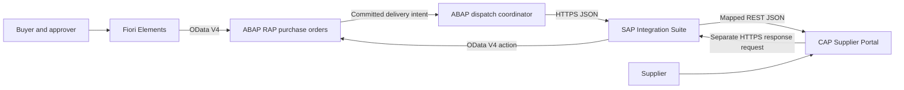

# Procurement Integration Hub

A guided SAP portfolio project connecting a custom procurement application to an external supplier portal.

**Phase 4 is under way: the CAP Supplier Portal foundation and domain model are locally runtime-verified.** `cap-supplier-portal` installs, typechecks, tests and starts on CAP 10 / Node.js 22 with TypeScript, and deploys `Suppliers`, `Orders` and composed `OrderItems` to SQLite with synthetic fixtures. It has no business API and no contact with SAP; ingestion, supplier decisions and the supplier UI are Phases 4.3 to 4.5. This is local Node.js execution evidence, a different and weaker claim than the SAP runtime evidence behind Phases 1 to 3. See the [Phase 4.1](cap-supplier-portal/docs/phase-4-1-cap-foundation.md) and [Phase 4.2](cap-supplier-portal/docs/phase-4-2-domain-model.md) guides.

**Phase 3.2 is SAP runtime-verified — a Fiori Elements app runs on the live OData V4 endpoint.** Two `#CUSTOMER` metadata extensions give the List Report four columns (Purchase Order, Supplier, Status, Total Amount in EUR) and a Filter Bar, and the Object Page a business-value title, a ten-field General Information section and an Items table showing quantities as `2 EA` and amounts as `1,500.00 EUR` — units and currency carried by CDS semantics alone, with no annotation for either. See the [Phase 3.2 guide](abap-rap/docs/phase-3-2-ui-annotations.md).

**Phase 3.1 is SAP runtime-verified — the purchase order BO is live on an OData V4 endpoint.** Service definition `ZJP_UI_PURCHASEORDER` and binding `ZJP_UI_PURCHASEORDER_O4` expose `PurchaseOrders` and `PurchaseOrderItems` with draft, `$expand` navigation and the five bound business actions, and the Phase 2 handlers enforce every rule unchanged — an already-approved order rejected over HTTP returns the same text the console test asserts. See the [Phase 3.1 guide](abap-rap/docs/phase-3-1-odata-service-exposure.md). Phase 2 remains complete and runtime-verified through 2.7E. The purchase-order lifecycle runs `DRAFT` → `SUBMITTED` → `APPROVED` or `REJECTED` through the root actions `submit`, `approve` and `reject`, with a mandatory reason on rejection and `RejectionOrigin = APPROVER`, and the root action `cancel` carries `DRAFT`, `SUBMITTED` or `APPROVED` to the terminal `CANCELLED`. All four are active-instance only and refuse technical drafts. Commercial content is editable only while business `Status` is `DRAFT`: once an order leaves that state, root and item commercial updates, adding items by association and `removeItem` are all rejected by RAP prechecks, on active and technical draft instances alike — `CANCELLED` is covered by that same invariant with no new code. Business `Status = 'DRAFT'` stays distinct from RAP technical draft state. Authorization is still a permissive study stub, so `approve` and `cancel` name transitions and not access controls. `APPROVED` → `CANCELLED` has no delivery-request guard because no Phase 2 capability can make that condition reachable; it belongs with `DeliveryIntent` in Phase 5. Physical root `DELETE` is restricted to `DRAFT`, and `PurchaseOrderNumber` is allocated on a successful `submit` as `PO` plus eight digits from number range object `ZJP_PO` — never on create or save, and never through a determination, so an order cancelled straight from `DRAFT` carries no number. `sendToSupplier` belongs to Phase 5 and is outside Phase 2.

Published repository: [Procurement Integration Hub on GitHub](https://github.com/joaopedromribeiro/procurement-integration-hub). The local main branch tracks origin/main. New working-tree edits must be committed and pushed before they appear on GitHub.

## Project overview

The planned solution lets a buyer create and submit a purchase order, an approver release it, and a supplier accept or reject it through a separate portal. SAP remains responsible for procurement rules; the supplier portal records supplier decisions; SAP Integration Suite mediates the exchange.

This is a custom learning business object. It does not create standard SAP MM purchase orders, update SAP standard tables, or implement a complete procure-to-pay process.

## Business problem

Procurement teams need reliable visibility into supplier acknowledgements without manually copying data between systems. Different API structures, delayed responses, duplicate requests, and unavailable suppliers make this an integration problem as well as an application-development problem.

## Architecture



The RAP purchase-order service and Fiori Elements buyer UI are implemented through Phase 3. The dispatcher, CAP portal and integration components remain planned for the later phases below; Phase 4 has begun that work, and the CAP Supplier Portal already runs locally as a standalone application with its own persistence. Phase 5 connects the dispatcher and CAP directly for testing. Phase 6 introduces Cloud Integration. Phase 9 adds SAP Event Mesh. Supplier decisions happen later in a separate request; an HTTP connection never waits for human approval.

## Technology stack

| Planned technology | Intended evidence | Status |
| --- | --- | --- |
| ABAP Cloud and CDS view entities | Activated tables and composed CDS model | Phase 1 complete; successful ADT activation reported by learner |
| Managed RAP and EML | BO behavior and ABAP runtime checks | CRUD/composition, validations, determinations, technical draft and ownership-safe active/draft `removeItem` verified in SAP |
| OData V4, SAP Fiori Elements | Service metadata and buyer UI demonstration | Phase 3 complete; SAP runtime-verified |
| SAP CAP, Node.js, TypeScript, CDS, SQLite | Running portal API and handler tests | Phases 4.1–4.2 locally runtime-verified; portal API is phases 4.3–4.4 |
| REST, JSON | Direct round trip with receipts and supplier response | Planned, phase 5 |
| SAP BTP Integration Suite, Cloud Integration, XML mapping | Deployed iFlows and message processing evidence | Planned, phase 6 |
| Error handling and monitoring | Fault-injection and recovery demonstrations | Planned, phase 7 |
| OAuth 2.0, XSUAA, destinations, authorization | Positive and negative security tests | Planned, phase 8 |
| SAP Event Mesh | Deployed queues, event delivery and duplicate tests | Planned, phase 9 |
| API Management | Deployed proxy and policy verification | Planned, phase 10 |
| SAP HANA Cloud and BTP Cloud Foundry | Optional deployment evidence | Conditional on access |

Clean Core is a design constraint throughout. A mock demonstrates the contract or pattern it exercises; it does not demonstrate hands-on use of the SAP service it represents.

## Business flow

1. Buyer creates a draft, enters a supplier and items, and saves an active order.
2. Buyer submits the active order; the application validates it and freezes commercial data.
3. Approver approves or rejects the submission.
4. Buyer requests delivery of an approved order; a committed snapshot is sent to the portal.
5. Portal stores the order and returns a receipt. SAP marks the order `SENT`.
6. Supplier accepts or rejects the order and may provide an estimated delivery date on acceptance.
7. A separate return request updates SAP to `CONFIRMED` or `REJECTED`.
8. Technical failures retain enough information for diagnosis, reconciliation, and controlled retry.

## ABAP RAP architecture

Managed, draft-enabled header/item composition over custom persistence; root and child CDS view entities; UI and integration projections; behavior definitions and implementations; service definitions and OData V4 bindings. EML is the internal BO interface. See [architecture](ARCHITECTURE.md) and [domain model](docs/architecture/domain-model.md).

## CAP architecture

CAP CDS models describe Suppliers, Orders, and composed OrderItems. TypeScript handlers enforce ingestion, supplier decisions, and row-level supplier access. SQLite supports local development; portable CDS and queries prepare for a later HANA Cloud deployment. Integration and supplier-facing services have separate permissions. The project runs locally and its persistence exists: [Phase 4.1](cap-supplier-portal/docs/phase-4-1-cap-foundation.md) delivered the CAP 10 / Node.js 22 / TypeScript foundation and [Phase 4.2](cap-supplier-portal/docs/phase-4-2-domain-model.md) the `pih.portal` domain model, implementing the CAP field set specified in the [domain model](docs/architecture/domain-model.md) rather than copying the SAP tables. The ingestion contract and the supplier decision API are Phases 4.3 and 4.4.

## Integration Suite flow

Two Cloud Integration iFlows mediate order delivery and supplier responses. The proposed outbound design uses an HTTPS sender, Content Modifier, JSON/XML conversion, XML validation, Router, graphical Message Mapping, JSON conversion, and HTTP receiver. REST is the API style; the Cloud Integration receiver adapter used here is HTTP. Groovy will be added only if a documented requirement cannot be handled clearly with standard steps.

## API contracts

[API_CONTRACTS.md](API_CONTRACTS.md) defines the boundaries, a realistic field mapping, request identities, and error behavior. The buyer-facing RAP OData V4 service is real: Phase 3.1 produced `ZJP_UI_PURCHASEORDER` and binding `ZJP_UI_PURCHASEORDER_O4`, and its service root, entity sets and bound actions are recorded there from the generated metadata. Every other route in that document remains a design target rather than a callable endpoint.

## Security

Production target: HTTPS, authenticated machine clients, supplier-scoped authorization, buyer/approver roles, and separately protected operational actions. Phase 8 adds OAuth and platform configuration. Earlier hosted tests must still use the authentication required by the host; unauthenticated development is restricted to local execution.

## Error handling

Delivery IDs and immutable snapshots make retry safe. A timeout means the delivery result is unknown. Supplier rejection is a business outcome, not a transport error. See [error policy](API_CONTRACTS.md#error-policy).

## Event-driven architecture

Phase 9 will replace the delivery trigger with committed RAP business events, SAP Event Mesh queues, and integration consumers. HTTP receipt and business-response semantics remain distinct. Event contracts, durable publication, idempotency, eventual consistency, and dead-letter recovery are designed in [ARCHITECTURE.md](ARCHITECTURE.md).

## How to run

The full RAP business object, its OData V4 service and a Fiori Elements List Report and Object Page are activated and runtime-verified in the learner's SAP system. The service root is recorded in [API_CONTRACTS.md](API_CONTRACTS.md), and the UI opens from Fiori Elements Preview on service binding `ZJP_UI_PURCHASEORDER_O4`, entity set `PurchaseOrders`. The [Phase 1 ADT guide](abap-rap/docs/phase-1-domain-model.md) contains the manual reproduction steps and confirmed compatibility fixes for the domain model, and each later phase guide does the same for its own objects. The source files are not a serialized ABAP import package. The ABAP side needs no npm installation.

The CAP Supplier Portal now runs locally. `cd cap-supplier-portal && npm ci && npm run typecheck && npm test && npm start` starts CAP on `http://localhost:4004`, where `GET /health/ping` answers `{"status":"UP", ...}`. [Phase 4.1](cap-supplier-portal/docs/phase-4-1-cap-foundation.md) built that foundation and [Phase 4.2](cap-supplier-portal/docs/phase-4-2-domain-model.md) added the portal's own persistence — `Suppliers`, `Orders` and composed `OrderItems` deploying to SQLite with synthetic fixtures. There is still no business API: the entities are reachable by query and by nothing else, and the ingestion and supplier surfaces are Phases 4.3 and 4.4. Node.js 22 or later is required. The portal does not contact SAP in Phase 4.

The [Phase 2.5A guide](abap-rap/docs/phase-2-5a-supplier-validation.md) records the successful Supplier-validation evidence. The [Phase 2.5B guide](abap-rap/docs/phase-2-5b-quantity-validation.md) contains the Quantity-validation source and SAP runtime test procedure; the successful SAP execution evidence is recorded.

The [Phase 0 review exercise](docs/phase-0-review.md) remains available as architecture background. The Phase 0 ZIP is an archived foundation snapshot and does not contain Phase 1 changes.

For future setup, consult [environments and services](docs/environments.md). Each implementation phase will add its own verified run instructions.

## Repository layout

```text
procurement-integration-hub/
  abap-rap/{cds,behavior,classes,service,persistence,docs}/
  cap-supplier-portal/{db,srv,app,test,docs}/
  integration-suite/{iflows,mappings,groovy,payloads,docs}/
  event-mesh/{docs,payloads}/
  api-management/docs/
  docs/{architecture,diagrams,screenshots}/
  README.md
  ARCHITECTURE.md
  API_CONTRACTS.md
  PROJECT_STATUS.md
  LEARNINGS.md
```

Empty directories are reserved with `.gitkeep`. Component READMEs explain the intended contents. The ABAP folders are a navigation plan; the actual serialization and package mapping will be selected for the target system before export.

## Screenshots

No runtime screenshots yet. Verified screenshots will be added under `docs/screenshots/` with the environment, phase, and scenario identified. Architecture diagrams are designs, not execution evidence.

## Project roadmap

| Phase | Deliverable | Completion gate |
| --- | --- | --- |
| 0 | Architecture and repository | Consistent documents and walkthrough |
| 1 | RAP domain model | Tables and CDS activate; composition can be inspected |
| 2 | RAP behavior | EML tests verify totals, draft lifecycle and transitions |
| 3 | OData V4 and Fiori Elements | Buyer flow works through generated service and UI |
| 4 | CAP Supplier Portal | API handlers and minimal supplier UI work locally |
| 5 | Direct RAP–CAP integration | Delivery and return response work with stable identities |
| 6 | Integration Suite | Both deployed iFlows transform and route correctly |
| 7 | Error handling and monitoring | Fault matrix, retries and reconciliation demonstrated |
| 8 | Authentication and security | OAuth and supplier isolation verified |
| 9 | Event Mesh | Committed events, duplicates and dead-letter recovery verified |
| 10 | API Management | Proxy authentication, throttling and routing verified |
| 11 | Tests and portfolio presentation | Evidence-backed README, diagrams, screenshots and lessons |

Phases 0 and 1, the whole of Phase 2 through 2.7E, and Phase 3 through 3.2 are complete within their documented scope, and Phase 4 is under way. [Phase 2.6](abap-rap/docs/phase-2-6-technical-draft.md) is SAP runtime-verified for active, saved-draft and buffer-only draft item removal. [Phase 2.7A](abap-rap/docs/phase-2-7a-submit-action.md) is SAP runtime-verified for the active `DRAFT` → `SUBMITTED` transition. [Phase 2.7B](abap-rap/docs/phase-2-7b-post-submission-immutability.md) added precheck-enforced commercial immutability, [Phase 2.7C](abap-rap/docs/phase-2-7c-approve-reject.md) is SAP runtime-verified for the `approve` and `reject` transitions and for the lifecycle invariant that makes every state after `DRAFT` immutable, and [Phase 2.7D-1](abap-rap/docs/phase-2-7d-1-cancel-action.md) is SAP runtime-verified for the `cancel` transitions into the terminal `CANCELLED`. [Phase 2.7D-2](abap-rap/docs/phase-2-7d-1-cancel-action.md#phase-27d-2-root-delete-narrowed-to-draft-runtime-verified) narrowed physical root `DELETE` to `DRAFT` and [Phase 2.7E](abap-rap/docs/phase-2-7e-purchase-order-number.md) allocates `PurchaseOrderNumber` on a successful `submit`; both are SAP runtime-verified, and they close Phase 2. [Phase 3.1](abap-rap/docs/phase-3-1-odata-service-exposure.md) is SAP runtime-verified for OData V4 exposure, and [Phase 3.2](abap-rap/docs/phase-3-2-ui-annotations.md) is SAP runtime-verified for the Fiori Elements List Report, Filter Bar, header info, General Information facet and Items facet. [Phase 4.1](cap-supplier-portal/docs/phase-4-1-cap-foundation.md) and [Phase 4.2](cap-supplier-portal/docs/phase-4-2-domain-model.md) are locally runtime-verified for the CAP project foundation and its persistence model — local Node.js execution evidence, not SAP evidence. `sendToSupplier`, Phase 4.3 onwards and Phases 5–11 remain unstarted.

## Lessons learned

See [LEARNINGS.md](LEARNINGS.md) for studied and practiced concepts, and [PROJECT_STATUS.md](PROJECT_STATUS.md) for evidence and remaining work. Current portfolio wording: “Implemented a managed RAP purchase-order BO in SAP S/4HANA with header/item CDS composition and managed UUID numbering; runtime-verified CRUD, EML, determinations, validations, technical RAP draft, ownership-protected item removal for active and draft instances, an active-only submit transition with state and content preconditions, precheck-enforced lifecycle immutability for header, items and item removal, approver approve/reject decisions with a recorded rejection reason, a cancel transition into a terminal state, physical deletion restricted to draft orders, and human-readable purchase-order numbers allocated from a number range on submission; then exposed the object as an OData V4 service and built a Fiori Elements List Report and Object Page over it through metadata extensions.” The CAP supplier portal is under way but early: Phase 4.1 delivered a running, tested CAP foundation and Phase 4.2 its portable persistence model, with no business API on either. Supplier dispatch and the integrations remain unimplemented — `sendToSupplier` and `DeliveryIntent` are Phase 5, the CAP portal API and the Integration Suite work are not built, RAP authorization is still a permissive study stub, and stale-ETag and multi-user concurrency are untested.

Technical references are collected in [SAP sources](docs/architecture/references.md).
