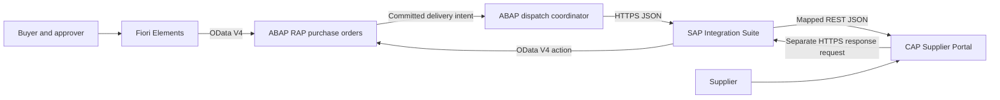

# Procurement Integration Hub

A guided SAP portfolio project connecting a custom procurement application to an external supplier portal.

**Current milestone: Phase 2.6 is SAP runtime-verified complete.** Technical RAP draft is enabled, and root-bound `removeItem` is the supported ownership-safe item deletion path for active and draft instances. It keeps business `Status = 'DRAFT'` distinct from RAP technical draft state. Phase 2.7 has not started.

Published repository: [Procurement Integration Hub on GitHub](https://github.com/joaopedromribeiro/procurement-integration-hub). The local main branch tracks origin/main. New working-tree edits must be committed and pushed before they appear on GitHub.

## Project overview

The planned solution lets a buyer create and submit a purchase order, an approver release it, and a supplier accept or reject it through a separate portal. SAP remains responsible for procurement rules; the supplier portal records supplier decisions; SAP Integration Suite mediates the exchange.

This is a custom learning business object. It does not create standard SAP MM purchase orders, update SAP standard tables, or implement a complete procure-to-pay process.

## Business problem

Procurement teams need reliable visibility into supplier acknowledgements without manually copying data between systems. Different API structures, delayed responses, duplicate requests, and unavailable suppliers make this an integration problem as well as an application-development problem.

## Architecture



All runtime components above are planned. Phase 5 connects the dispatcher and CAP directly for testing. Phase 6 introduces Cloud Integration. Phase 9 adds SAP Event Mesh. Supplier decisions happen later in a separate request; an HTTP connection never waits for human approval.

## Technology stack

| Planned technology | Intended evidence | Status |
| --- | --- | --- |
| ABAP Cloud and CDS view entities | Activated tables and composed CDS model | Phase 1 complete; successful ADT activation reported by learner |
| Managed RAP and EML | BO behavior and ABAP runtime checks | CRUD/composition, validations, determinations, technical draft and ownership-safe active/draft `removeItem` verified in SAP |
| OData V4, SAP Fiori Elements | Service metadata and buyer UI demonstration | Planned, phase 3 |
| SAP CAP, Node.js, TypeScript, CDS, SQLite | Running portal API and handler tests | Planned, phase 4 |
| REST, JSON | Direct round trip with receipts and supplier response | Planned, phase 5 |
| SAP BTP Integration Suite, Cloud Integration, XML mapping | Deployed iFlows and message processing evidence | Planned, phase 6 |
| Error handling and monitoring | Fault-injection and recovery demonstrations | Planned, phase 7 |
| OAuth 2.0, XSUAA, destinations, authorization | Positive and negative security tests | Planned, phase 8 |
| SAP Event Mesh | Deployed queues, event delivery and duplicate tests | Planned, phase 9 |
| API Management | Deployed proxy and policy verification | Planned, phase 10 |
| SAP HANA Cloud and BTP Cloud Foundry | Optional deployment evidence | Conditional on access |

Clean Core is a design constraint throughout. A mock demonstrates the contract or pattern it exercises; it does not demonstrate hands-on use of the SAP service it represents.

## Business flow

1. Buyer creates a draft, enters a supplier and items, and saves an active order.
2. Buyer submits the active order; the application validates it and freezes commercial data.
3. Approver approves or rejects the submission.
4. Buyer requests delivery of an approved order; a committed snapshot is sent to the portal.
5. Portal stores the order and returns a receipt. SAP marks the order `SENT`.
6. Supplier accepts or rejects the order and may provide an estimated delivery date on acceptance.
7. A separate return request updates SAP to `CONFIRMED` or `REJECTED`.
8. Technical failures retain enough information for diagnosis, reconciliation, and controlled retry.

## ABAP RAP architecture

Managed, draft-enabled header/item composition over custom persistence; root and child CDS view entities; UI and integration projections; behavior definitions and implementations; service definitions and OData V4 bindings. EML is the internal BO interface. See [architecture](ARCHITECTURE.md) and [domain model](docs/architecture/domain-model.md).

## CAP architecture

CAP CDS models describe Suppliers, Orders, and composed OrderItems. TypeScript handlers enforce ingestion, supplier decisions, and row-level supplier access. SQLite supports local development; portable CDS and queries prepare for a later HANA Cloud deployment. Integration and supplier-facing services have separate permissions.

## Integration Suite flow

Two Cloud Integration iFlows mediate order delivery and supplier responses. The proposed outbound design uses an HTTPS sender, Content Modifier, JSON/XML conversion, XML validation, Router, graphical Message Mapping, JSON conversion, and HTTP receiver. REST is the API style; the Cloud Integration receiver adapter used here is HTTP. Groovy will be added only if a documented requirement cannot be handled clearly with standard steps.

## API contracts

[API_CONTRACTS.md](API_CONTRACTS.md) defines proposed boundaries, a realistic field mapping, request identities, and error behavior. Routes are design targets, not callable endpoints. Actual RAP paths will be taken from generated service metadata in Phase 3.

## Security

Production target: HTTPS, authenticated machine clients, supplier-scoped authorization, buyer/approver roles, and separately protected operational actions. Phase 8 adds OAuth and platform configuration. Earlier hosted tests must still use the authentication required by the host; unauthenticated development is restricted to local execution.

## Error handling

Delivery IDs and immutable snapshots make retry safe. A timeout means the delivery result is unknown. Supplier rejection is a business outcome, not a transport error. See [error policy](API_CONTRACTS.md#error-policy).

## Event-driven architecture

Phase 9 will replace the delivery trigger with committed RAP business events, SAP Event Mesh queues, and integration consumers. HTTP receipt and business-response semantics remain distinct. Event contracts, durable publication, idempotency, eventual consistency, and dead-letter recovery are designed in [ARCHITECTURE.md](ARCHITECTURE.md).

## How to run

The six domain-model objects have been activated in the learner's SAP system; there is no transactional application or OData service yet. The [Phase 1 ADT guide](abap-rap/docs/phase-1-domain-model.md) contains the manual reproduction steps and confirmed compatibility fixes. The source files are not a serialized ABAP import package. No npm installation is needed.

The [Phase 2.5A guide](abap-rap/docs/phase-2-5a-supplier-validation.md) records the successful Supplier-validation evidence. The [Phase 2.5B guide](abap-rap/docs/phase-2-5b-quantity-validation.md) contains the Quantity-validation source and SAP runtime test procedure; the successful SAP execution evidence is recorded.

The [Phase 0 review exercise](docs/phase-0-review.md) remains available as architecture background. The Phase 0 ZIP is an archived foundation snapshot and does not contain Phase 1 changes.

For future setup, consult [environments and services](docs/environments.md). Each implementation phase will add its own verified run instructions.

## Repository layout

```text
procurement-integration-hub/
  abap-rap/{cds,behavior,classes,service,persistence,docs}/
  cap-supplier-portal/{db,srv,app,test}/
  integration-suite/{iflows,mappings,groovy,payloads,docs}/
  event-mesh/{docs,payloads}/
  api-management/docs/
  docs/{architecture,diagrams,screenshots}/
  README.md
  ARCHITECTURE.md
  API_CONTRACTS.md
  PROJECT_STATUS.md
  LEARNINGS.md
```

Empty directories are reserved with `.gitkeep`. Component READMEs explain the intended contents. The ABAP folders are a navigation plan; the actual serialization and package mapping will be selected for the target system before export.

## Screenshots

No runtime screenshots yet. Verified screenshots will be added under `docs/screenshots/` with the environment, phase, and scenario identified. Architecture diagrams are designs, not execution evidence.

## Project roadmap

| Phase | Deliverable | Completion gate |
| --- | --- | --- |
| 0 | Architecture and repository | Consistent documents and walkthrough |
| 1 | RAP domain model | Tables and CDS activate; composition can be inspected |
| 2 | RAP behavior | EML tests verify totals, draft lifecycle and transitions |
| 3 | OData V4 and Fiori Elements | Buyer flow works through generated service and UI |
| 4 | CAP Supplier Portal | API handlers and minimal supplier UI work locally |
| 5 | Direct RAP–CAP integration | Delivery and return response work with stable identities |
| 6 | Integration Suite | Both deployed iFlows transform and route correctly |
| 7 | Error handling and monitoring | Fault matrix, retries and reconciliation demonstrated |
| 8 | Authentication and security | OAuth and supplier isolation verified |
| 9 | Event Mesh | Committed events, duplicates and dead-letter recovery verified |
| 10 | API Management | Proxy authentication, throttling and routing verified |
| 11 | Tests and portfolio presentation | Evidence-backed README, diagrams, screenshots and lessons |

Phases 0 and 1 and Phase 2.1–2.6 are complete within their documented scope. [Phase 2.6](abap-rap/docs/phase-2-6-technical-draft.md) is SAP runtime-verified, including active, saved-draft and buffer-only draft item removal, ownership rejection and total recalculation. Phase 2.7 business actions and Phases 3–11 remain unstarted.

## Lessons learned

See [LEARNINGS.md](LEARNINGS.md) for studied and practiced concepts, and [PROJECT_STATUS.md](PROJECT_STATUS.md) for evidence and remaining work. Current portfolio wording: “Implemented a managed RAP purchase-order BO in SAP S/4HANA with header/item CDS composition and managed UUID numbering; verified CRUD, create-by-association, transactional buffering, EML commits and composition cleanup in the SAP runtime.” This does not claim determinations, validations, draft, business actions or integrations.

Technical references are collected in [SAP sources](docs/architecture/references.md).
