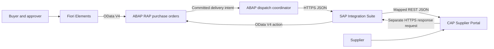

# Procurement Integration Hub

A guided SAP portfolio project connecting a custom procurement application to an external supplier portal.

**Phase 4 is complete: the CAP Supplier Portal is built, locally runtime-verified and closed.** `cap-supplier-portal` installs, typechecks, tests and starts on CAP 10 / Node.js 22 with TypeScript; it ingests purchase-order snapshots idempotently at `POST /rest/integration/v1/Orders`, serves a browser UI at `http://localhost:4004/` where a supplier sees only its own orders and can accept, reject or re-date them, and writes every decision together with a pending outbound response in one transaction. [Phase 4.6](cap-supplier-portal/docs/phase-4-6-closure.md) closed the phase with a clean-install re-verification — 87 tests in 20 suites, 0 fail — a live smoke test across all four surfaces, and a contract reconciliation that found no implementation defect. **Nothing is sent to SAP.** Phase 5 connects the two systems and is open at [5.1](abap-rap/docs/phase-5-1-outbound-foundation.md), which is design and evidence review only — no ABAP object was created, no HTTP request was made in either direction, nothing was deployed, and nothing about it is runtime-verified. It found that SAP cannot reach CAP at all today, that the released ABAP outbound HTTP API set is unknown, and that `OrderRevision` is `0` on every SAP row while CAP requires a revision of at least 1; seven blockers and twelve ADT probes are recorded there. Supplier isolation is enforced server-side from the authenticated user's attributes, which is local mock sign-in and **not production authentication**, and no concurrent race has been exercised on either service. This is local Node.js execution evidence, a different and weaker claim than the SAP runtime evidence behind Phases 1 to 3. See the [Phase 4.1](cap-supplier-portal/docs/phase-4-1-cap-foundation.md), [4.2](cap-supplier-portal/docs/phase-4-2-domain-model.md), [4.3](cap-supplier-portal/docs/phase-4-3-integration-ingestion.md), [4.4](cap-supplier-portal/docs/phase-4-4-supplier-service.md), [4.5](cap-supplier-portal/docs/phase-4-5-supplier-ui.md) and [4.6](cap-supplier-portal/docs/phase-4-6-closure.md) guides.

**Phase 3.2 is SAP runtime-verified — a Fiori Elements app runs on the live OData V4 endpoint.** Two `#CUSTOMER` metadata extensions give the List Report four columns (Purchase Order, Supplier, Status, Total Amount in EUR) and a Filter Bar, and the Object Page a business-value title, a ten-field General Information section and an Items table showing quantities as `2 EA` and amounts as `1,500.00 EUR` — units and currency carried by CDS semantics alone, with no annotation for either. See the [Phase 3.2 guide](abap-rap/docs/phase-3-2-ui-annotations.md).

**Phase 3.1 is SAP runtime-verified — the purchase order BO is live on an OData V4 endpoint.** Service definition `ZJP_UI_PURCHASEORDER` and binding `ZJP_UI_PURCHASEORDER_O4` expose `PurchaseOrders` and `PurchaseOrderItems` with draft, `$expand` navigation and the five bound business actions, and the Phase 2 handlers enforce every rule unchanged — an already-approved order rejected over HTTP returns the same text the console test asserts. See the [Phase 3.1 guide](abap-rap/docs/phase-3-1-odata-service-exposure.md). Phase 2 remains complete and runtime-verified through 2.7E. The purchase-order lifecycle runs `DRAFT` → `SUBMITTED` → `APPROVED` or `REJECTED` through the root actions `submit`, `approve` and `reject`, with a mandatory reason on rejection and `RejectionOrigin = APPROVER`, and the root action `cancel` carries `DRAFT`, `SUBMITTED` or `APPROVED` to the terminal `CANCELLED`. All four are active-instance only and refuse technical drafts. Commercial content is editable only while business `Status` is `DRAFT`: once an order leaves that state, root and item commercial updates, adding items by association and `removeItem` are all rejected by RAP prechecks, on active and technical draft instances alike — `CANCELLED` is covered by that same invariant with no new code. Business `Status = 'DRAFT'` stays distinct from RAP technical draft state. Authorization is still a permissive study stub, so `approve` and `cancel` name transitions and not access controls. `APPROVED` → `CANCELLED` has no delivery-request guard because no Phase 2 capability can make that condition reachable; it belongs with `DeliveryIntent` in Phase 5. Physical root `DELETE` is restricted to `DRAFT`, and `PurchaseOrderNumber` is allocated on a successful `submit` as `PO` plus eight digits from number range object `ZJP_PO` — never on create or save, and never through a determination, so an order cancelled straight from `DRAFT` carries no number. `sendToSupplier` belongs to Phase 5 and is outside Phase 2.

Published repository: [Procurement Integration Hub on GitHub](https://github.com/joaopedromribeiro/procurement-integration-hub). The local main branch tracks origin/main. New working-tree edits must be committed and pushed before they appear on GitHub.

## Project overview

The planned solution lets a buyer create and submit a purchase order, an approver release it, and a supplier accept or reject it through a separate portal. SAP remains responsible for procurement rules; the supplier portal records supplier decisions; SAP Integration Suite mediates the exchange.

This is a custom learning business object. It does not create standard SAP MM purchase orders, update SAP standard tables, or implement a complete procure-to-pay process.

## Business problem

Procurement teams need reliable visibility into supplier acknowledgements without manually copying data between systems. Different API structures, delayed responses, duplicate requests, and unavailable suppliers make this an integration problem as well as an application-development problem.

## Architecture



The RAP purchase-order service and Fiori Elements buyer UI are implemented through Phase 3. The dispatcher, CAP portal and integration components remain planned for the later phases below; Phase 4 has begun that work, and the CAP Supplier Portal already runs locally as a standalone application with its own persistence and a working ingestion API. Phase 5 connects the dispatcher and CAP directly for testing. Phase 6 introduces Cloud Integration. Phase 9 adds SAP Event Mesh. Supplier decisions happen later in a separate request; an HTTP connection never waits for human approval.

## Technology stack

| Planned technology | Intended evidence | Status |
| --- | --- | --- |
| ABAP Cloud and CDS view entities | Activated tables and composed CDS model | Phase 1 complete; successful ADT activation reported by learner |
| Managed RAP and EML | BO behavior and ABAP runtime checks | CRUD/composition, validations, determinations, technical draft and ownership-safe active/draft `removeItem` verified in SAP |
| OData V4, SAP Fiori Elements | Service metadata and buyer UI demonstration | Phase 3 complete; SAP runtime-verified |
| SAP CAP, Node.js, TypeScript, CDS, SQLite | Running portal API and handler tests | Phase 4 complete; locally runtime-verified |
| SAP HANA Cloud, HDI | Deployed schema and queries running on HANA | Configured for the production profile with a generated HDI deployer; **not deployed, not bound, not runtime-verified** |
| REST, JSON | Direct round trip with receipts and supplier response | Planned, phase 5 |
| SAP BTP Integration Suite, Cloud Integration, graphical message mapping, OAuth 2.0 receiver, exception handling | Deployed iFlows and message processing evidence | **Phases 6.1 to 6.4 runtime-verified** — `PIH_OrderDelivery_v1` deployed in a dedicated subaccount, with a Graphical Message Mapping at semantic parity with the ABAP mapper, a Request Reply call to the protected CAP service over OAuth 2.0 client credentials, truthful downstream error propagation and an Exception Subprocess returning a controlled `502`. **SAP is cut over**: the ABAP coordinator delivers through Cloud Integration, verified with a real `201`, `200` replay and `409`. The inbound supplier response is Phase 6.5 and is not built |
| Error handling and monitoring | Fault-injection and recovery demonstrations | Planned, phase 7 |
| OAuth 2.0, XSUAA, destinations, authorization | Positive and negative security tests | Planned, phase 8 |
| SAP Event Mesh | Deployed queues, event delivery and duplicate tests | Planned, phase 9 |
| API Management | Deployed proxy and policy verification | Planned, phase 10 |
| SAP HANA Cloud and BTP Cloud Foundry | Optional deployment evidence | Conditional on access |

Clean Core is a design constraint throughout. A mock demonstrates the contract or pattern it exercises; it does not demonstrate hands-on use of the SAP service it represents.

## Business flow

1. Buyer creates a draft, enters a supplier and items, and saves an active order.
2. Buyer submits the active order; the application validates it and freezes commercial data.
3. Approver approves or rejects the submission.
4. Buyer requests delivery of an approved order; a committed snapshot is sent to the portal.
5. Portal stores the order and returns a receipt. SAP marks the order `SENT`.
6. Supplier accepts or rejects the order and may provide an estimated delivery date on acceptance.
7. A separate return request updates SAP to `CONFIRMED` or `REJECTED`.
8. Technical failures retain enough information for diagnosis, reconciliation, and controlled retry.

## ABAP RAP architecture

Managed, draft-enabled header/item composition over custom persistence; root and child CDS view entities; UI and integration projections; behavior definitions and implementations; service definitions and OData V4 bindings. EML is the internal BO interface. See [architecture](ARCHITECTURE.md) and [domain model](docs/architecture/domain-model.md).

## CAP architecture

CAP CDS models describe Suppliers, Orders, and composed OrderItems. TypeScript handlers enforce ingestion, supplier decisions, and row-level supplier access. SQLite supports local development; portable CDS and queries prepare for a later HANA Cloud deployment. Integration and supplier-facing services have separate permissions. All of that now runs: [Phase 4.1](cap-supplier-portal/docs/phase-4-1-cap-foundation.md) delivered the CAP 10 / Node.js 22 / TypeScript foundation, [Phase 4.2](cap-supplier-portal/docs/phase-4-2-domain-model.md) the `pih.portal` domain model implementing the CAP field set specified in the [domain model](docs/architecture/domain-model.md) rather than copying the SAP tables, [Phase 4.3](cap-supplier-portal/docs/phase-4-3-integration-ingestion.md) the integration-facing ingestion service, [Phase 4.4](cap-supplier-portal/docs/phase-4-4-supplier-service.md) the supplier-facing service with scoped reads and bound decision actions, and [Phase 4.5](cap-supplier-portal/docs/phase-4-5-supplier-ui.md) a frameworkless browser UI over it, and [Phase 4.6](cap-supplier-portal/docs/phase-4-6-closure.md) closed the phase with a consolidated verification.

## Integration Suite flow

Two Cloud Integration iFlows mediate order delivery and supplier responses. The proposed outbound design uses an HTTPS sender, Content Modifier, JSON/XML conversion, XML validation, Router, graphical Message Mapping, JSON conversion, and HTTP receiver. REST is the API style; the Cloud Integration receiver adapter used here is HTTP. Groovy will be added only if a documented requirement cannot be handled clearly with standard steps.

## API contracts

[API_CONTRACTS.md](API_CONTRACTS.md) defines the boundaries, a realistic field mapping, request identities, and error behavior. Several of its routes are now real. The buyer-facing RAP OData V4 service is SAP runtime-verified: Phase 3.1 produced `ZJP_UI_PURCHASEORDER` and binding `ZJP_UI_PURCHASEORDER_O4`, and its service root, entity sets and bound actions are recorded there from the generated metadata. The CAP ingestion endpoint `POST /rest/integration/v1/Orders` is implemented and locally verified in Phase 4.3, and the supplier routes — the order list and detail, plus `accept`, `reject` and `updateEstimatedDeliveryDate` — in Phase 4.4. The remaining routes, all of which cross a system boundary this project has not built yet, stay design targets rather than callable endpoints.

## Security

Production target: HTTPS, authenticated machine clients, supplier-scoped authorization, buyer/approver roles, and separately protected operational actions. Phase 8 adds OAuth and platform configuration. Earlier hosted tests must still use the authentication required by the host; unauthenticated development is restricted to local execution.

## Error handling

Delivery IDs and immutable snapshots make retry safe. A timeout means the delivery result is unknown. Supplier rejection is a business outcome, not a transport error. See [error policy](API_CONTRACTS.md#error-policy).

## Event-driven architecture

Phase 9 will replace the delivery trigger with committed RAP business events, SAP Event Mesh queues, and integration consumers. HTTP receipt and business-response semantics remain distinct. Event contracts, durable publication, idempotency, eventual consistency, and dead-letter recovery are designed in [ARCHITECTURE.md](ARCHITECTURE.md).

## How to run

The full RAP business object, its OData V4 service and a Fiori Elements List Report and Object Page are activated and runtime-verified in the learner's SAP system. The service root is recorded in [API_CONTRACTS.md](API_CONTRACTS.md), and the UI opens from Fiori Elements Preview on service binding `ZJP_UI_PURCHASEORDER_O4`, entity set `PurchaseOrders`. The [Phase 1 ADT guide](abap-rap/docs/phase-1-domain-model.md) contains the manual reproduction steps and confirmed compatibility fixes for the domain model, and each later phase guide does the same for its own objects. The source files are not a serialized ABAP import package. The ABAP side needs no npm installation.

The CAP Supplier Portal runs locally and **is deployed to SAP BTP Cloud Foundry**. Locally, `cd cap-supplier-portal && npm ci && npm run typecheck && npm test && npm run watch` serves CAP on `http://localhost:4004` with SQLite in memory — **`npm run watch` is the TypeScript development command; `npm start` is the production command** (`cds-serve`) and does not register a TypeScript runtime. The deployed application runs on SAP HANA through the existing `pih-hdi` container with XSUAA enforcing two named roles, at [`0badc38dtrial-dev-cap-supplier-portal-srv.cfapps.us10-003.hana.ondemand.com`](https://0badc38dtrial-dev-cap-supplier-portal-srv.cfapps.us10-003.hana.ondemand.com); every route is authenticated and anonymous requests get 401. **No business order has yet been written to HANA**, so HANA runtime behaviour remains unverified — see [Deployed state](cap-supplier-portal/README.md#deployed-state-sap-btp-cloud-foundry). Phases [4.1](cap-supplier-portal/docs/phase-4-1-cap-foundation.md) to [4.4](cap-supplier-portal/docs/phase-4-4-supplier-service.md) built the foundation, the persistence, the ingestion boundary and the supplier service, and [Phase 4.5](cap-supplier-portal/docs/phase-4-5-supplier-ui.md) added a browser UI over it: open `http://localhost:4004/`, sign in as `supplier1` or `supplier2`, and accept, reject or re-date your own orders. Node.js 22 or later is required. Supplier isolation is local and mocked, not production authentication, and the portal does not contact SAP in Phase 4.

The [Phase 2.5A guide](abap-rap/docs/phase-2-5a-supplier-validation.md) records the successful Supplier-validation evidence. The [Phase 2.5B guide](abap-rap/docs/phase-2-5b-quantity-validation.md) contains the Quantity-validation source and SAP runtime test procedure; the successful SAP execution evidence is recorded.

The [Phase 0 review exercise](docs/phase-0-review.md) remains available as architecture background. The Phase 0 ZIP is an archived foundation snapshot and does not contain Phase 1 changes.

For future setup, consult [environments and services](docs/environments.md). Each implementation phase will add its own verified run instructions.

## Repository layout

```text
procurement-integration-hub/
  abap-rap/{cds,behavior,classes,service,persistence,docs}/
  cap-supplier-portal/{db,srv,app,test,docs}/
  integration-suite/{iflows,mappings,groovy,payloads,docs}/
  event-mesh/{docs,payloads}/
  api-management/docs/
  docs/{architecture,diagrams,screenshots}/
  README.md
  ARCHITECTURE.md
  API_CONTRACTS.md
  PROJECT_STATUS.md
  LEARNINGS.md
```

Empty directories are reserved with `.gitkeep`. Component READMEs explain the intended contents. The ABAP folders are a navigation plan; the actual serialization and package mapping will be selected for the target system before export.

## Screenshots

No runtime screenshots yet. Verified screenshots will be added under `docs/screenshots/` with the environment, phase, and scenario identified. Architecture diagrams are designs, not execution evidence.

## Project roadmap

| Phase | Deliverable | Completion gate |
| --- | --- | --- |
| 0 | Architecture and repository | Consistent documents and walkthrough |
| 1 | RAP domain model | Tables and CDS activate; composition can be inspected |
| 2 | RAP behavior | EML tests verify totals, draft lifecycle and transitions |
| 3 | OData V4 and Fiori Elements | Buyer flow works through generated service and UI |
| 4 | CAP Supplier Portal | API handlers and minimal supplier UI work locally |
| 5 | Direct RAP–CAP integration | Delivery and return response work with stable identities |
| 6 | Integration Suite | Both deployed iFlows transform and route correctly |
| 7 | Error handling and monitoring | Fault matrix, retries and reconciliation demonstrated |
| 8 | Authentication and security | OAuth and supplier isolation verified |
| 9 | Event Mesh | Committed events, duplicates and dead-letter recovery verified |
| 10 | API Management | Proxy authentication, throttling and routing verified |
| 11 | Tests and portfolio presentation | Evidence-backed README, diagrams, screenshots and lessons |

**Phase 6 is complete and Phase 7 has begun with its design freeze.** Phase 7 — error handling, monitoring and operational resilience — hardens the proven bidirectional flows in place and adds no new product; Event Mesh stays Phase 9 and API Management stays Phase 10. Its nine subphases run 7.1 fault model, 7.2 real `UNKNOWN` and reconciliation, 7.3 attempt history, 7.4 retry and transient-failure policy, 7.5 inbound concurrency hardening, 7.6 outbound recovery parity, 7.7 monitoring and correlation, 7.8 operational runbook, 7.9 runtime resilience tests and closure. **7.1 is frozen design and changed no executable source, and 7.2 is complete and runtime-verified** — a real supplier response was driven to `UNKNOWN` by a deterministic injected state-machine-facing unanswered observation while the one real send completed with `HTTP 204`, then reconciled to `DELIVERED` under a fresh correlation ID with SAP proving the response was applied at most once. **7.3, attempt history, is also complete and runtime-verified** and is the first Phase 7 subphase with executable source behind it: a durable `SupplierResponseDeliveryAttempts` child on the CAP inbound leg, and one `attempt_count` column on the SAP delivery intent counting **outbound** attempts — two independent counters that are never conflated. On a fresh order `PO00000160` two inbound attempts produced exactly two history rows under two distinct correlation IDs, the second through the real reconciliation command, while SAP's `LastChangedAt` stayed byte-for-byte unchanged across the replay. **7.4, retry and transient-failure policy, is next and has not started; Phase 7 as a whole is not complete.** See the [Phase 7 guide](docs/phase-7-operational-resilience.md).

**Phases 6.1 through 6.4 are runtime-verified, and SAP is cut over**: Cloud Integration has a deployed entry boundary for the source delivery contract in a dedicated `PIH Integration` subaccount, and it now maps that contract to the CAP order shape with semantic parity against the Phase 5 ABAP mapper, using standard components and no Groovy. A real HTTPS request was converted, validated, mapped and answered with its own correlation ID echoed back, while an invalid `schemaVersion` was rejected by the schema and recorded as Failed. **Phase 6.3 closed the loop** — Cloud Integration calls the protected CAP service over OAuth 2.0 client credentials and returns the portal's own receipt, with a truthful `409` passed through rather than flattened into a generic error and a controlled `502` from an Exception Subprocess. **Phase 6.4 then cut SAP over**: the post-commit coordinator posts the immutable delivery snapshot verbatim to Cloud Integration, which now owns mapping on the production path, verified with a real `201`, a real `200` replay returning the same portal order, and a real `409` for changed content under the same delivery id. **Phase 6 is complete and runtime-verified.** Phase 6.5 closed the inbound leg: the RAP `applySupplierResponse` action and its restricted OData V4 Web API, the `PIH_SupplierResponse_v1` iFlow, and the CAP sender that drains committed supplier decisions. All three supplier decision shapes have run end to end on real infrastructure — an `ACCEPTED` acceptance, an estimated-delivery-date update at a higher response version, and a terminal `REJECTED` — alongside an identical replay that returned `204` with `LastChangedAt` unmoved and a conflicting replay that SAP refused with `400`. Postman is off the business path in both directions and CAP has no direct dependency on SAP in either. `UNKNOWN` reconciliation is implemented and deployed with its state guard runtime-proven, while its transport transitions have automated-test evidence only. Phase 5's direct path survives intact as the rollback and the parity reference. **Phase 5.2g is SAP runtime-verified**: the post-commit dispatch coordinator claims a persisted delivery intent under a lease and commits, posts the immutable approved snapshot to the deployed CAP portal through the verified transport seam, and records the outcome back onto both business objects in a second transaction — a real run returned HTTP 201 with the intent `DELIVERED` and the order moved `APPROVED` to `SENT`. Phases 0 and 1, the whole of Phase 2 through 2.7E, Phase 3 through 3.2 and the whole of Phase 4 are complete within their documented scope. [Phase 2.6](abap-rap/docs/phase-2-6-technical-draft.md) is SAP runtime-verified for active, saved-draft and buffer-only draft item removal. [Phase 2.7A](abap-rap/docs/phase-2-7a-submit-action.md) is SAP runtime-verified for the active `DRAFT` to `SUBMITTED` transition. [Phase 2.7B](abap-rap/docs/phase-2-7b-post-submission-immutability.md) added precheck-enforced commercial immutability, [Phase 2.7C](abap-rap/docs/phase-2-7c-approve-reject.md) is SAP runtime-verified for the `approve` and `reject` transitions and for the lifecycle invariant that makes every state after `DRAFT` immutable, and [Phase 2.7D-1](abap-rap/docs/phase-2-7d-1-cancel-action.md) is SAP runtime-verified for the `cancel` transitions into the terminal `CANCELLED`. [Phase 2.7D-2](abap-rap/docs/phase-2-7d-1-cancel-action.md#phase-27d-2-root-delete-narrowed-to-draft-runtime-verified) narrowed physical root `DELETE` to `DRAFT` and [Phase 2.7E](abap-rap/docs/phase-2-7e-purchase-order-number.md) allocates `PurchaseOrderNumber` on a successful `submit`; both are SAP runtime-verified, and they close Phase 2. [Phase 3.1](abap-rap/docs/phase-3-1-odata-service-exposure.md) is SAP runtime-verified for OData V4 exposure, and [Phase 3.2](abap-rap/docs/phase-3-2-ui-annotations.md) is SAP runtime-verified for the Fiori Elements List Report, Filter Bar, header info, General Information facet and Items facet. [Phase 4.1](cap-supplier-portal/docs/phase-4-1-cap-foundation.md), [Phase 4.2](cap-supplier-portal/docs/phase-4-2-domain-model.md), [Phase 4.3](cap-supplier-portal/docs/phase-4-3-integration-ingestion.md), [Phase 4.4](cap-supplier-portal/docs/phase-4-4-supplier-service.md) [Phase 4.5](cap-supplier-portal/docs/phase-4-5-supplier-ui.md) and [Phase 4.6](cap-supplier-portal/docs/phase-4-6-closure.md) complete Phase 4 — the CAP project foundation, its persistence model, the integration ingestion API, the supplier service, the supplier UI and the closure verification — on local Node.js execution evidence, not SAP evidence. [Phase 5.1](abap-rap/docs/phase-5-1-outbound-foundation.md) opened Phase 5 with design and evidence review. Its **connectivity half is now SAP runtime-verified** — S/4 calls the deployed CAP endpoint over HTTPS with OAuth2, and a full ingestion, replay and conflict sequence has crossed between the systems — while its design half remains design. **Phase 5.2a and 5.2b are both SAP runtime-verified**: the two PurchaseOrder header values a delivery needs, then the `DeliveryIntent` persistence and RAP business object with its unique Table Index. **Phase 5.2c is SAP runtime-verified**: the transport seam `ZJP_IF_OUTBOUND_TRANSPORT`, its network-free fake `ZJP_CL_TRANSPORT_FAKE` and the console harness `ZJP_CL_TRANSPORT_TEST` activated and passed all four deterministic scenarios through an interface-typed reference, with no network, no exception and no commit. **Phase 5.2d, the builder and mapper, is SAP runtime-verified** — probes P5, P6 and P10 were answered first, giving this project its first verified UUID, decimal and JSON APIs, and SAP now produces the exact JSON body the deployed portal accepts, byte for byte. **Phase 5.2e, the real HTTP transport, is SAP runtime-verified** — SAP now performs a real OAuth-protected POST to the deployed portal through the same seam the fake implements, receiving 201, an idempotent 200 with the identical receipt, and a 409 conflict, with an unresolvable destination classified as a technical failure. **Phase 5.2f is SAP runtime-verified** — `sendToSupplier` now creates or reuses a durable delivery intent in the order's own transaction, so an approved order is recorded as waiting for dispatch without any network call; **Phase 5.2g, the coordinator that actually sends it, is SAP runtime-verified** and completes Phase 5, so `sendToSupplier` and the coordinator are both implemented. **Phase 6 is complete and Phase 7 is the active phase.** Phase 7 — error handling, monitoring and operational resilience — hardens the proven flows in place and introduces no new product; its subphase **7.1 is a frozen fault model and design and changed no executable source**, and subphases 7.2 through 7.9 have not been executed. **Phases 8 to 11 have not started.**

## Lessons learned

See [LEARNINGS.md](LEARNINGS.md) for studied and practiced concepts, and [PROJECT_STATUS.md](PROJECT_STATUS.md) for evidence and remaining work. Current portfolio wording: “Implemented a managed RAP purchase-order BO in SAP S/4HANA with header/item CDS composition and managed UUID numbering; runtime-verified CRUD, EML, determinations, validations, technical RAP draft, ownership-protected item removal for active and draft instances, an active-only submit transition with state and content preconditions, precheck-enforced lifecycle immutability for header, items and item removal, approver approve/reject decisions with a recorded rejection reason, a cancel transition into a terminal state, physical deletion restricted to draft orders, and human-readable purchase-order numbers allocated from a number range on submission; then exposed the object as an OData V4 service and built a Fiori Elements List Report and Object Page over it through metadata extensions; and built a CAP/Node.js/TypeScript supplier portal with its own portable domain model, an idempotent REST ingestion API whose replay and conflict semantics rest on a database uniqueness constraint, and a supplier-facing service with row-level isolation and transactional accept/reject decisions.” Supplier dispatch and the integrations remain unimplemented — `sendToSupplier` and `DeliveryIntent` are Phase 5, no supplier decision is sent anywhere yet, the supplier UI now exists locally but sends nothing, the Integration Suite work is not built, portal authentication is a local mock and RAP authorization is still a permissive study stub, and stale-ETag and multi-user concurrency are untested on both sides.

Technical references are collected in [SAP sources](docs/architecture/references.md).
