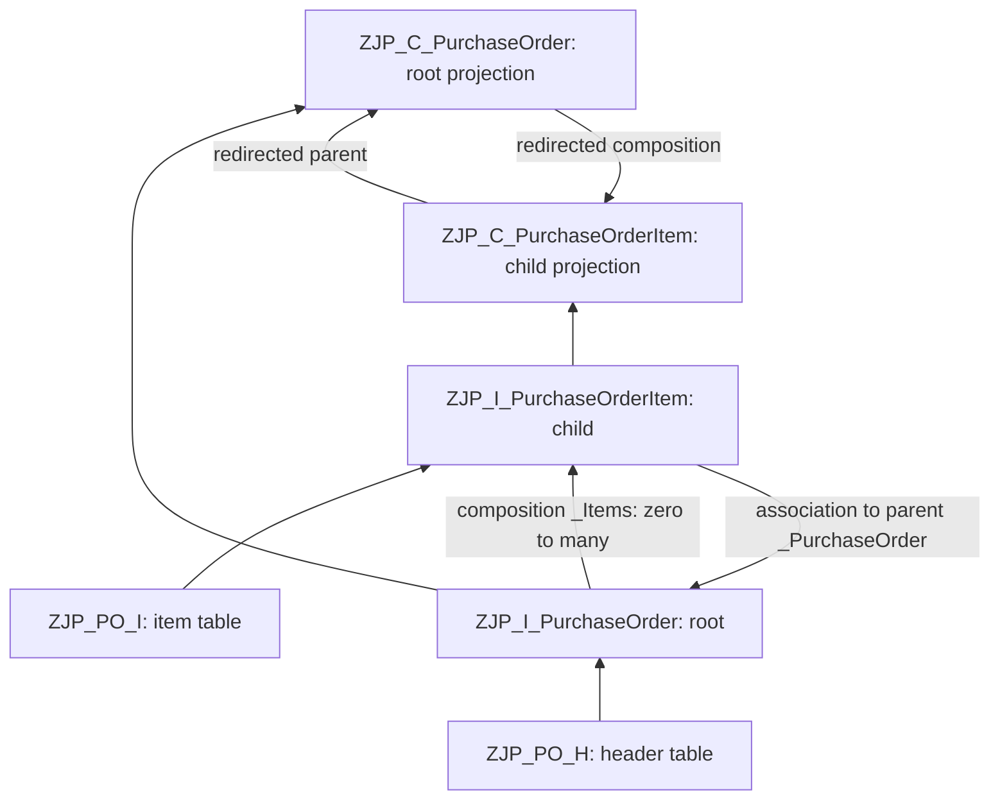

# Phase 1 — RAP persistence and domain model

Status: Phase 1 complete. The learner manually created and successfully activated all six objects in SAP S/4HANA using ADT/Eclipse, with the two compatibility adjustments below. This is learner-reported SAP activation evidence; separate data-preview, ATC and CRUD results have not been supplied. Exact S/4HANA/ABAP release is still unknown. The target SAP compiler is authoritative.

## Compatibility adjustments confirmed during activation

In ZJP_I_PurchaseOrder, the compiler rejected the standalone currency-code marker with the message: "Annotation Semantics.currencyCode is not allowed in view entities." The root source therefore exposes Currency normally and retains `@Semantics.amount.currencyCode: 'Currency'` on TotalAmount. Do not reintroduce the rejected marker in this root view. The amount-to-currency relationship is preserved.

In ZJP_C_PurchaseOrderItem, the compiler rejected an explicit `provider contract transactional_query` with: "Provider contract not modifiable if view contains 'redirected to parent' associations." The working child declaration uses `as projection on ZJP_I_PurchaseOrderItem` without that provider-contract clause and retains `_PurchaseOrder : redirected to parent ZJP_C_PurchaseOrder`. The root projection retains its explicit transactional_query contract. Root and child declarations should not be made identical merely for visual consistency.

The corresponding full listings below and their source files have been reconciled to these reported adjustments. The remaining four source files are unchanged; this is not a complete ADT export comparison. All six activations were reported successful. Future syntax questions will be resolved against the target compiler and the actual object source, rather than restoring a generic example.

## Before creating anything

Phase 0's [architecture](../../ARCHITECTURE.md), [API contracts](../../API_CONTRACTS.md) and [project status](../../PROJECT_STATUS.md) were reviewed first. This implementation preserves the custom BO, UUID keys, header/item composition, decimal scales, separate business/integration status, and separate UI/integration boundaries. The `ZJP_` prefix replaces the provisional Phase 0 naming family at the learner's request.

Today we define storage and the shape of the future RAP BO. We do not define behavior, draft tables, actions, validations, determinations, EML consumers, services, CAP or iFlows. No full RAP generator is used: it would create later-phase objects without explaining them.

In ADT, use your S/4HANA development connection and a customer package supporting **ABAP for Cloud Development**. Suggested package name: `ZJP_PIH`. Package creation/transport settings follow your system's development rules. Inspect object properties and the API State of reused SAP types in ADT. Record the exact release in [environments](../../docs/environments.md) when known. If an object already exists under one of these names, inspect it before replacing it.

`I` and `C` are our naming conventions for the base model and consumption projection. They do not enable framework behavior. All six object names begin with `ZJP_` and fit the relevant name limits. The mixed-case CDS names and uppercase ADT names identify the same case-insensitive objects.

## The six objects and their relationships



| Step | ADT object name | ADT object type | Source |
| --- | --- | --- | --- |
| 1 | ZJP_PO_H | Database Table | [Header table](../persistence/zjp_po_h.ddl) |
| 2 | ZJP_PO_I | Database Table | [Item table](../persistence/zjp_po_i.ddl) |
| 3 | ZJP_I_PURCHASEORDER | Data Definition | [Root view](../cds/zjp_i_purchaseorder.ddls) |
| 4 | ZJP_I_PURCHASEORDERITEM | Data Definition | [Child view](../cds/zjp_i_purchaseorderitem.ddls) |
| 5–6 | No additional object | Relationship declarations in the preceding views | Composition and parent association below |
| 7a | ZJP_C_PURCHASEORDER | Data Definition | [Root projection](../cds/zjp_c_purchaseorder.ddls) |
| 7b | ZJP_C_PURCHASEORDERITEM | Data Definition | [Child projection](../cds/zjp_c_purchaseorderitem.ddls) |

The `.ddl` and `.ddls` files are hand-maintained source for manual ADT creation, not an abapGit export package. Copy their content into the corresponding ADT editor; do not try to import them as a complete repository. Code blocks below match those source files.

## Step 1 — header persistence table

**What and why:** `ZJP_PO_H` is the physical storage for one active purchase-order header per client/UUID. A CDS entity reads this table; it does not replace persistence. SAP MM tables are not involved.

**Create in ADT:** right-click the package → New → Other ABAP Repository Object → Database Table. Enter `ZJP_PO_H`, use the description in the source, and select an appropriate transport. Replace the editor template with:

```abap
@EndUserText.label : 'Procurement Hub: Purchase Order Header'
@AbapCatalog.enhancement.category : #NOT_EXTENSIBLE
@AbapCatalog.tableCategory : #TRANSPARENT
@AbapCatalog.deliveryClass : #A
@AbapCatalog.dataMaintenance : #RESTRICTED
define table zjp_po_h {
  key client                  : abap.clnt not null;
  key purchase_order_uuid     : sysuuid_x16 not null;
  purchase_order_number       : abap.char(20) not null;
  supplier                    : abap.char(10) not null;
  supplier_name               : abap.char(100) not null;
  company_code                : abap.char(4) not null;
  purchasing_organization     : abap.char(4) not null;
  purchasing_group            : abap.char(3) not null;
  currency                    : abap.cuky not null;
  total_amount                : abap.dec(19,2) not null;
  status                      : abap.char(12) not null;
  supplier_response           : abap.char(8) not null;
  estimated_delivery_date     : abap.dats not null;
  created_by                  : abp_creation_user not null;
  created_at                  : abp_creation_tstmpl not null;
  last_changed_by             : abp_lastchange_user not null;
  last_changed_at             : abp_lastchange_tstmpl not null;
  local_last_changed_at       : abp_locinst_lastchange_tstmpl not null;
  order_revision              : abap.int4 not null;
  integration_status          : abap.char(16) not null;
  delivery_id                 : sysuuid_x16 not null;
  last_error_code             : abap.char(60) not null;
  last_error_message          : abap.char(255) not null;
  last_error_at               : abp_lastchange_tstmpl not null;
  last_correlation_id         : sysuuid_x16 not null;
  last_response_id            : sysuuid_x16 not null;
  last_response_version       : abap.int4 not null;
  rejection_origin           : abap.char(10) not null;
  rejection_reason           : abap.char(255) not null;
}
```

**Read the code:**

- `#TRANSPARENT` defines ordinary database persistence. Delivery class `#A` identifies application data. `#RESTRICTED` is a table-maintenance setting, not an authorization implementation. `#NOT_EXTENSIBLE` keeps this learning table's extension surface closed.
- `client` is the leading key and makes the table client-dependent. `purchase_order_uuid` is its business-instance identity within that client. `sysuuid_x16` supplies the UUID-compatible RAW(16) type; it does not generate a value.
- `purchase_order_number` is a human-readable number. It is not the primary key, automatically generated, or uniqueness-enforced in Phase 1. Assignment was addressed in [Phase 2.7E](phase-2-7e-purchase-order-number.md), which allocates it from a number range object on a successful `submit`. Database-level uniqueness remains deliberately unenforced: there is still no index and no unique constraint, and the number range object is the only uniqueness authority.
- `supplier` and organizational codes are plain application fields. Using ABAP primitive types avoids a dependency on unreleased SAP MM data elements. They have no value help or existence validation yet. Reusable custom data elements become useful when we need shared labels/domains; creating one per field now adds little learning value.
- Monetary fields use fixed-point `DEC`, not binary floating point. Header total has two decimals; item unit price below has four. Amount/currency semantics are attached in the CDS layer. `CURR` with a currency reference is an enterprise alternative, but needs deliberate handling of SAP currency-dependent decimal semantics. Here explicit decimal scales match the Phase 0 EUR-only contract.
- `Status` is future business state. No default DRAFT is assigned by this definition. `IntegrationStatus` is separately stored and is 16 characters, enough for NOT_REQUESTED. Storing these fields does not implement transitions.
- `ABP_*` administrative types prepare for RAP's managed audit fields. Their matching CDS annotations appear in Step 3. A table definition alone does not maintain the timestamps.
- Delivery IDs, response versions and last-error fields preserve the agreed Phase 0 header shape. For this lesson they are passive columns. No outbox table or integration code is created. `LastErrorAt` uses a timestamp type but is intentionally not annotated as the general last-change timestamp.
- `not null` prohibits database SQL NULL; it does **not** prohibit ABAP initial values. An empty supplier, zero UUID or zero revision still needs later business validation. Initial date `00000000`, blank optional text and initial optional UUID mean “not provided” in this persistence model. A later API adapter must deliberately translate these to the JSON null/absence defined in the contracts.

**Test now:** save, run the syntax check, activate, then open Data Preview (normally F8 / Open With → Data Preview). Expected: activation succeeds, the physical table is available, keys are CLIENT and PURCHASE_ORDER_UUID, and the table has **zero rows** in a new installation. Verify the total's precision/scale is 19/2 and UUID storage is RAW(16). Empty data is the expected result, not a failure.

**Checkpoint:** explain why a blank supplier is still technically possible despite `not null`. Once that is clear and activation succeeds, continue to the item table.

## Step 2 — item persistence table

**What and why:** `ZJP_PO_I` stores each commercial line separately. `purchase_order_uuid` links the line to its header; `purchase_order_item_uuid` identifies the line independently of renumbering.

**Create in ADT:** Database Table `ZJP_PO_I`, in the same package. Paste:

```abap
@EndUserText.label : 'Procurement Hub: Purchase Order Item'
@AbapCatalog.enhancement.category : #NOT_EXTENSIBLE
@AbapCatalog.tableCategory : #TRANSPARENT
@AbapCatalog.deliveryClass : #A
@AbapCatalog.dataMaintenance : #RESTRICTED
define table zjp_po_i {
  key client                  : abap.clnt not null;
  key purchase_order_item_uuid : sysuuid_x16 not null;
  purchase_order_uuid         : sysuuid_x16 not null;
  item_number                 : abap.numc(5) not null;
  material                    : abap.char(40) not null;
  material_description        : abap.char(100) not null;
  @Semantics.quantity.unitOfMeasure : 'zjp_po_i.unit_of_measure'
  quantity                    : abap.quan(13,3) not null;
  unit_of_measure             : abap.unit(3) not null;
  net_price                   : abap.dec(19,4) not null;
  currency                    : abap.cuky not null;
  total_amount                : abap.dec(19,2) not null;
  local_last_changed_at       : abp_locinst_lastchange_tstmpl not null;
}
```

**Read the code:** the physical key is CLIENT + PURCHASE_ORDER_ITEM_UUID. The parent UUID is a regular required column, not an additional item key: the item's own UUID is sufficient. RAP will fill/guard the parent relationship through create-by-association in Phase 2. The current table does not prevent orphan rows if someone writes directly to it.

`ItemNumber` is NUMC(5), such as `00010`. Numeric text is not the technical identity and does not by itself guarantee uniqueness within an order. A future validation must enforce that uniqueness.

The table annotation links `quantity` to this table's `unit_of_measure`. This is measurement metadata, not a unit conversion. Quantity has three decimals, net price four, and line total two. The item retains its own currency so every price/amount has a local currency reference. Equality with header currency is a future behavior rule. No arithmetic is performed by these columns.

**Test now:** syntax-check and activate the table, open Data Preview, and inspect the field definitions. Expected: zero rows; one UUID item key plus CLIENT; parent UUID is present but not a key; QUANTITY references UNIT_OF_MEASURE; no computed default amount. Confirm both tables are active before the CDS layer.

**Checkpoint:** an item number can change while its UUID stays stable. The parent association will use the header UUID, not the display order number.

## Step 3 — root CDS view entity

**What and why:** `ZJP_I_PurchaseOrder` is the root node of the future BO's composition tree. It gives database columns domain names and semantics and declares access to its items. `root` identifies the top node; it does not yet implement a managed BO.

**Create in ADT:** New → Other ABAP Repository Object → Data Definition, name `ZJP_I_PURCHASEORDER`. Use a view-entity template if available and replace its contents. Do not create a classic `define view` with `@AbapCatalog.sqlViewName`.

```abap
@AccessControl.authorizationCheck: #NOT_REQUIRED
@EndUserText.label: 'Procurement Hub: Purchase Order'
define root view entity ZJP_I_PurchaseOrder
  as select from zjp_po_h
  composition [0..*] of ZJP_I_PurchaseOrderItem as _Items
{
  key purchase_order_uuid     as PurchaseOrderUUID,
      purchase_order_number   as PurchaseOrderNumber,
      supplier                as Supplier,
      supplier_name           as SupplierName,
      company_code            as CompanyCode,
      purchasing_organization as PurchasingOrganization,
      purchasing_group        as PurchasingGroup,
      currency                as Currency,
      @Semantics.amount.currencyCode: 'Currency'
      total_amount            as TotalAmount,
      status                  as Status,
      supplier_response       as SupplierResponse,
      estimated_delivery_date as EstimatedDeliveryDate,
      @Semantics.user.createdBy: true
      created_by              as CreatedBy,
      @Semantics.systemDateTime.createdAt: true
      created_at              as CreatedAt,
      @Semantics.user.lastChangedBy: true
      last_changed_by         as LastChangedBy,
      @Semantics.systemDateTime.lastChangedAt: true
      last_changed_at         as LastChangedAt,
      @Semantics.systemDateTime.localInstanceLastChangedAt: true
      local_last_changed_at   as LocalLastChangedAt,
      order_revision          as OrderRevision,
      integration_status      as IntegrationStatus,
      delivery_id             as DeliveryId,
      last_error_code         as LastErrorCode,
      last_error_message      as LastErrorMessage,
      last_error_at           as LastErrorAt,
      last_correlation_id     as LastCorrelationId,
      last_response_id        as LastResponseId,
      last_response_version   as LastResponseVersion,
      rejection_origin       as RejectionOrigin,
      rejection_reason       as RejectionReason,
      _Items
}
```

**Read the code:** `as select from` connects the semantic entity to physical persistence. `as PurchaseOrderUUID` and the other aliases are the domain-facing names; a later BDEF mapping will connect these names to table fields for writes. The root CDS key is just PurchaseOrderUUID. CDS handles the client dependency of the source; we do not expose CLIENT or hand-code a client predicate.

`@Semantics.amount.currencyCode: 'Currency'` refers to a **CDS element alias**, unlike the table-qualified quantity reference in Step 2. Administrative annotations identify creation, last-change and local-instance-change fields. They become effective for managed writes when managed behavior is added. `LastChangedAt` prepares the root total ETag; `LocalLastChangedAt` prepares its instance ETag. Neither performs concurrency checks by itself.

`@AccessControl.authorizationCheck: #NOT_REQUIRED` means a CDS access-control role is not required for this isolated lesson. No DCL is supplied; no row-level business authorization is implemented. The later secured service must add deliberate access control and behavior authorization. Merely changing this annotation to `#CHECK` would not create a policy.

**Activation dependency:** this source refers to an item entity that is not created yet. Save it, but complete Step 4 before activating the pair. An unresolved child reference at this intermediate point is expected; it is not a reason to remove the composition from the final model.

**Test after Step 4:** activate the two base views together using ADT's inactive-object activation selection, then Data Preview the root. Expected: zero rows, domain-facing aliases, one root UUID key, and an exposed `_Items` relationship. Currency and audit annotations can be inspected in the source/annotation tooling. No draft flags or action buttons exist.

## Step 4 — item CDS view entity

**What and why:** `ZJP_I_PurchaseOrderItem` is a dependent child, so it uses `define view entity` without `root`. Its parent association supplies the relationship condition used by the composition.

**Create in ADT:** Data Definition `ZJP_I_PURCHASEORDERITEM`, then paste:

```abap
@AccessControl.authorizationCheck: #NOT_REQUIRED
@EndUserText.label: 'Procurement Hub: Purchase Order Item'
define view entity ZJP_I_PurchaseOrderItem
  as select from zjp_po_i
  association to parent ZJP_I_PurchaseOrder as _PurchaseOrder
    on $projection.PurchaseOrderUUID = _PurchaseOrder.PurchaseOrderUUID
{
  key purchase_order_item_uuid as PurchaseOrderItemUUID,
      purchase_order_uuid     as PurchaseOrderUUID,
      item_number             as ItemNumber,
      material                as Material,
      material_description    as MaterialDescription,
      @Semantics.quantity.unitOfMeasure: 'UnitOfMeasure'
      quantity                as Quantity,
      @Semantics.unitOfMeasure: true
      unit_of_measure         as UnitOfMeasure,
      @Semantics.amount.currencyCode: 'Currency'
      net_price               as NetPrice,
      @Semantics.currencyCode: true
      currency                as Currency,
      @Semantics.amount.currencyCode: 'Currency'
      total_amount            as TotalAmount,
      @Semantics.systemDateTime.localInstanceLastChangedAt: true
      local_last_changed_at   as LocalLastChangedAt,
      _PurchaseOrder
}
```

**Read the code:** the child's key remains its own UUID, and PurchaseOrderUUID remains an exposed non-key field. The ON condition compares the current row's projected parent UUID to the parent's key. Exposing `_PurchaseOrder` in the element list makes the navigation part of the entity interface. Quantity/amount annotations point to UnitOfMeasure/Currency in this entity, not to persistence field names.

**Test now:** save both base views; select both in ADT and activate the inactive pair. Expected: both active with the root composition and child parent association resolved. Then preview the child and inspect its key, parent UUID, decimal scales and unit/currency references. New tables mean zero rows here too.

If your ADT activation dialog cannot resolve the initial cycle, build the root temporarily without its composition declaration and without the final `_Items` element (remove the preceding trailing comma), activate that root, then create the child and restore the complete root. Select child and restored root together for activation. This is creation sequencing only; keep the complete source in Git. Do not work around an unsupported language feature by switching the project to Standard ABAP.

**Checkpoint:** the child is not another root. A single root owns this composition tree.

## Step 5 — understand the header composition

The relationship is already in the root source:

```abap
composition [0..*] of ZJP_I_PurchaseOrderItem as _Items
```

It means an order is a whole whose items are dependent parts. `[0..*]` allows an empty preparatory order. “At least one item before submission” is a behavior validation, not a reason to assert a false minimum cardinality on all stored headers.

There is no ON clause here because the child's `association to parent` defines the linking condition. `_Items` must also appear in the root select list. Composition is a modeling contract, not a database foreign-key constraint, an SQL cascade-delete trigger, or a generic CRUD API. RAP will later use it with the behavior definition for transactional operations.

**Test:** navigate from the root's `_Items` declaration to its target in ADT (Open Declaration/F3 where configured), and inspect the target's parent association. Expected: target ZJP_I_PurchaseOrderItem and parent ZJP_I_PurchaseOrder; the key comparison uses PurchaseOrderUUID. With no rows, this verifies the modeled relationship, not an executed row-navigation scenario.

## Step 6 — understand the parent association

This declaration is already in the child source:

```abap
association to parent ZJP_I_PurchaseOrder as _PurchaseOrder
  on $projection.PurchaseOrderUUID = _PurchaseOrder.PurchaseOrderUUID
```

`$projection` addresses the current entity's projected element names. `_PurchaseOrder` is the target alias. A child has one composition parent; do not replace `association to parent` with an ordinary association just to silence an activation error. The model states a required ownership relationship but does not independently validate arbitrary direct table writes.

**Test:** inspect the ON condition and use Open Declaration on the parent target. Expected: it resolves to the root, not the item and not a projection. In a later fixture, one header UUID shared by two item rows should produce two `_Items` results and one parent per item. Do not fabricate that runtime test result today; row-navigation testing follows when we add controlled test data.

## Step 7a — root projection view

**What and why:** `ZJP_C_PurchaseOrder` is a consumer-facing projection over the base entity. It provides the future buyer UI's field surface without creating another table or copying records. The separate integration projection remains a Phase 3 design task.

**Create in ADT:** Data Definition `ZJP_C_PURCHASEORDER`. Paste and save; its child projection is created next.

```abap
@AccessControl.authorizationCheck: #NOT_REQUIRED
@EndUserText.label: 'Procurement Hub: Purchase Order Projection'
@Metadata.allowExtensions: true
define root view entity ZJP_C_PurchaseOrder
  provider contract transactional_query
  as projection on ZJP_I_PurchaseOrder
{
  key PurchaseOrderUUID,
      PurchaseOrderNumber,
      Supplier,
      SupplierName,
      CompanyCode,
      PurchasingOrganization,
      PurchasingGroup,
      Currency,
      TotalAmount,
      Status,
      SupplierResponse,
      EstimatedDeliveryDate,
      CreatedBy,
      CreatedAt,
      LastChangedBy,
      LastChangedAt,
      LocalLastChangedAt,
      OrderRevision,
      IntegrationStatus,
      LastErrorCode,
      LastErrorMessage,
      LastErrorAt,
      RejectionOrigin,
      RejectionReason,
      _Items : redirected to composition child ZJP_C_PurchaseOrderItem
}
```

**Read the code:** `as projection on` projects the existing entity. `provider contract transactional_query` states its intended RAP transactional-service use; it does not grant write operations. `@Metadata.allowExtensions: true` permits later UI metadata extensions without adding UI annotations in this phase.

This projection keeps commercial fields, audit fields, integration status and safe error summaries, and deliberately omits DeliveryId, LastCorrelationId, LastResponseId and LastResponseVersion. Those internal bookkeeping fields remain in the base entity. This is an interface decision, not a security substitute.

Currency/quantity and administrative element annotations propagate from the base fields; we retain their names and do not disable propagation. `_Items : redirected to composition child ...` ensures navigation stays within the consumer projection tree.

**Test after Step 7b:** activate the two projections together. Inspect projected field names and annotations. Expected: the omitted bookkeeping fields are absent and `_Items` points to ZJP_C_PurchaseOrderItem. Data Preview should show zero rows for this simple persisted projection on a supporting release; activation/metadata checks are the primary check here. No service or Fiori UI is available yet.

## Step 7b — item projection view

**What and why:** `ZJP_C_PurchaseOrderItem` presents item fields at the same projection level as its parent.

**Create in ADT:** Data Definition `ZJP_C_PURCHASEORDERITEM`, then paste:

```abap
@AccessControl.authorizationCheck: #NOT_REQUIRED
@EndUserText.label: 'Procurement Hub: Purchase Order Item Projection'
@Metadata.allowExtensions: true
define view entity ZJP_C_PurchaseOrderItem
  as projection on ZJP_I_PurchaseOrderItem
{
  key PurchaseOrderItemUUID,
      PurchaseOrderUUID,
      ItemNumber,
      Material,
      MaterialDescription,
      Quantity,
      UnitOfMeasure,
      NetPrice,
      Currency,
      TotalAmount,
      LocalLastChangedAt,
      _PurchaseOrder : redirected to parent ZJP_C_PurchaseOrder
}
```

**Read the code:** `redirected to parent ZJP_C_PurchaseOrder` changes the navigation target to the projected parent. Redirecting only the root's child link would leave an inconsistent projection tree. This child deliberately has no explicit provider-contract clause, as required by the learner's compiler for this redirected-parent projection. The parent UUID is retained because the association depends on it. Currency and unit fields are retained because the amount/quantity semantics depend on them.

**Test now:** save both projections and activate them together through the inactive-object selection. Expected: both active; the root remains root, the child remains non-root, and both navigation targets are `ZJP_C_*`. Inspect annotation propagation in ADT and preview the projected fields. For creation-order issues, the same temporary-parent technique as Step 4 applies: temporarily omit `_Items` from the root projection, create the child, then restore and activate the pair.

The activation issue in this system was resolved by removing only the child's explicit provider-contract declaration. Keep the root contract and both relationship redirections. Record any further release-specific diagnostic and adapt to the confirmed working syntax; adding behavior is not a workaround for a CDS compatibility error.

## What this phase does and does not enforce

| Property | Phase 1 implementation | Later responsibility |
| --- | --- | --- |
| Technical identity | Physical primary keys and CDS keys | Managed UUID assignment |
| Header/item ownership | Composition and parent association | Controlled create-by-association and delete behavior |
| Quantity/price storage | Decimal fields and semantics | Quantity > 0, price >= 0, rounding and totals |
| Business states | Sized text columns | Default values, allowed codes and transitions |
| Mandatory supplier | Field exists; SQL NULL excluded | Reject empty or unknown supplier |
| Display/item number uniqueness | Not enforced | Numbering and validation under appropriate locking |
| Draft | No draft storage or behavior | Phase 2 draft tables and managed draft behavior |
| Audit/concurrency | Types and CDS annotations | Managed updates, lock and ETag declarations |
| Authorization | No DCL/business permission logic | Deliberate checks before secured service use |
| OData | No endpoint at this checkpoint | Delivered by [Phase 3.1](phase-3-1-odata-service-exposure.md): `ZJP_UI_PURCHASEORDER` and `ZJP_UI_PURCHASEORDER_O4` |

## Record your SAP results

| Check | Expected | Actual |
| --- | --- | --- |
| Target product/release recorded | S/4HANA, exact ABAP release | Product confirmed; release pending |
| Both tables activate | Active; correct keys/scales | Successful activation reported by learner |
| Base view pair activates | Root/child cycle resolves | Successful activation reported after root currency-marker adjustment |
| Projection pair activates | Redirected composition/parent resolve | Successful activation reported after child provider-contract adjustment |
| Preview all six objects where supported | No rows in new installation; expected fields | Not separately reported; no row counts claimed |
| Currency/unit and audit references | Resolve to local elements | Sources activated; separate annotation inspection not reported |
| ABAP Cloud checks | No unreleased dependency or unsupported syntax | Activation reported; separate ATC run not reported |
| Objects outside the six-model-object scope | None | None created locally |

The learner's successful activation of all six objects satisfies the Phase 1 completion gate for moving into the behavior-architecture lesson. No additional Phase 1 runtime test is required before that conceptual step. The unreported preview/ATC checks remain optional evidence, not invented results. CRUD and row-navigation tests belong to the later EML step. Continue with [Phase 2, Step 1](phase-2-step-1-behavior-architecture.md); stop there until the learner confirms understanding.

## Review before Phase 2

Explain the chain “table → base CDS entity → projection” in your own words. Then explain why `root`, composition, `not null`, amount annotations and a timestamp type each describe one aspect of the model but do not constitute the complete transactional business logic.

Official references checked for this lesson: [RAP reuse data elements](https://help.sap.com/docs/abap-cloud/abap-rap/rap-reuse-data-elements), [CDS entity modeling](https://help.sap.com/docs/abap-cloud/abap-data-models/entity-modeling), [projection relationships](https://help.sap.com/docs/abap-cloud/abap-rap/projection-views-for-processor-bo-projection), [transactional query projections](https://help.sap.com/doc/abapdocu_latest_index_htm/latest/en-US/ABENCDS_PV_TRANSACTIONAL_QUERY.html), and [creating/activating data definitions](https://help.sap.com/docs/abap-cloud/abap-development-tools-user-guide/creating-and-activating-data-models). Exact syntax availability must still be checked against the target release.
