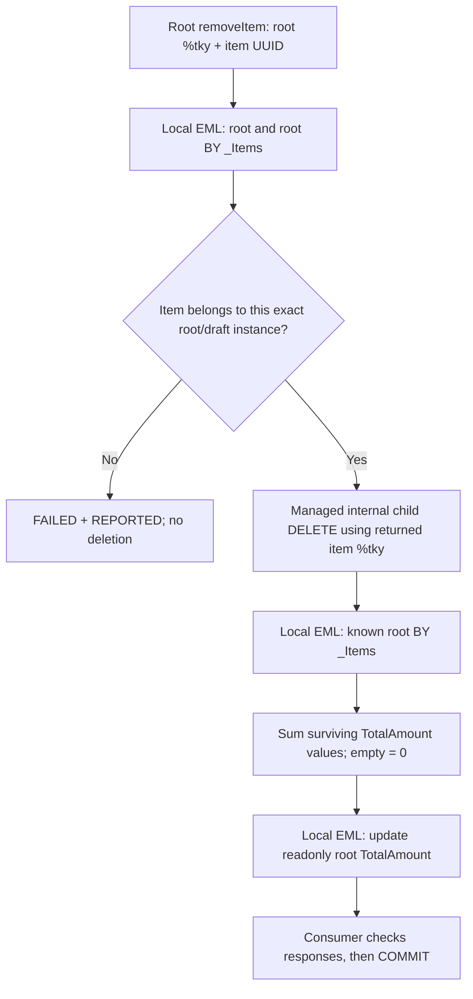

# Phase 2.6 — Technical draft item removal

Status: **SAP runtime-verified complete** for active, saved-draft and buffer-only draft item removal, total recalculation and ownership protection. Phase 2.7A `submit` and Phase 2.7B post-submission immutability are runtime-verified complete on top of this baseline; approve, reject, sendToSupplier and cancel are pending.

## Target evidence

SAP_BASIS 758 SP01 (SAPK-75801INSAPBASIS), S4CORE 108 SP01 (SAPK-10801INS4CORE), ADT Core 3.60.3 / Business Object Tools 1.209.0, Eclipse 4.40.0.

The learner's compiler accepts with draft, total etag, Edit/Activate/Discard/Resume, Prepare including child validations, and draft associations. Generated ZJP_PO_HD has root UUID as key; ZJP_PO_ID has item UUID as key and parent UUID as a non-key field. Both retain their generated %admin include. Their complete generated DDL has not been exported to this repository; do not recreate it from guessed fields.

The learner's runtime establishes:

| Probe | Result |
| --- | --- |
| Deleted child READ / child BY _PurchaseOrder | NOT_FOUND; no parent can be recovered |
| Known active root after deleting 00020 / last item | Root readable; exactly 00010 / empty collection |
| Known buffer-only draft root after deleting its only item | Root readable, %is_draft = 01, empty collection |
| Known saved draft root after deleting 00020 / last item | Exactly 00010 / empty collection, %is_draft = 01 |
| Former child delete determination on drafts | Parent lookup diagnostic; stale total 1500 for buffer-only root and 1900 for saved root |

These probe results led to the root-known design. The subsequent SAP runtime test verifies the action, ownership protection and corrected active/draft totals. The former persisted-parent lookup was runtime-verified only for committed active items in Phase 2.4C. It never supported deletion of an uncommitted item. That implementation is now removed rather than extended to read draft tables.

## Design and ownership

The instance-bound root action removeItem takes one PurchaseOrderItemUUID parameter. Its generated input contains the root's complete %tky, including %is_draft. The existing child entity key stays unchanged.



Standard child DELETE is declared internal. External EML consumers must call the root action; they cannot independently delete a child and leave its header stale. Root DELETE remains available for whole-composition cleanup. Future projection behavior must expose the technical operation intentionally, never restore unrestricted child DELETE.

The BDEF delegates removeItem authorization to the existing root update authorization. This avoids adding guessed authorization components. The existing permissive study policy is unchanged and is not production role authorization. This checkpoint does not claim separate authorization-policy coverage for every framework draft action; its verified scope is the technical draft model and active/draft item-removal path.

The handler checks ownership through root-to-item EML and also compares parent UUID and %is_draft before deleting. It keeps variables within a single action invocation, uses no cross-callback state, and performs no SQL access. RAP supplies root locking, managed item deletion and persistence. Custom code owns membership checking and aggregation. No handler COMMIT/ROLLBACK is permitted.

Create/Quantity/NetPrice determination arithmetic and triggers stay unchanged. The necessary draft adjustment groups affected roots by full %tky and filters sibling aggregation by both parent UUID and %is_draft, preventing active/draft versions with the same UUID from being combined. Removal sums already-derived item totals after the managed delete returns; it does not depend on the order of separate delete determinations.

Every EML stage checks FAILED and forwards REPORTED through the target-compatible deep CORRESPONDING pattern. Failures are also reported against the requested root action. An action is not a nested database transaction: a later failure does not automatically undo an earlier successful nested EML mutation. The caller must ROLLBACK ENTITIES on any FAILED and must not commit a partial request. Both console tests do this. Do not interpret REPORTED alone as a save veto.

One invocation removes one item from one root. To remove multiple items from the same root, use sequential calls, each followed by response checks. Repeating a removal of an absent item is rejected without further mutation.

## Exact ADT objects and activation order

1. Confirm already generated Database Table objects **ZJP_PO_HD** and **ZJP_PO_ID** remain active. Do not change their definitions, active persistence, or CDS keys.
2. Create **Data Definition ZJP_A_REMOVEITEM**, using the abstract-entity template, from [zjp_a_removeitem.ddls](../cds/zjp_a_removeitem.ddls). It is an action parameter structure, not a database table. Activate it first.
3. Update **Behavior Definition ZJP_I_PURCHASEORDER** from [zjp_i_purchaseorder.bdef](../behavior/zjp_i_purchaseorder.bdef), and **Behavior Implementation class ZBP_I_PURCHASEORDER**, Local Types, from [zbp_i_purchaseorder.clas.locals_imp.abap](../classes/zbp_i_purchaseorder.clas.locals_imp.abap). Save both and activate them **together** in ADT to resolve the new action method dependency. The global class source is unchanged; do not create a separate global lhc class.
4. Update and activate ordinary ABAP classes **ZJP_CL_PO_EML_TEST** and **ZJP_CL_PO_DRAFT_PROBE** from the linked [active test](../classes/zjp_cl_po_eml_test.clas.abap) and [draft test](../classes/zjp_cl_po_draft_probe.clas.abap).
5. Run the active test first, then the draft test, using Run As → ABAP Application (Console), normally F9. No service, projection BDEF, UI or business action is needed.

Target ADT generated removeItem as FOR MODIFY / IMPORTING keys FOR ACTION PurchaseOrder~removeItem. Check %tky, %param-PurchaseOrderItemUUID and the generated action response marker against autocomplete. The BDEF, handler and tests compiled and ran on the recorded target. Preserve the generated signatures and internal DELETE boundary.

The sources use documented RAP [internal standard operations](https://help.sap.com/doc/7dc426856bc640bf98e9e345a0736cf4/1909%20FPS00/en-US/ABAP_RESTful_Programming_Model_On-Premise_EN.pdf) and [action authorization delegation available since ABAP Platform 2021](https://help.sap.com/docs/ABAP_PLATFORM_NEW/fc4c71aa50014fd1b43721701471913d/eb5df2a2aa18406382af2b2d055d2d87.html?version=202110.latest). The target compiler remains authoritative for this new declaration.

## Runtime tests

### ZJP_CL_PO_EML_TEST — active regression

Keep all existing Supplier/Quantity/NetPrice negative save tests, zero-price positive tests, database snapshots and positive calculations. The fixture totals remain 1900 → 2650 → 2800.

Before removal, a separate uncommitted active root/item is created. Requesting that foreign item through the main root fails with `Item does not belong to this Purchase Order.` Both roots and all three items must remain unchanged in the buffer. Rollback removes only the new fixture; table checks confirm the main committed 2800 total is unchanged.

Then EXECUTE removeItem for item 00020: expect surviving 00010, header/item total 2400 before commit, and persisted header 2400 afterward. Remove 00010: expect an empty collection and header 0 before/after commit. Root cleanup remains managed EML DELETE.

Read-only SELECT in the active tests independently verifies active persistence. No test or handler writes tables directly. The obsolete persisted-parent/deleted-child diagnostic checks have been removed.

### ZJP_CL_PO_DRAFT_PROBE — corrected totals

1. Create a draft root, capture mapped complete %tky, then CBA using that exact key and explicit child %is_draft = mk-on. Separate requests preserve the working SAP_BASIS 758 fixture correction; %cid_ref alone previously selected an active parent.
2. Verify buffer-only root TotalAmount = 1500 and business Status = DRAFT. Call removeItem before the first commit. Expect root still draft/readable, no children, total 0, unchanged business Status. Rollback the fixture.
3. Create a fresh two-item draft the same way, commit it, then read its saved draft root/items. Expect total 1900, items 1500 and 400, all identities draft.
4. Call removeItem for 00020. Expect only 00010, total 1500. Commit, then reread the draft through EML to check the saved total and surviving item identity.
5. Call removeItem for 00010. Expect empty children and total 0. Commit, then reread to check the saved empty collection and total 0.
6. Execute framework Discard and commit. The target-confirmed Discard input uses %key-PurchaseOrderUUID, not %tky; draft selection is implicit for this framework action. Final draft read must fail with NOT_FOUND and return no root. No direct draft-table access is used.

Saving a technical draft is not activating it. These tests do not call Activate, assert full draft lifecycle coverage, or change business Status.

Runtime-verified final console lines:

```text
PASS: removeItem active totals 2400/0; ownership, Phase 2.5 regression and cleanup pass.
PASS: removeItem buffer-only draft total 1500/0; rollback complete.
PASS: removeItem saved draft totals 1900/1500/0; both deletion commits pass.
PASS: removeItem saved and buffer-only draft deletion; totals and cleanup pass.
```

Positive commits returned sy-subrc 0. Existing negative validation commits must remain nonzero; foreign-item rejection and final Discard NOT_FOUND are intentional negative responses. Other removal FAILED tables should be empty, with no old parent-lookup message.

Optional visibility check: in a temporary external console source, syntax-check the former PurchaseOrderItem DELETE request. ADT should reject access to the internal operation. Remove that temporary request afterward; do not put it in the executable regression classes.

## Debugger checkpoints and return evidence

In lhc_PurchaseOrder->removeItem, break at the managed DELETE, the surviving-items LOOP and the root UPDATE. Inspect action_key-%tky/%is_draft, action_key-%param, owned_items, item_to_delete-%tky, surviving_items, header_total and all stage FAILED/REPORTED. Draft calls must stay %is_draft = 01 throughout; active calls must stay 00. Empty surviving_items must give header_total = 0.

Retain these tests as regression evidence. If a future change fails, return the first STOP/compiler diagnostic and printed UUIDs; rollback cannot undo earlier commits.

Phase 2.5 regression remained successful. The learner confirms the technical action, ownership rejection, active/draft totals, saved-draft persistence and cleanup all passed in SAP. Phase 2.6 is complete within this documented scope. Phase 2.7A `submit` and Phase 2.7B post-submission immutability have since been runtime-verified separately; approve, reject, sendToSupplier and cancel are pending.
