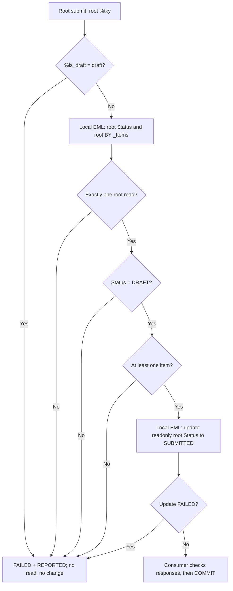

# Phase 2.7A — Root business action `submit`

Status: **SAP runtime-verified complete** for the active `DRAFT` → `SUBMITTED` transition, the re-submit and empty-order rejections, and the buffer-only and saved technical draft rejections. Phase 2.1–2.6 remain runtime-verified and were not changed to achieve this. Phase 2.7B has since added post-submission commercial immutability on top of this transition.

## Target baseline

SAP_BASIS 758 SP01 (SAPK-75801INSAPBASIS), S4CORE 108 SP01 (SAPK-10801INS4CORE), ADT Core 3.60.3 / Business Object Tools 1.209.0, Eclipse 4.40.0. The target compiler remains authoritative over every declaration below.

## Scope

This subphase implements one business transition only.

| In scope | Out of scope for 2.7A |
| --- | --- |
| Root action `submit`, business `Status` `DRAFT` → `SUBMITTED` | `approve`, `reject`, `sendToSupplier`, `cancel` |
| Active-instance rejection of technical draft calls | `Activate`-then-`submit` coverage |
| At-least-one-item precondition | `PurchaseOrderNumber` allocation |
| FAILED/REPORTED rejection contract | Commercial-field enforcement after `SUBMITTED`, delivered by Phase 2.7B |
| Active and draft EML regression additions | Projection/service exposure, DCL, UI |

Phase 2.6 `removeItem`, the technical draft model, all determinations, all three validations and the authorization stub are unchanged.

## Business rules

1. `submit` is an instance-bound root action with **no parameter and no result**, declared `action ( authorization : update ) submit;`. Authorization is delegated to root update, matching the verified `removeItem` pattern; the permissive study policy is unchanged and is not production role authorization.
2. **Active only.** A call whose `%tky-%is_draft = mk-on` is rejected before any read or change. The supported draft path is the framework `Activate` action followed by `submit` on the resulting active instance; that sequence is deliberately not tested in this subphase.
3. **`Status` must be `DRAFT`.** This makes a second `submit`, and a `submit` on any later status, an explicit rejection rather than a silent no-op.
4. **At least one current item.** The check reads the root's live composition through `BY \_Items`, so an order whose last item was removed by `removeItem` is rejected at the moment of submission.
5. **Effect.** One local-mode EML `UPDATE FIELDS ( Status )` writing `'SUBMITTED'`. No other field is written. `Status` is `readonly` in the BDEF; `initializeStatus` already establishes that a readonly field is maintained this way.
6. **No re-validation of content.** Supplier, Quantity and NetPrice keep their existing `on save` validations and trigger declarations. Every committed active root has passed `validateSupplier`; every committed active item has passed `validateQuantity` and `validateNetPrice`; the draft path additionally runs all three through `Prepare`. `submit` therefore checks transition state only and duplicates no business rule.
7. **No `PurchaseOrderNumber` at this checkpoint.** Submission was named as the intended future allocation point, but no number-range facility was confirmed on the target yet, so the field stayed initial and the regression asserted that. [Phase 2.7E](phase-2-7e-purchase-order-number.md) has since confirmed the facility and implemented exactly that: allocation on a successful `submit`.
8. **No commercial locking in this subphase.** At the 2.7A checkpoint a `SUBMITTED` order was still editable and its items still removable. That was a documented gap, not an implemented restriction; [Phase 2.7B](phase-2-7b-post-submission-immutability.md) closed it.



## Rejection contract

Every rejection appends exactly one entry to `failed-purchaseorder` and one message to `reported-purchaseorder`, both carrying `%tky` and `%op-%action-submit = if_abap_behv=>mk-on`. Action rejections carry **no** `%element` marker; element markers stay with the validations. Nested EML `REPORTED` is forwarded for both entity sets through the same deep `CORRESPONDING` pattern used by `removeItem`.

| Condition | Message text |
| --- | --- |
| Technical draft instance | `Submit is not allowed on a draft instance.` |
| Root unreadable or not exactly one instance | `Order could not be read; submit not performed.` |
| `Status` is not `DRAFT` | `Only orders in status DRAFT can be submitted.` |
| No items | `Submit requires at least one item.` |
| Nested status update failed | `Status update failed; rollback this request.` |

Every message text is 46 characters or shorter. The Phase 2.6 observation applies directly: `new_message_with_text` truncated a 53-character text to 50 characters on that path, and the console tests compare returned text exactly. This is empirical, target- and path-specific behavior, not a documented universal limit. Keep messages short and verify the returned text in the console rather than relaxing an assertion; if a text comes back truncated, shorten the constant in both the handler and the test to the same literal.

A rejection mutates nothing. An action is not a nested database transaction, so the caller must `ROLLBACK ENTITIES` on any FAILED and must not commit a partial request. `REPORTED` alone is not a save veto. No handler `COMMIT`/`ROLLBACK`, no SQL write, no handler-instance state.

## Exact ADT objects and activation order

1. Update **Behavior Definition ZJP_I_PURCHASEORDER** from [zjp_i_purchaseorder.bdef](../behavior/zjp_i_purchaseorder.bdef). One added line: `action ( authorization : update ) submit;`.
2. Update **Behavior Implementation class ZBP_I_PURCHASEORDER**, Local Types, from [zbp_i_purchaseorder.clas.locals_imp.abap](../classes/zbp_i_purchaseorder.clas.locals_imp.abap). One added declaration and one added `METHOD submit` block; no existing method body is changed. Save the BDEF and the Local Types, then activate them **together** to resolve the new action method dependency. The global class source is unchanged.
3. Update and activate **ZJP_CL_PO_EML_TEST** from [the active test](../classes/zjp_cl_po_eml_test.clas.abap).
4. Update and activate **ZJP_CL_PO_DRAFT_PROBE** from [the draft test](../classes/zjp_cl_po_draft_probe.clas.abap).
5. Run the active test first, then the draft test, with Run As → ABAP Application (Console), normally F9.

No new CDS object, database table, service, projection BDEF or UI is required. `ZJP_A_RemoveItem` is not reused; `submit` has no parameter.

## Regression additions

### ZJP_CL_PO_EML_TEST

All existing Phase 2.3–2.6 assertions, fixtures, database snapshots and PASS lines are unchanged and still print first. Two self-contained fixtures run afterwards, each creating, committing, checking, cleaning up and verifying zero rows.

`test_submit_active`:

1. Create one active root (`SUP003`) with one item, 2 × 750 = 1500. Commit. Verify persisted `status = 'DRAFT'`, total 1500 and initial `purchase_order_number`.
2. Confirm the fixture is an active instance in business `Status = 'DRAFT'`.
3. EXECUTE `submit`. Expect empty FAILED, buffered `Status = 'SUBMITTED'`, header and item totals still 1500.
4. Commit. Verify persisted `status = 'SUBMITTED'`, total 1500 and still-initial `purchase_order_number`.
5. EXECUTE `submit` again. Expect one FAILED entry for `submit` on that root, the exact text `Only orders in status DRAFT can be submitted.`, and a buffer still showing `SUBMITTED` / 1500.
6. Roll back, then reverify the persisted row is untouched.
7. Managed root DELETE, commit, expect zero headers and zero items.

`test_submit_requires_item`:

1. Create one active root (`SUP004`) with no items. Commit. Verify persisted `status = 'DRAFT'` and total 0.
2. EXECUTE `submit`. Expect one FAILED entry, the item-precondition message, and a buffered `Status` still `DRAFT`.
3. Roll back, reverify the persisted `DRAFT` row, then delete the fixture and verify zero rows.

`check_submit_database` is a new read-only helper. The runtime-verified `check_database` helper is untouched, because it deliberately asserts `status = 'DRAFT'` for the Phase 2.3–2.6 flow.

Runtime-verified final line, after the four existing PASS markers:

```text
PASS: submit active DRAFT to SUBMITTED persisted; re-submit and empty-order rejections pass.
```

### ZJP_CL_PO_DRAFT_PROBE

Two rejection blocks are inserted before the existing `removeItem` probes, on the fixtures those probes already build. Neither block mutates anything, so the Phase 2.6 draft evidence that follows is unaffected.

1. Buffer-only draft, total 1500: EXECUTE `submit`. Expect one FAILED entry for `submit`, the text `Submit is not allowed on a draft instance.`, and a root still `%is_draft = 01`, `Status = 'DRAFT'`, total 1500.
2. Saved draft, total 1900 with two items: EXECUTE `submit`. Expect the same rejection, with the root still draft, `Status = 'DRAFT'`, total 1900 and both items present.

Runtime-verified lines, printed before the existing removal PASS markers:

```text
PASS: submit rejected on buffer-only draft; Status DRAFT and total 1500 unchanged.
PASS: submit rejected on saved draft; Status DRAFT and total 1900 unchanged.
```

Positive commits must return `sy-subrc` 0. The three submit rejections are inspected directly in FAILED/REPORTED and followed by `ROLLBACK ENTITIES`; they are not commit-verified, because a rejected action mutates nothing to commit.

## Runtime evidence

The learner ran both console classes on the recorded target and reported the following outcomes. No independent SAP execution is claimed here.

| Case | Reported result |
| --- | --- |
| Active `DRAFT` → `SUBMITTED` | Succeeded; buffered TotalAmount stayed 1500 |
| Commit of the submitted order | `sy-subrc` 0; `SUBMITTED` persisted in ZJP_PO_H |
| `PurchaseOrderNumber` after submission | Remained initial |
| Re-submit of the submitted order | Rejected with `Only orders in status DRAFT can be submitted.`; persisted order remained `SUBMITTED` and unchanged |
| Submit of an order with no items | Rejected with `Submit requires at least one item.`; the order remained `DRAFT` |
| Submit of a buffer-only technical draft | Rejected with `Submit is not allowed on a draft instance.`; `Status` stayed `DRAFT`, TotalAmount stayed 1500 |
| Submit of a saved technical draft | Rejected with the same message; `Status` stayed `DRAFT`, TotalAmount stayed 1900 |
| Phase 2.5 Supplier / Quantity / NetPrice | Still pass |
| Phase 2.6 active `removeItem` | Still passes |
| Phase 2.6 saved and buffer-only draft removal and cleanup | Still pass |

This settles the declaration questions that were open while the sources were unverified. The parameterless `action ( authorization : update ) submit;` is accepted under `strict ( 2 )` in a `with draft` behavior definition; the generated handler signature carries the complete root `%tky` including `%is_draft`; `%op-%action-submit` exists in the generated root FAILED and REPORTED structures; and `EXECUTE submit FROM VALUE #( ( %tky = ... ) )` is accepted for an action with no parameter.

All three rejection texts were returned in full, so no truncation occurred at 46 characters or below. The Phase 2.6 observation still stands as a limit to respect, not a resolved issue: a 53-character text was truncated to 50 on this target, and the tests compare returned text exactly.

The two identical draft rejections confirm that the guard is on `%is_draft` rather than on draft persistence: a buffer-only draft and a saved draft are rejected the same way, and neither is mutated. The active rejections confirm that a rejected action leaves the persisted row untouched, so both rejection paths are side-effect-free.

Retain both classes as regression evidence. If a future change fails, return the first STOP or compiler diagnostic and the printed UUIDs; rollback cannot undo earlier commits.

## Known gaps carried forward

Runtime verification covers the transition and its three rejections. It does not cover any of the following, and none of them may be presented as solved.

- Commercial-field and item locking after submission was out of scope here and was delivered separately by [Phase 2.7B](phase-2-7b-post-submission-immutability.md).
- `PurchaseOrderNumber` remained initial for submitted orders at this checkpoint; allocation arrived in [Phase 2.7E](phase-2-7e-purchase-order-number.md).
- `approve` and `reject` were out of scope here and were added by [Phase 2.7C](phase-2-7c-approve-reject.md); `cancel` was added by [Phase 2.7D-1](phase-2-7d-1-cancel-action.md). `sendToSupplier` remains unimplemented and is deferred to Phase 5.
- Authorization remains the permissive study stub; negative permission cases are not covered.
- `Activate`-then-`submit` is the documented draft path but is not exercised by these tests.
