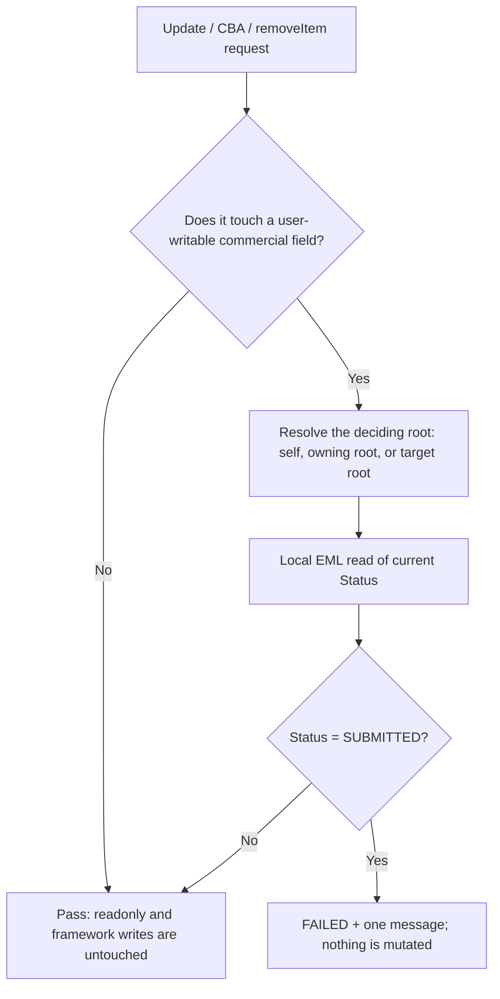

# Phase 2.7B — Post-submission commercial immutability

Status: **SAP runtime-verified complete** for root updates, item updates, create-by-association and `removeItem` on `SUBMITTED` orders, for both active and technical draft instances in the tested flows. Phase 2.1–2.7A remain runtime-verified and were not rewritten to achieve this. Approve, reject, sendToSupplier, cancel and `PurchaseOrderNumber` are not started.

## Target baseline

SAP_BASIS 758 SP01 (SAPK-75801INSAPBASIS), S4CORE 108 SP01 (SAPK-10801INS4CORE), ADT Core 3.60.3 / Business Object Tools 1.209.0, Eclipse 4.40.0.

**Every syntax and structure statement below was confirmed on this target and must not be generalized to other releases.** The compiler and runtime of the target system remain authoritative.

## Target-specific compiler evidence

Collected in the Phase 2.7B-1 probe round, each with a zero-footprint ADT experiment — nothing saved, nothing activated, the behavior definition restored to its baseline afterwards.

| Question | Target result |
| --- | --- |
| Derived type literally named "precheck" | **Does not exist.** Neither `STRUCTURE FOR` nor `TABLE FOR` proposes one. Precheck is an operation option, not a type |
| `update ( precheck );` on the root | Accepted, syntax check clean |
| `update ( precheck );` on the item | Accepted, syntax check clean |
| `association _Items { create ( precheck ); with draft; }` | Accepted, syntax check clean |
| `precheck` offered on root `create` | Offered by autocomplete, **not syntax-tested, not used** |

ADT generated these three signatures. They are used verbatim; none was written by hand.

```abap
METHODS precheck_update FOR PRECHECK
  IMPORTING entities FOR UPDATE purchaseorder.

METHODS precheck_update FOR PRECHECK
  IMPORTING entities FOR UPDATE PurchaseOrderItem.

METHODS precheck_cba_items FOR PRECHECK
  IMPORTING entities FOR CREATE purchaseorder\_items.
```

The `FOR UPDATE` line type on this target exposes `%cid_ref`, `%control`, `%data`, `%is_draft`, `%key`, `%pky`, `%tky` and the entity fields. `%control` carries an individual flag per field, including all five commercial root fields. This is what makes field-scoped rejection possible; a release without `%control` per field would need a different design.

## Business rules

1. A **root update** is rejected when the instance's current `Status = 'SUBMITTED'` **and** `%control` flags at least one of `Supplier`, `CompanyCode`, `PurchasingOrganization`, `PurchasingGroup`, `Currency`.
2. An **item update** is rejected when the **owning root's** current `Status = 'SUBMITTED'` and `%control` flags at least one of `ItemNumber`, `Material`, `MaterialDescription`, `Quantity`, `UnitOfMeasure`, `NetPrice`, `Currency`. The item carries no status of its own.
3. **Create-by-association `_Items`** is rejected when the target root is `SUBMITTED`. No `%control` filter applies; adding an item is always a commercial change.
4. **`removeItem`** is rejected when the root is `SUBMITTED`, checked before the ownership test and before any mutation.
5. If `%control` flags none of the listed user-writable fields, no rule fires. This is what preserves `submit`'s own `Status` write and the `TotalAmount` writes of `calculateTotalAmount` — both touch readonly fields only.
6. The status read happens in a precheck, before the buffer changes, so it is the **current** business status. `%tky` carries `%is_draft`, so a draft instance resolves against its own draft row.
7. **Root `DELETE` stays allowed.** Removing a submitted order belongs to the cancel/lifecycle rules of a later subphase, and the Phase 2.7A regression depends on deleting its own submitted fixture.

| Condition | Message text | Length |
| --- | --- | --- |
| Root commercial update on a submitted order | `Submitted orders cannot be changed.` | 35 |
| Item commercial update on a submitted order | `Submitted order items cannot change.` | 36 |
| Create-by-association on a submitted order | `Items cannot be added after submission.` | 39 |
| `removeItem` on a submitted order | `Submitted orders cannot lose items.` | 35 |

All four stay within the 50-character limit established in Phase 2.6, and all four were returned in full.



## Why precheck, and why no save-time backstop

Precheck runs before the transactional buffer is changed, applies to every external consumer, and sees both the current state and the requested change through `%control`. That matches the rule exactly.

Whether a precheck executes for an EML request issued `IN LOCAL MODE` was never determined, and it did not need to be. The `%control` scoping makes the design correct under either answer: the only local-mode writes this behavior pool performs are `Status` from `submit` and `TotalAmount` from `calculateTotalAmount`, and neither field appears in any guarded list. The full Phase 2.3–2.7A regression passing unchanged confirms this empirically.

A validation-on-save backstop was considered and deliberately **not** implemented. It would add no coverage, it would fire late, and a delete-triggered validation risked interfering with the root-delete cascade that rule 7 depends on. Instance feature control was also left out: it is advisory for UI rendering and `IN LOCAL MODE` bypasses it, so it could never have been the enforcement layer. It remains available as optional UX.

Gating the framework `Edit` action was considered and proved unnecessary — see the draft analysis below.

## Draft behavior on this target

Two probe results decided the draft design, and the implementation relies on both.

- **`Edit` on a `SUBMITTED` active order succeeds, and the resulting technical draft carries `Status = SUBMITTED`.** The draft is therefore guarded by the ordinary rules, reading its own status through `%tky`. Runtime-verified: a root commercial update and an item commercial update on such a draft were both rejected.
- **`submit` on an active instance is refused by the framework while a saved technical draft of it exists**, returning the root with `%FAIL = LOCKED` and a runtime lock message. Our handler never ran.

Together these close the case that shaped the design: a draft coexisting with a submitted active instance can only have been created after submission, and therefore carries `SUBMITTED`. No active-counterpart lookup is needed from inside a draft-context rule, and no `Edit` gate is required.

**Two limits on that conclusion, stated deliberately.**

- The `LOCKED` result is **single-user evidence** from one console flow. It is a concurrency outcome, not a business rule. Multi-user behavior, lock takeover and lock expiry were not tested, and no business rule was weakened on the strength of it.
- **`Activate` over a `SUBMITTED` active instance was never reached and is not claimed.** The probe was blocked at the preceding `submit`, so the behavior of that path is unknown on this target. `%cid` on `Activate` was accepted by the compiler but never executed.

## Exact ADT objects and activation order

1. Update **Behavior Definition ZJP_I_PURCHASEORDER** from [zjp_i_purchaseorder.bdef](../behavior/zjp_i_purchaseorder.bdef). Three lines: root `update ( precheck );`, `association _Items { create ( precheck ); with draft; }`, item `update ( precheck );`.
2. Update **Behavior Implementation class ZBP_I_PURCHASEORDER**, Local Types, from [zbp_i_purchaseorder.clas.locals_imp.abap](../classes/zbp_i_purchaseorder.clas.locals_imp.abap): three new methods, plus two insertions into `removeItem` — `Status` added to its root read and a guard before the ownership test. No other existing method body changed. The global class is unchanged.
3. **Save both and activate them together.** The precheck declarations and their handlers must activate in one step. Never activate the behavior definition alone with a precheck declared and no handler.
4. Update and activate **ZJP_CL_PO_EML_TEST** and **ZJP_CL_PO_DRAFT_PROBE**.
5. Run the active test first, then the draft test, with Run As → ABAP Application (Console), normally F9.

No new CDS object, database table, service, projection or UI is required.

## Runtime evidence

The learner ran both console classes on the recorded target and reported the following. No independent SAP execution is claimed here.

**Active regression, unchanged:** every Phase 2.3–2.7A PASS marker still printed — header totals, the Supplier, Quantity and NetPrice validations, the Phase 2.6 `removeItem` regression and the Phase 2.7A `submit` regression.

**Phase 2.7B active behavior:**

| Case | Result |
| --- | --- |
| Fixture reached `SUBMITTED`, `TotalAmount` 1900 | Confirmed |
| Root `Supplier` update | Rejected |
| Root `Currency` update | Rejected |
| Item `Quantity` update | Rejected |
| Item `Material` update | Rejected |
| Create-by-association of a third item | Rejected |
| `removeItem` | Rejected |
| Persisted state after all six rejections | Unchanged |
| Root `DELETE` on the submitted order | Succeeded |
| `DRAFT` negative control | Still editable, `TotalAmount` recalculated correctly |

**Draft behavior:** the Phase 2.6 draft regression stayed green; `Edit` on a submitted order produced a draft carrying `Status = SUBMITTED`; root and item commercial updates on that draft were both rejected; `Discard` and cleanup completed with zero remaining headers and zero remaining items.

No `STOP` marker appeared in either output.

Runtime-verified final lines:

```text
PASS: immutability fixture is SUBMITTED with total 1900.
PASS: all six submitted-order mutations were rejected.
PASS: the persisted submitted order is unchanged.
PASS: a submitted root can still be deleted; cleanup done.
PASS: DRAFT order still accepts Supplier and Quantity changes.
PASS: DRAFT control fixture cleanup complete.
PASS: Phase 2.7B rejects root, item, CBA and removeItem changes after SUBMITTED.
PASS: SUBMITTED draft rejected both root and item updates.
PASS: Phase 2.7B draft immutability verified; cleanup complete.
```

## Known gaps carried forward

Runtime verification covers the four operations above on `SUBMITTED` orders. It does not cover any of the following, and none may be presented as solved.

- `PurchaseOrderNumber` is still not allocated; submitted orders have no human-readable identity.
- Root `DELETE` of a submitted order is still allowed by design; physical deletion rules and `cancel` belong to a later subphase.
- No `approve`, `reject`, `sendToSupplier` or `cancel` transition exists; `SUBMITTED` remains terminal.
- Authorization remains the permissive study stub; negative permission cases are not covered.
- `Activate` over a `SUBMITTED` active instance is untested.
- Precheck behavior for `IN LOCAL MODE` requests is undetermined; the design does not depend on it.
- Instance feature control is not implemented; no UI affordance reflects these rules yet.
- Multi-user and concurrency behavior, including draft lock takeover and expiry, is untested.
