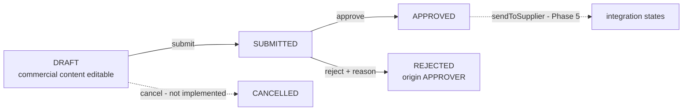

# Phase 2.7C — Approver decisions: approve and reject

Status: **SAP runtime-verified complete** for `SUBMITTED` → `APPROVED`, `SUBMITTED` → `REJECTED`, and the generalized lifecycle immutability invariant that replaced the Phase 2.7B `SUBMITTED`-only rule. Phase 2.1–2.7B remain runtime-verified and were not rewritten to achieve this. `cancel` and `sendToSupplier` are not started, and `PurchaseOrderNumber` remains unresolved for Phase 2 closure.

## Target baseline

SAP_BASIS 758 SP01 (SAPK-75801INSAPBASIS), S4CORE 108 SP01 (SAPK-10801INS4CORE), ADT Core 3.60.3 / Business Object Tools 1.209.0, Eclipse 4.40.0. Every syntax and behavior statement below was observed on this target and must not be generalized to other releases.

## The lifecycle invariant

**Business rule: commercial content is editable only while business `Status` is `DRAFT`.**

Phase 2.7B rejected changes when `Status = 'SUBMITTED'`. That was sufficient while `SUBMITTED` was the only state after `DRAFT`. With `APPROVED` and `REJECTED` now reachable, the rule is expressed the other way round, so every persisted state after `DRAFT` is immutable — including states added later, with no further change to these handlers.

**Technical carve-out: `Status` `INITIAL` may pass the prechecks.** This is a transient creation-compatibility case only. `initializeStatus` is a determination on modify, so a newly created root can be readable inside a request before `DRAFT` has been established. Allowing `INITIAL` through keeps root and item creation working.

`INITIAL` is **not** an editable business state. It is a framework transient that exists only between creation and the determination that sets `DRAFT`. No persisted order is expected to sit in it, and no rule, document or interface should present it as a lifecycle value. The invariant is `DRAFT`; the carve-out is an implementation accommodation.

The unreadable-instance branch is also preserved in all three prechecks: an instance that cannot be read is left to the framework's own handling, which is what allows create-by-association against a root addressed only by `%cid_ref`.

Applied identically to root update, item update, create-by-association `_Items` and `removeItem`. `%control` field scoping from Phase 2.7B is unchanged, so the framework's own writes to readonly fields — `Status` from the actions, `TotalAmount` from the determinations — continue to pass.

## Business transitions added

| From | Action | To | Additional effect |
| --- | --- | --- | --- |
| `SUBMITTED` | `approve` | `APPROVED` | none |
| `SUBMITTED` | `reject` | `REJECTED` | `RejectionOrigin = 'APPROVER'`, `RejectionReason` from the action parameter |

Both actions are instance-bound on the root, delegate authorization to root update, and accept **active instances only**. Technical draft instances are refused before any read, exactly as `submit` does — Phase 2.7B established that a draft taken from a submitted order carries that order's `Status`, so a draft would otherwise be decidable.

`reject` requires a non-initial `RejectionReason`. Its parameter is the new abstract entity `ZJP_A_Reject`, following the runtime-verified `ZJP_A_RemoveItem` pattern:

```
@EndUserText.label: 'Purchase order rejection parameter'
define abstract entity ZJP_A_Reject
{
  RejectionReason : abap.char(255);
}
```

The length matches `rejection_reason : abap.char(255) not null` in the persistence table. `RejectionOrigin` is not a parameter; the handler fixes it to `'APPROVER'`.

**This is approver rejection only.** Supplier-side rejection sets `RejectionOrigin = 'SUPPLIER'` through a different mechanism in a later phase and is not touched here. The two paths share a status but not an implementation.

**No approver-role authorization is implemented.** Authorization remains the permissive study stub delegated to root update. The word "approve" in this subphase names a lifecycle transition, not an access control. Do not read it as approval governance.

### Rejection precedence

Eligibility and lifecycle state are evaluated before parameter content, so a call fails for the most fundamental reason first:

1. technical draft instance → `Not allowed on a draft instance.`
2. root unreadable or not exactly one instance → `Order could not be read; no action taken.`
3. `Status` is not `SUBMITTED` → `Only submitted orders can be decided.`
4. `reject` only, reason initial → `Rejection reason is required.`
5. nested update failed → `Status update failed; rollback this request.`

A draft with an empty reason therefore fails as a draft, and an `APPROVED` order with an empty reason fails as already decided. Each rejection appends one `failed-purchaseorder` entry and one message, marked `%op-%action-approve` or `%op-%action-reject`, and mutates nothing.



## Message texts

Phase 2.7B's four immutability messages were reworded for the generalized invariant. The earlier texts named `SUBMITTED` and would now be wrong.

| Condition | Text |
| --- | --- |
| Root commercial update outside `DRAFT` | `Only draft orders can be changed.` |
| Item commercial update outside `DRAFT` | `Only draft order items can change.` |
| Create-by-association outside `DRAFT` | `Items can be added to draft orders only.` |
| `removeItem` outside `DRAFT` | `Only draft orders can lose items.` |
| Decision on a draft instance | `Not allowed on a draft instance.` |
| Root unreadable during a decision | `Order could not be read; no action taken.` |
| Decision on a non-`SUBMITTED` order | `Only submitted orders can be decided.` |
| `reject` without a reason | `Rejection reason is required.` |

On message length: the target truncated one 53-character text to 50 characters on the Phase 2.6 path, and the console tests compare returned text exactly. That is **empirical, target- and path-specific behavior, not a documented universal limit**. Messages here are kept short and their returned text is verified in the console rather than assumed.

## Exact ADT objects and activation order

1. Create **Data Definition ZJP_A_REJECT** from [zjp_a_reject.ddls](../cds/zjp_a_reject.ddls) using the abstract-entity template. Activate it **alone, first**.
2. Update **Behavior Definition ZJP_I_PURCHASEORDER** from [zjp_i_purchaseorder.bdef](../behavior/zjp_i_purchaseorder.bdef): two new lines, `action ( authorization : update ) approve;` and `action ( authorization : update ) reject parameter ZJP_A_Reject;`.
3. Update **Behavior Implementation class ZBP_I_PURCHASEORDER**, Local Types, from [zbp_i_purchaseorder.clas.locals_imp.abap](../classes/zbp_i_purchaseorder.clas.locals_imp.abap): the `approve` and `reject` methods, the generalized status check in both prechecks, the create-by-association precheck and the `removeItem` guard, and the four reworded messages. The global class is unchanged.
4. **Save the BDEF and Local Types, then activate them together.** Never activate the behavior definition alone with actions declared and no handlers.
5. Update and activate **ZJP_CL_PO_EML_TEST** and **ZJP_CL_PO_DRAFT_PROBE**.
6. Run the active test first, then the draft test, with Run As → ABAP Application (Console), normally F9.

No new database table, service, projection or UI is required.

## Runtime evidence

The learner ran both console classes on the recorded target and reported the following. No independent SAP execution is claimed here.

**Regression:** no `STOP` markers in either class. The Phase 2.3–2.7B regression remained green, including the Phase 2.7B immutability block — all six submitted-order mutations still rejected, now under the reworded messages.

**Approve:**

| Case | Result |
| --- | --- |
| `SUBMITTED` → `APPROVED` | Succeeded; persisted in ZJP_PO_H |
| `TotalAmount` | Remained 1500 |
| `PurchaseOrderNumber` | Remained initial |
| Re-approve | Rejected |
| `reject` from `APPROVED` | Rejected |
| Root commercial update, item commercial update, create-by-association, `removeItem` on `APPROVED` | All rejected |

**Reject:**

| Case | Result |
| --- | --- |
| `reject` without a reason | Refused; nothing written |
| `SUBMITTED` → `REJECTED` | Succeeded; persisted in ZJP_PO_H |
| `RejectionOrigin` | Persisted as `APPROVER` |
| `RejectionReason` | Persisted as `Budget exceeded` |
| `TotalAmount` / `PurchaseOrderNumber` | 1500 / initial |
| `approve` from `REJECTED` | Rejected |
| Commercial mutations on `REJECTED` | Rejected |

**Draft:** the Phase 2.6 and 2.7B draft regressions remained green. A technical draft of a `SUBMITTED` order rejected a root commercial update, an item commercial update, `approve` and `reject`. Cleanup finished with zero remaining headers and zero remaining items.

Runtime-verified markers:

```text
PASS: SUBMITTED to APPROVED persisted with total 1500.
PASS: APPROVED rejects re-decision and every commercial change.
PASS: reject without a reason is refused and writes nothing.
PASS: SUBMITTED to REJECTED persisted with origin APPROVER.
PASS: REJECTED rejects approve and every commercial change.
PASS: Phase 2.7C approve and reject transitions with lifecycle immutability.
PASS: SUBMITTED draft rejected root and item updates plus approve and reject.
```

## Known gaps carried forward

None of the following is implemented, and none may be presented as solved.

- **`cancel` is not implemented.** `DRAFT`/`SUBMITTED` → `CANCELLED`, and `APPROVED` → `CANCELLED` only when delivery was never requested, remain future work.
- **`sendToSupplier` is deferred to Phase 5.** `DeliveryIntent`, delivery identity, the immutable snapshot and dispatch semantics are introduced there. A status-only action now would name a capability that does not exist.
- **`PurchaseOrderNumber` remains unresolved for Phase 2 closure.** Approved and rejected orders still carry no human-readable identity. Before Phase 2 is declared complete, the target must be investigated for an appropriate released number-range mechanism. If a suitable mechanism exists, it is implemented within Phase 2. If it cannot reasonably be implemented within the Phase 2 target and scope, an explicit architectural deferment decision is made and documented at that point. No destination phase is named before that decision is made. Open issue OI-02 keeps this inside Phase 2.
- **Root `DELETE` is unchanged and still allowed at any status.** Narrowing it belongs with the `cancel` lifecycle rules.
- **No approver-role authorization.** The permissive study stub is unchanged; negative permission cases are uncovered.
- **Supplier-side rejection** (`RejectionOrigin = 'SUPPLIER'`) is future work and shares no code with this subphase.
- **`Activate` over a closed-status technical draft is untested.** The Phase 2.7B probe never reached it.
- **The saved-draft `LOCKED` behavior is target-specific, single-user evidence** from one console flow. It is a concurrency observation, not a lifecycle guarantee, and no business rule depends on it.
- **No multi-user or concurrency coverage is claimed**, including lock takeover and lock expiry.
