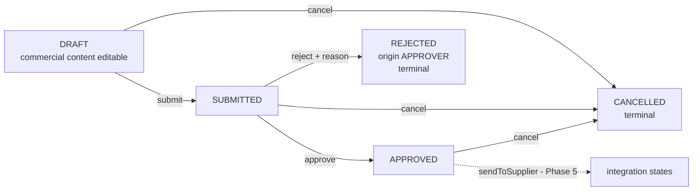

# Phase 2.7D-1 — The cancel lifecycle action

Status: **SAP runtime-verified complete** for `DRAFT` → `CANCELLED`, `SUBMITTED` → `CANCELLED` and `APPROVED` → `CANCELLED`, and for the refusal of `REJECTED` → `CANCELLED`, of re-cancellation and of cancellation on a technical draft. Phase 2.1–2.7C remain runtime-verified and were not rewritten to achieve this. Root `DELETE` is deliberately unchanged here; see [Phase 2.7D-2](#phase-27d-2-root-delete-narrowed-to-draft-runtime-verified).

## Target baseline

SAP_BASIS 758 SP01 (SAPK-75801INSAPBASIS), S4CORE 108 SP01 (SAPK-10801INS4CORE), ADT Core 3.60.3 / Business Object Tools 1.209.0, Eclipse 4.40.0. Every syntax and behavior statement below was observed on this target and must not be generalized to other releases.

## Why the subphase was split

Phase 2.7D was planned as one step covering both `cancel` and the final physical root `DELETE` policy. It was split because narrowing `DELETE` to `DRAFT` invalidates the self-cleaning teardown of five runtime-verified fixtures across the two console classes, three of which are deliberately left in a terminal state. Bundling a new transition with a rewrite of teardown in verified test classes would produce one activation round in which a failure could not be attributed. 2.7D-1 adds only the transition and touches no existing test line; 2.7D-2 owns the deletion policy and the teardown consequences.

## Business transitions added

| From `Status` | `cancel` | To |
| --- | --- | --- |
| `DRAFT` | allowed | `CANCELLED` |
| `SUBMITTED` | allowed | `CANCELLED` |
| `APPROVED` | allowed | `CANCELLED` |
| `REJECTED` | **rejected** | — |
| `CANCELLED` | **rejected** | — |
| `INITIAL` | **rejected** | — |

The authority is the project domain model, not general procurement practice: [docs/architecture/domain-model.md](../../docs/architecture/domain-model.md) lists `DRAFT`/`SUBMITTED` → `CANCELLED` and conditional `APPROVED` → `CANCELLED`, and states that `REJECTED` and `CANCELLED` are terminal in v1, with rework meaning a new order.

`cancel` is root-bound, parameterless, delegates authorization to root update, and accepts **active instances only**. It writes `Status = 'CANCELLED'` and nothing else: no `RejectionOrigin`, no `RejectionReason`, no `PurchaseOrderNumber`, no integration fields, no totals recalculation and no revalidation of business content.

**`DRAFT` → `CANCELLED` is a business transition on an active instance**, not the discarding of an edit session. The domain model keeps these separate, and so does the implementation: cancelling records a withdrawn order, while the framework draft action `Discard` throws away a technical draft and is untouched by this subphase.

### Allow-list, not deny-list

Eligibility is expressed as a positive allow-list of `DRAFT`, `SUBMITTED` and `APPROVED`. This is the opposite shape from the Phase 2.7C prechecks, which are deny-rules and therefore need an explicit `INITIAL` carve-out to keep creation working. An allow-list excludes `INITIAL` on its own, with no carve-out and no comment, because `INITIAL` is the transient state between creation and `initializeStatus` rather than a business state. The 2.7C carve-out is not extended to `cancel`.

### Guard precedence

Eligibility and lifecycle state are evaluated before anything else, matching the Phase 2.7C ordering:

1. technical draft instance → `Not allowed on a draft instance.`
2. root unreadable or not exactly one instance → `Order could not be read; no action taken.`
3. `Status` outside the allow-list → `Only open orders can be cancelled.`
4. nested update failed → `Status update failed; rollback this request.`

Each rejection appends one `failed-purchaseorder` entry marked `%op-%action-cancel` plus one message, and mutates nothing.

## APPROVED cancellation carries no delivery-request guard

The domain model allows `APPROVED` → `CANCELLED` **only if delivery has never been requested**. That guard is **not implemented in Phase 2, deliberately**.

`IntegrationStatus` and `DeliveryId` exist in the model — [zjp_i_purchaseorder.ddls](../cds/zjp_i_purchaseorder.ddls), persisted as `abap.char(16) not null` and `sysuuid_x16 not null` — but both are declared `field ( readonly )` and **no handler, determination or action assigns either one**. [Phase 1](phase-1-domain-model.md) states this on purpose: storing the fields does not implement transitions.

In Phase 2, therefore, "delivery has been requested" is not merely false — it is **unrepresentable as true**. A guard such as `IF IntegrationStatus IS NOT INITIAL` would be a tautology that can never fire, and could never be tested negatively, because producing a non-initial `IntegrationStatus` would require a direct SQL write, which the repository rules forbid. A branch that is present but unexercised reads as enforcement while carrying no evidence.

**The guard is a Phase 5 obligation, not Phase 2 debt.** It belongs in the same change that introduces `DeliveryIntent` and `sendToSupplier`, which is what first makes the condition reachable and testable. [ARCHITECTURE.md](../../ARCHITECTURE.md) already places it there: claiming the delivery intent is what prevents concurrent sends and cancellation. Until that change lands, `APPROVED` → `CANCELLED` is **unguarded because no dispatch capability exists** — it must not be described as guarded or as safe against a delivery race.

## CANCELLED immutability needed no new code

`CANCELLED` is a state after `DRAFT`, so the Phase 2.7C invariant — *commercial content is editable only while business `Status` is `DRAFT`* — already covers it. Root updates, item updates, create-by-association and `removeItem` are all rejected on a cancelled order with **no `CANCELLED`-specific branch in any precheck or in `removeItem`**.

This is the payoff the invariant was written for. Under the enumerated Phase 2.7B rule, which named `SUBMITTED`, adding `CANCELLED` would have required editing four handlers and would have silently permitted edits to any state left off the list.

The action's own write passes for the same reason `submit` does: `Status` is a readonly field, never flagged in `%control`, so the root update precheck does not guard it.

## Message texts

| Condition | Text |
| --- | --- |
| `cancel` on a technical draft | `Not allowed on a draft instance.` |
| Root unreadable during `cancel` | `Order could not be read; no action taken.` |
| `cancel` outside the allow-list | `Only open orders can be cancelled.` |
| Nested status update failed | `Status update failed; rollback this request.` |

Only the third text is new; the other three are reused verbatim from Phase 2.7C. The new text is 34 characters. The target truncated one 53-character text to 50 characters on the Phase 2.6 path, which is **empirical, target- and path-specific behavior, not a documented universal limit**; messages are kept short and their returned text is verified in the console rather than assumed.

## Lifecycle after Phase 2.7D-1



## Exact ADT objects and activation order

1. Update **Behavior Definition ZJP_I_PURCHASEORDER** from [zjp_i_purchaseorder.bdef](../behavior/zjp_i_purchaseorder.bdef): one new line, `action ( authorization : update ) cancel;`.
2. Update **Behavior Implementation class ZBP_I_PURCHASEORDER**, Local Types, from [zbp_i_purchaseorder.clas.locals_imp.abap](../classes/zbp_i_purchaseorder.clas.locals_imp.abap): the `cancel` declaration and the `cancel` method. No other method changed, and the global class is unchanged.
3. **Save the BDEF and Local Types, then activate them together.** Never activate the behavior definition alone with an action declared and no handler.
4. Update and activate **ZJP_CL_PO_EML_TEST** and **ZJP_CL_PO_DRAFT_PROBE** in the same round. Phase 2.7C showed what happens otherwise: correct production behavior reported under a stale test class produces a wrong verdict.
5. Run the active test first, then the draft test, with Run As → ABAP Application (Console), normally F9.

No new abstract entity, database table, service, projection or UI is required. `cancel` is parameterless, so nothing like `ZJP_A_Reject` was needed.

The handler signature follows the generated form already proven by `submit`, `approve` and `reject`:

```abap
METHODS cancel FOR MODIFY
  IMPORTING keys FOR ACTION PurchaseOrder~cancel.
```

No new derived type or generated structure was introduced by this subphase, which is why no probe round was required.

## Runtime evidence

The learner ran both console classes on the recorded target and reported the following. No independent SAP execution is claimed here.

**Regression:** no `STOP` markers in either class. The Phase 2.3–2.7C regression remained green, and no existing assertion or message text was changed.

**Active transitions:**

| Case | Result |
| --- | --- |
| `DRAFT` → `CANCELLED` | Succeeded; persisted in ZJP_PO_H |
| `TotalAmount` | Remained 1500 |
| `PurchaseOrderNumber` | Remained initial |
| `SUBMITTED` → `CANCELLED` | Succeeded; persisted with total 1500 |
| `APPROVED` → `CANCELLED` | Succeeded; persisted with total 1500 |
| `REJECTED` → `CANCELLED` | Rejected; `Status` remained `REJECTED` |
| `RejectionOrigin` on the rejected fixture | Retained as `APPROVER` |

**Terminal behavior on `CANCELLED`:** re-`cancel`, `submit`, `approve`, `reject`, a representative root commercial update, a representative item commercial update, create-by-association and `removeItem` were all rejected.

**Draft:** `cancel` on the `SUBMITTED` technical draft was rejected. The earlier draft regression remained green and cleanup ended with zero remaining headers and zero remaining items.

Runtime-verified markers:

```text
PASS: DRAFT to CANCELLED persisted with total 1500.
PASS: CANCELLED refuses re-cancel, submit, approve and reject.
PASS: CANCELLED rejects every commercial change.
PASS: SUBMITTED to CANCELLED persisted with total 1500.
PASS: APPROVED to CANCELLED persisted with total 1500.
PASS: REJECTED refuses cancel and stays REJECTED.
PASS: Phase 2.7D-1 cancel lifecycle verified.
PASS: Phase 2.7D-1 technical draft refuses cancel.
```

## Phase 2.7D-2: root DELETE narrowed to DRAFT, runtime-verified

Root `DELETE` was **intentionally unchanged** in 2.7D-1. Phase 2.7D-2 closed it, and the run reported under [Phase 2.7E](phase-2-7e-purchase-order-number.md) verified it.

ADT supplied the missing target evidence: `delete ( precheck );` is accepted on the root, and the generated signature is `METHODS precheck_delete FOR PRECHECK IMPORTING keys FOR DELETE purchaseorder.`, used verbatim. The policy implemented is **physical deletion only while business `Status` is `DRAFT`**, with the same transient `INITIAL` carve-out the other prechecks use so that a create-then-delete inside one round keeps working. `SUBMITTED`, `APPROVED`, `REJECTED` and `CANCELLED` are refused with `Only draft orders can be deleted.` Technical draft `Discard` is a framework draft action and was not touched.

The regression consequence was paid, not avoided. Narrowing deletion invalidated the teardown of five deliberately terminal fixtures — two `SUBMITTED` and one each `APPROVED` and `REJECTED` in the active class, plus the `SUBMITTED` fixture in the draft probe. There is no lawful managed replacement: direct SQL deletion is forbidden, and `cancel` does not help because `CANCELLED` is not deletable either. A test-only deletion backdoor in production behavior was rejected. The resolution is **deliberate residue**: each old teardown became a positive assertion that deletion is now refused, the per-fixture sweeps expect the surviving rows instead of zero, and every fixture UUID is printed so the rows can be identified by hand. Four positive `DRAFT` deletion paths remain, so deletion is still proven to work where it is allowed.

Each full run therefore leaves roughly nine header rows and ten item rows behind. That is the intended outcome, not a leak: a real system never physically deletes closed orders either.

## Known gaps carried forward

None of the following is implemented, and none may be presented as solved.

- **Root `DELETE` was unchanged and still allowed at any status at this checkpoint.** Phase 2.7D-2 has since narrowed it to `DRAFT`, and that is runtime-verified.
- **`APPROVED` → `CANCELLED` has no delivery-request guard**, because nothing in Phase 2 can make that condition true. The guard belongs with `DeliveryIntent` and `sendToSupplier` in Phase 5 and must not be described as present.
- **`sendToSupplier` is deferred to Phase 5.** `DeliveryIntent`, delivery identity, the immutable snapshot and dispatch semantics are introduced there.
- **`PurchaseOrderNumber` was unallocated at this checkpoint.** [Phase 2.7E](phase-2-7e-purchase-order-number.md) has since implemented allocation on a successful `submit`, closing OI-02 inside Phase 2. An order cancelled directly from `DRAFT` still carries no number, because it never passes through `submit` — that is the rule, not a gap, and the run confirmed it. Phase 2.7E is runtime-verified.
- **No approver-role authorization.** The permissive study stub is unchanged, so `cancel` names a lifecycle transition and not an access control: any user may cancel any order. Negative permission cases are uncovered.
- **Supplier-side rejection** (`RejectionOrigin = 'SUPPLIER'`) is future work and shares no code with this subphase.
- **`Activate` over a closed-status technical draft is untested.** The Phase 2.7B probe never reached it.
- **The saved-draft `LOCKED` behavior is target-specific, single-user evidence** from one console flow. Cancelling an active order while a saved draft exists was not exercised and no rule depends on it.
- **No multi-user or concurrency coverage is claimed**, including lock takeover and lock expiry.
