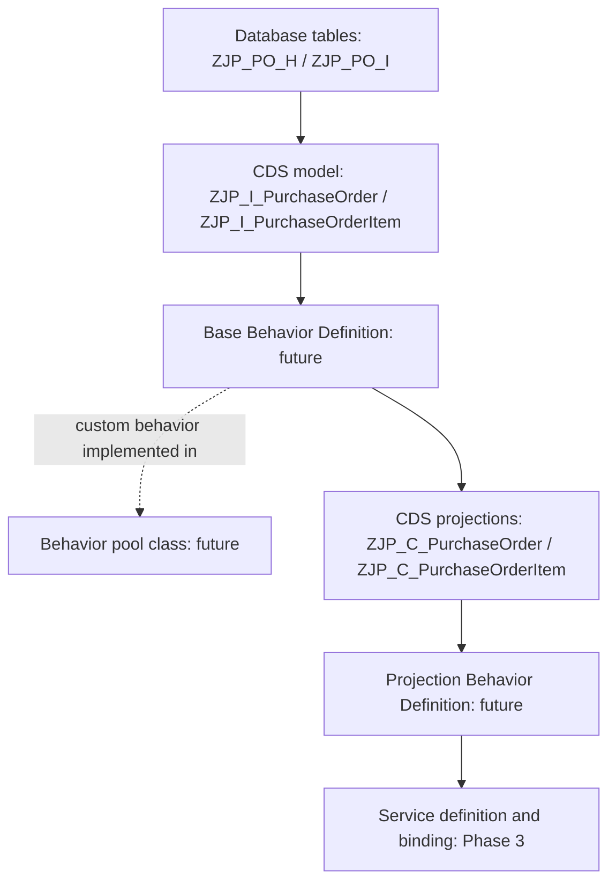

# Phase 2, Step 1 — RAP behavior architecture

Historical introductory lesson. Phase 1 and Phase 2.1–2.3 are complete, including [verified SAP EML execution](phase-2-3-eml-runtime-evidence.md). The current checkpoint is the [Phase 2.4A status-initialization plan](phase-2-4a-status-initialization-plan.md).

## What we are building toward

Phase 1 defined what a purchase order looks like and how its items relate to it. Phase 2 will give that model a transactional contract: the operations consumers may request and the rules RAP applies while processing changes.

The intended object is one managed RAP Purchase Order BO with two entities: PurchaseOrder as root and PurchaseOrderItem as child. “Managed” means the framework supplies standard transactional buffering and persistence once behavior is configured. We still supply business-specific decisions and checks. An unmanaged BO is useful when existing application logic must own those responsibilities; our new custom tables fit the managed approach. See [SAP's standard managed behavior](https://help.sap.com/docs/ABAP_PLATFORM_NEW/fc4c71aa50014fd1b43721701471913d/a44909694d6d47ea8d4583f91e588548.html).

## How the layers connect

This is a map of the development layers, not the chronological execution of a database request. Behavior attaches to the existing CDS entities; it does not replace the tables or insert another SQL view into their select statements.

| Existing object | Its role when behavior is added |
| --- | --- |
| ZJP_PO_H | Stores committed active header data |
| ZJP_PO_I | Stores committed active item data |
| ZJP_I_PurchaseOrder | Supplies root fields, keys and the `_Items` composition to the base behavior |
| ZJP_I_PurchaseOrderItem | Supplies child fields, keys and `_PurchaseOrder` parent relationship to that same BO |
| ZJP_C_PurchaseOrder | Exposes the selected header fields and projected item navigation to a consumer |
| ZJP_C_PurchaseOrderItem | Exposes item fields and redirects parent navigation to the projected header |

The Phase 1 compatibility fixes stay in place. Adding behavior is not a reason to reintroduce the rejected root currency marker or the child's explicit provider-contract clause.

## Data model, definition and implementation

**CDS data model:** describes structure and relationships. In this project, it says that a header has PurchaseOrderUUID, Supplier, TotalAmount and Status, and that `_Items` leads to its item entity. An amount annotation describes the currency reference; it does not calculate the amount. A composition describes ownership; by itself it does not expose a write API.

**Behavior Definition (BDEF):** is a separate ADT repository object, written in Behavior Definition Language. It declares the BO's transactional contract: enabled operations, persistence mapping and behavior characteristics, plus declarations for later custom logic. One root-based BDEF can contain the behavior sections for both our root and child. “Child behavior” does not mean a second independent root BDEF. See [SAP's behavior-definition model](https://help.sap.com/docs/abap-cloud/abap-rap/defining-and-implementing-behavior-of-business-object).

**Behavior Implementation:** is ABAP code in a special class called a behavior pool. Local handler classes inside it implement the requested extension points. Later, our supplier validation and total calculation will belong here. Declaring a validation in the BDEF and implementing its method are distinct steps. Basic managed persistence does not require hand-written INSERT/UPDATE/DELETE handlers. See [SAP's behavior pool explanation](https://help.sap.com/docs/abap-cloud/abap-rap/implementing-behavior-of-business-object).

**Projection Behavior Definition:** selects which underlying operations the consumer projection uses. The CDS projection chooses the fields/navigation; the projection behavior chooses the operations. Reused behavior still runs in the base BO. For the basic projection planned here, no separate projection implementation class is needed. See [SAP's behavior projection](https://help.sap.com/docs/abap-cloud/abap-rap/projecting-behavior?locale=en-US&the-interaction-phase=).

For example, the existence of a Quantity field belongs to the CDS model. Making an item update operation available belongs to the behavior definition. Checking a proposed quantity against a business rule belongs to custom behavior logic. None of that logic is implemented in this step.

## Future ADT artifacts: identify them, do not create them yet

| Purpose | ADT object type | Proposed name / placement |
| --- | --- | --- |
| Base BO contract, root and child sections | Behavior Definition | ZJP_I_PURCHASEORDER, attached to the existing root CDS entity |
| Custom behavior methods | ABAP Class, behavior pool | ZBP_I_PURCHASEORDER; selected by the learner and now referenced by the corrected BDEF |
| Operations selected for the projection | Behavior Definition, implementation type Projection | ZJP_C_PURCHASEORDER, attached to the root projection |

The two Behavior Definition objects can share names with their corresponding CDS data definitions because they are different repository object types. ZBP_I_PURCHASEORDER supersedes the earlier proposed class name. Its implementation is now required by the current root instance-authorization contract, while standard CRUD stays managed. This introductory lesson itself contains no class code.

## What a future change request will do

A later EML test will request an operation from RAP, which will use the BO's declared behavior and manage the transactional buffer. Custom handlers run where the configured behavior requires them. Successful changes reach the persistent tables during the save sequence. We will learn that sequence explicitly in the EML step.

Phase 3's OData service will give external consumers another entry point to the BO. It will not replace the BO or introduce a second implementation of the procurement rules. The layer diagram reads from storage toward service; a runtime request arrives from a consumer and is processed toward persistence.

## The Phase 2 learning checkpoints

| Step | Topic | Current status |
| --- | --- | --- |
| 2.1 | Behavior Definition | Complete; corrected managed root/child contract executed by EML |
| 2.2 | Behavior pool / authorization stub | Complete for the permissive study scope |
| 2.3 | EML CRUD/composition runtime verification | Complete; successful learner-supplied SAP output |
| 2.4 | Determinations | Current: Status DRAFT explanation and plan only |
| 2.5 | Validations | Pending; follows determinations |
| 2.6 | Technical draft | Pending; follows validations |
| 2.7 | Business actions | Pending; follows draft |

This is a roadmap, not an implementation. Outbound delivery and supplier-response effects still depend on later integration phases; naming an action will not establish those integrations.

## Step 1 exercise and expected result

In ADT, open the already active ZJP_I_PurchaseOrder and ZJP_I_PurchaseOrderItem definitions. Locate `_Items` and `_PurchaseOrder`; then open the two projections and find their redirections. Do not change or reactivate them for this exercise.

Explain where each future concern belongs:

1. The field Supplier exists and is exposed to a consumer.
2. Consumers can request an item update.
3. A requested business operation rejects invalid supplier data.
4. A particular projection exposes an existing operation.

Expected classification: (1) CDS model/projection; (2) base behavior declaration; (3) custom behavior implementation with its declaration in the BDEF; (4) projection behavior. The same BO underlies both entities; it is not one independent BO per table.

Passing this step means being able to explain those responsibilities. It does not require an EML run, CRUD result or new activation. Stop here and confirm understanding before Step 2. That pause is the learner's explicit instruction, not a tooling or system-access blocker.
