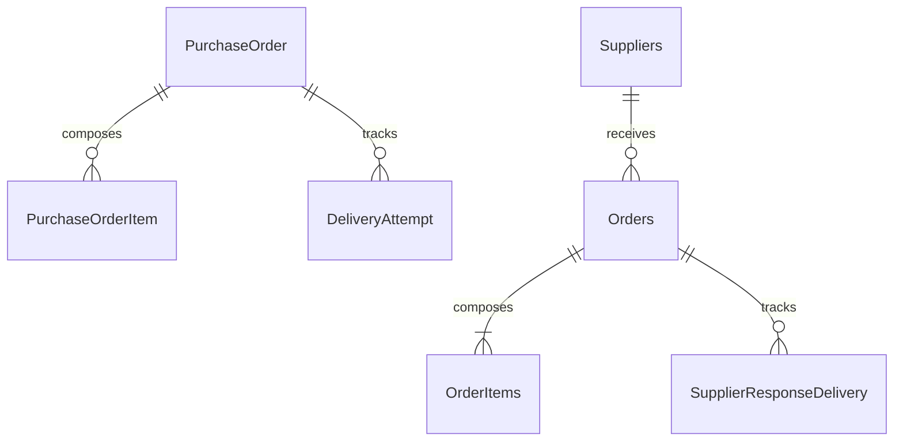

# Domain model

Phase 0 logical model with Phase 1 implementation updates. The learner has now activated the RAP persistence/CDS objects in SAP S/4HANA through ADT. The field definitions below describe the agreed model; behavior and integration rules remain future implementation.

Phase 1 update: source for the full RAP header/item field set exists under [abap-rap](../../abap-rap/README.md), using the ZJP_ prefix. The [ADT guide](../../abap-rap/docs/phase-1-domain-model.md) explains each object and records successful activation plus the root currency-marker and child provider-contract corrections. The logical nullable fields below map to ABAP initial values in non-null persistence columns; API null conversion is deferred. Monetary columns use DEC(19,2)/DEC(19,4) with amount-to-currency annotations in CDS; quantity uses QUAN(13,3) with a local UNIT reference. Constraints such as required supplier, allowed states and uniqueness of display/item numbers remain behavior work, not implemented database checks. Draft tables remain Phase 2 work.

## Ownership and relationships

The first three entities belong to RAP; the remaining entities belong to CAP. There are no cross-database foreign keys. CAP correlates to RAP through source system, source order UUID and revision. A RAP order may have zero items while being prepared; submission requires at least one. CAP only receives validated complete orders.

## PurchaseOrder, RAP root

| Field | Proposed logical type | Meaning and rules |
| --- | --- | --- |
| PurchaseOrderUUID | UUID, RAW(16) in ABAP | Technical root key; canonical UUID string on the wire |
| PurchaseOrderNumber | String(20) | Unique display identifier, e.g. PO000001; never the integration key |
| Supplier | String(10) | Required when saving an active order; controlled synthetic code initially |
| SupplierName | String(100) | Read-only snapshot derived from supplier reference data |
| CompanyCode | String(4) | Required active-order organizational context |
| PurchasingOrganization | String(4) | Required active-order organizational context |
| PurchasingGroup | String(3) | Required active-order organizational context |
| Currency | Currency code, up to 5 characters internally | Required; initially only EUR is configured end to end |
| TotalAmount | Decimal(19,2) | Read-only sum of rounded item amounts for initial EUR scope |
| Status | String(12), controlled values | Procurement lifecycle; not the RAP draft flag |
| CreatedBy | Released user-name-compatible type | Framework-managed |
| CreatedAt | UTC timestamp | Framework-managed |
| LastChangedBy | Released user-name-compatible type | Framework-managed, added for audit |
| LastChangedAt | UTC timestamp | Root total-change timestamp for draft concurrency |
| LocalLastChangedAt | UTC timestamp | Instance ETag candidate, separate from root total ETag |
| SupplierResponse | String(8), nullable | ACCEPTED or REJECTED; null until supplier decision |
| EstimatedDeliveryDate | Date, nullable | Supplier-provided, allowed on accepted orders |
| OrderRevision | Positive integer | Starts at 1; frozen at submission; no revision editing in v1. **Not implemented:** no RAP handler writes it, so every row holds the `abap.int4` initial value `0`, and CAP's ingestion requires `source.revision` ≥ 1. Phase 5.1 records this as blocker B1 |
| IntegrationStatus | String(16) | NOT_REQUESTED, PENDING, IN_FLIGHT, DELIVERED, FAILED or UNKNOWN |
| DeliveryId | UUID, nullable | Current immutable logical delivery; retained on retry |
| LastErrorCode | String(60), nullable | Safe diagnostic code |
| LastErrorMessage | String(255), nullable | Useful sanitized summary; detailed diagnostics in restricted logs |
| LastErrorAt | UTC timestamp, nullable | Most recent integration failure time |
| LastCorrelationId | UUID, nullable | Links UI diagnostics to integration processing |
| LastResponseId | UUID, nullable | Latest applied supplier response identity |
| LastResponseVersion | Nonnegative integer | 0 before response; increments in CAP for every response change |
| RejectionOrigin | String(10), nullable | APPROVER or SUPPLIER; avoids ambiguity in REJECTED |
| RejectionReason | String(255), nullable | Required for rejection |

Draft persistence also needs the RAP-required draft administrative include and draft tables for both nodes. Draft storage is framework infrastructure, not an integration source. Exact ETag annotations and update propagation will be verified during implementation.

## PurchaseOrderItem, RAP child

| Field | Proposed logical type | Meaning and rules |
| --- | --- | --- |
| PurchaseOrderItemUUID | UUID, RAW(16) | Technical child key |
| PurchaseOrderUUID | UUID, RAW(16) | Required parent reference; association to parent |
| ItemNumber | NUMC(5) internally | Unique within order; values 00010, 00020; external line number 10, 20 |
| Material | String(40) | Synthetic material identifier; no standard MM lookup assumed |
| MaterialDescription | String(100) | Order-time description |
| Quantity | Decimal(13,3) | Greater than zero for active valid items |
| UnitOfMeasure | Unit code, up to 3 characters internally | Initial configured code EA; wire mapping to PCE |
| NetPrice | Decimal(19,4) | Nonnegative price per exactly one unit; no price-unit conversion in v1 |
| Currency | Currency code | Derived from parent; all items match header |
| TotalAmount | Decimal(19,2) | Read-only rounded quantity × net price |
| LocalLastChangedAt | UTC timestamp | Child concurrency bookkeeping as required by chosen behavior |

Associate quantities with units and amounts with currencies in CDS semantics. Currency-aware precision must be extended deliberately before supporting currencies with other minor units; two decimal places is an explicit EUR-only first-version decision. JSON monetary/quantity values use decimal strings to avoid binary floating-point ambiguity.

Calculate each item at sufficient precision, round half up to two decimals, then sum rounded items. For 2 EA × EUR 750.0000, item and header total are EUR 1500.00. A second line of 3 EA × EUR 0.3350 rounds to EUR 1.01; the header becomes EUR 1501.01. Reject overflow rather than truncate. CAP verifies supplied totals and rejects mismatches; it never silently reprices SAP's order.

Use a concurrency-safe number-range facility released for the selected ABAP environment for PurchaseOrderNumber. Gaps are acceptable. Never use MAX + 1, and never reset or reuse a consumed number. **Allocate on a successful `submit`, that is on `DRAFT` → `SUBMITTED`** — not on first active creation/save, and not through a determination. A `DRAFT` order therefore displays no number, and an order cancelled directly from `DRAFT` never receives one. This supersedes the earlier "allocate on first active creation/save" wording, which was settled in Phase 2 against the RAP implementation; see the [Phase 2.7E guide](../../abap-rap/docs/phase-2-7e-purchase-order-number.md).

## Supplier and reference data

Maintain a small synthetic supplier reference in RAP and seed matching Suppliers in CAP. These are controlled fixtures, not a master-data replication solution. `SUP001` is active in both; organizational codes 1000/1000/001 and EUR/EA are initial allowed reference values. Reject unknown suppliers and unsupported currencies or units.

## CAP persistence

| Entity | Fields and constraints |
| --- | --- |
| Suppliers | ID: UUID; supplierCode: String(10), unique; name: String(100); active: Boolean |
| Orders | ID: UUID; sourceSystem: String(30); sourceOrderId: UUID; sourceRevision: Integer; externalOrderNumber: String(20); supplier: association to Suppliers; currency: String(3); totalAmount: Decimal(19,2); status: RECEIVED/ACCEPTED/REJECTED; estimatedDeliveryDate: Date nullable; rejectionReason: String(255) nullable; deliveryId: UUID; receivedAt/modifiedAt: UTC timestamps; responseVersion: Integer |
| OrderItems | ID: UUID; order: parent association; sourceItemId: UUID; lineNumber: Integer; productCode: String(40); description: String(100); quantity: Decimal(13,3); uom: String(3); unitPrice: Decimal(19,4); currency: String(3); lineAmount: Decimal(19,2) |
| DeliveryReceipts, phase 5 | Source system + deliveryId unique; normalized request hash; source order identity; portal order ID; original receipt; createdAt |
| SupplierResponseDelivery, phase 5 | responseId: UUID; order association; version; immutable response payload; state PENDING/DELIVERED/FAILED/UNKNOWN; attempt count; last error; timestamps |

Uniqueness: Orders(sourceSystem, sourceOrderId, sourceRevision); OrderItems(order, lineNumber) and OrderItems(order, sourceItemId); responses(order, version). Receipt and order insert occur in one local transaction with database uniqueness enforcement, not only a read-before-insert check. Suppliers have an independent CAP UUID; supplierCode is the external mapping key.

`DeliveryIntent` in RAP, introduced in Phase 5, stores delivery ID, root UUID, revision, immutable snapshot/hash, dispatch state, correlation, lease and original approval evidence. It also stores the **receipt's `portalOrderId`**, which the Phase 4.6 handoff assigns to SAP — *"what SAP stores to refer to the portal's copy"* — and for which no column exists on `PurchaseOrder` in this document or in `ZJP_PO_H`. It belongs here rather than on the header because a receipt is the result of one delivery, not a property of the order: one row per delivery keeps each receipt beside the payload that earned it, where a header field would be overwritten by a later revision. Phase 7 extends this with DeliveryAttempt history: attempt UUID, direction, correlation ID, start/end, outcome, HTTP status, error code, safe message and next retry time. These operational records are not editable commercial items and should be exposed read-only where needed. The minimum field set, the reason it is a separate managed RAP business object rather than a composition child or a plain table, and which of the two contract DTOs the snapshot freezes are designed in the [Phase 5.1 outbound foundation](../../abap-rap/docs/phase-5-1-outbound-foundation.md); nothing is implemented.

## Business transitions

| Current RAP status | Operation / condition | Next status |
| --- | --- | --- |
| DRAFT | submit; active entity, required fields and at least one valid item | SUBMITTED |
| SUBMITTED | approve; approver authorization | APPROVED |
| SUBMITTED | reject; approver authorization and reason | REJECTED, origin APPROVER |
| APPROVED | sendToSupplier; no existing pending delivery | APPROVED, integration PENDING |
| APPROVED | Positive portal receipt | SENT, integration DELIVERED |
| APPROVED | Definite send failure or ambiguous timeout | ERROR, integration FAILED or UNKNOWN |
| ERROR | Retry same approved snapshot | ERROR while pending; SENT on positive receipt |
| SENT | Supplier ACCEPTED response | CONFIRMED, SupplierResponse ACCEPTED |
| SENT | Supplier REJECTED response | REJECTED, origin SUPPLIER |
| CONFIRMED | Newer supplier delivery-date update | CONFIRMED |
| DRAFT / SUBMITTED | cancel | CANCELLED |
| APPROVED | cancel, only if delivery has never been requested | CANCELLED |

`REJECTED` and `CANCELLED` are terminal in v1. Rework means creating a new order. No edits to commercial fields/items after submission; this avoids approval becoming stale. Draft discard is a RAP edit operation, not business cancellation. Physical deletion is limited to unsubmitted active orders with no integration history, if enabled at all.

Exception to the ordinary response path: an authenticated callback may arrive before SAP stores the receipt. If its delivery ID, supplier, revision and immutable dispatched intent match an order in APPROVED/ERROR, the callback itself proves receipt. Apply the response atomically, mark integration DELIVERED and move directly to CONFIRMED/REJECTED. A later delivery receipt must not downgrade that state to SENT. Unknown or never-dispatched deliveries are rejected.

No unrestricted status PATCH exists. `retryDelivery` is an operational replay of an approved snapshot, not a new `sendToSupplier` call on arbitrary ERROR orders. An error on an inbound request does not erase an existing CONFIRMED/REJECTED state. CAP remains responsible for retrying a failed response; RAP records a diagnostic only when it can safely identify the relevant order.

## Validation timing

- Draft autosave may retain incomplete input; activation checks supplier, organizational references, currency and valid populated items. An active preparatory order can have zero items.
- Submission rechecks all mandatory data, at least one item and recalculated totals before freezing the order.
- Approval and delivery enforce the current state and authorization within the handler, even if the UI button is disabled.
- Supplier accept/reject requires CAP status RECEIVED. A duplicate response ID with the same content is a no-op; the opposite decision is a conflict.
- An estimated date may be provided with acceptance or updated after acceptance. A newly supplied date cannot be earlier than the date portion of request receipt in UTC; an omitted date means unknown. Rejection requires a reason and forbids a delivery date.
- Historical dates are not rejected when the exact earlier request is replayed: deduplication runs before current-date validation. A later date update uses its own new response ID/version.

## Model exercises

1. Explain why a technical draft and an active order with Status DRAFT are different.
2. Explain why CAP needs both its own ID and sourceOrderId.
3. Trace APPROVED → ERROR after a timeout, then a matching accepted response → CONFIRMED.
4. Verify the EUR 1501.01 rounding example by hand.

These are design reviews. No database tables or CDS views exist yet.
